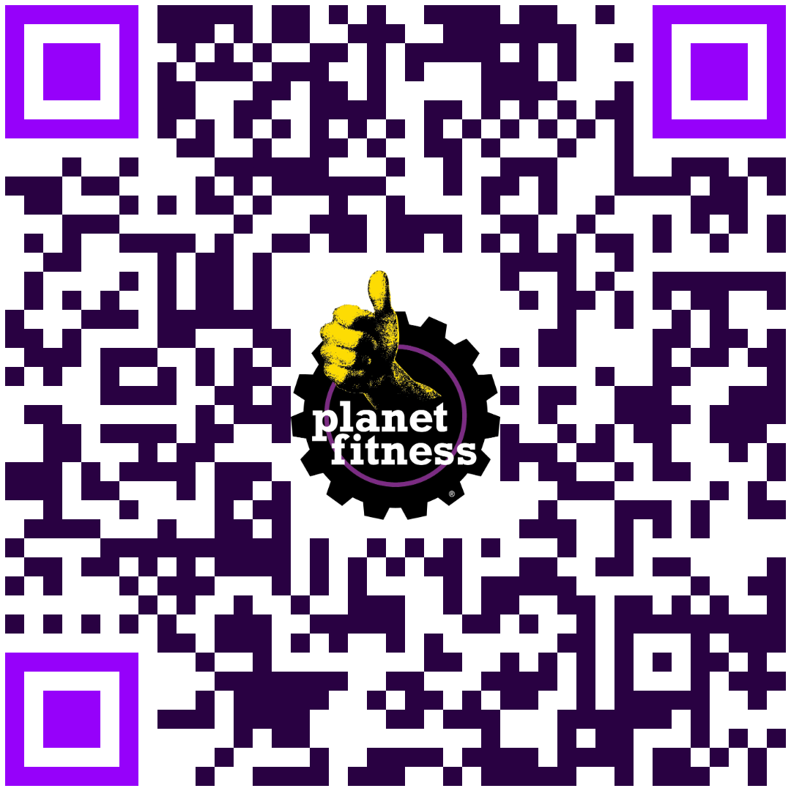
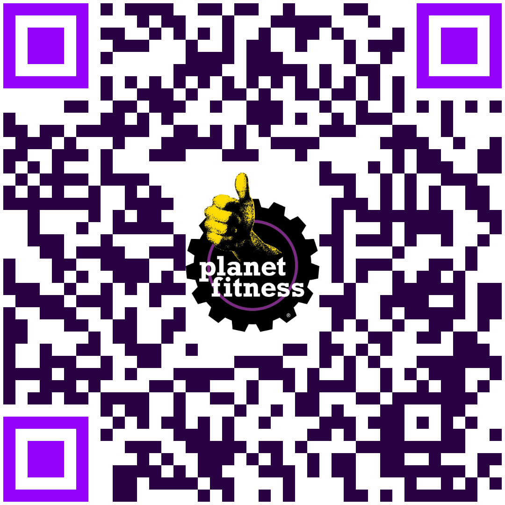
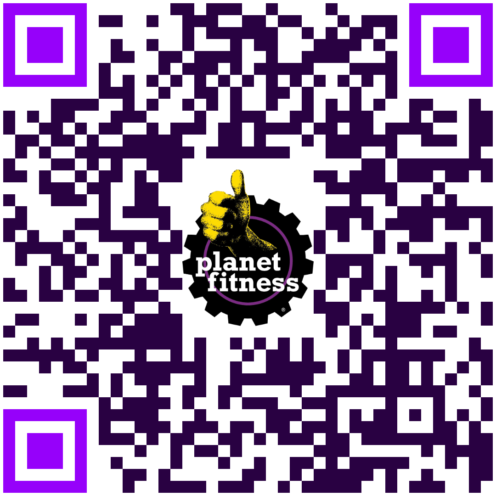
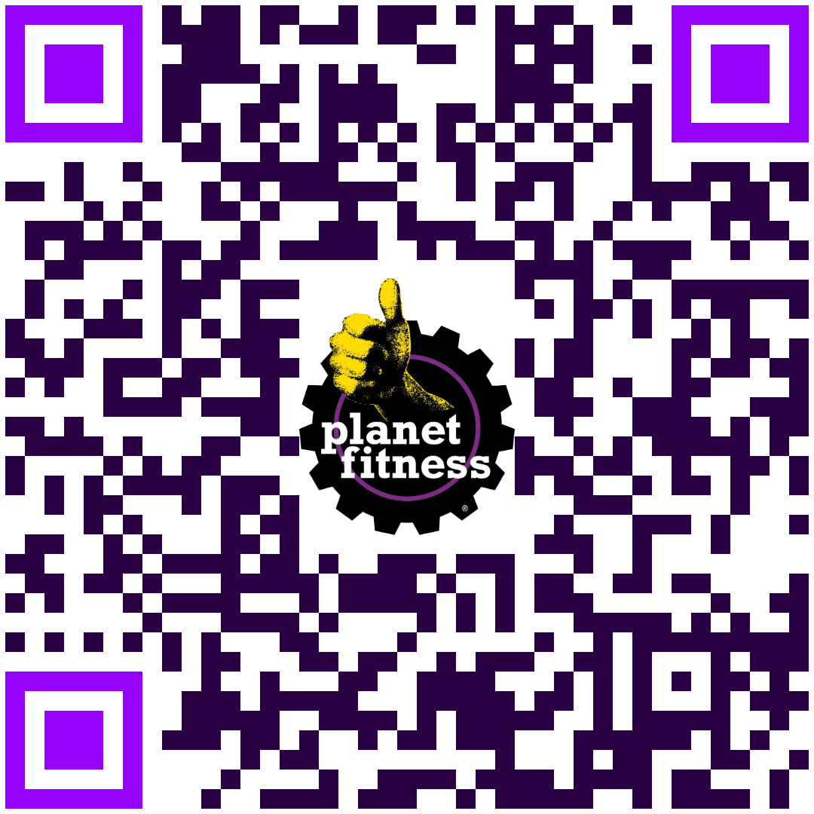
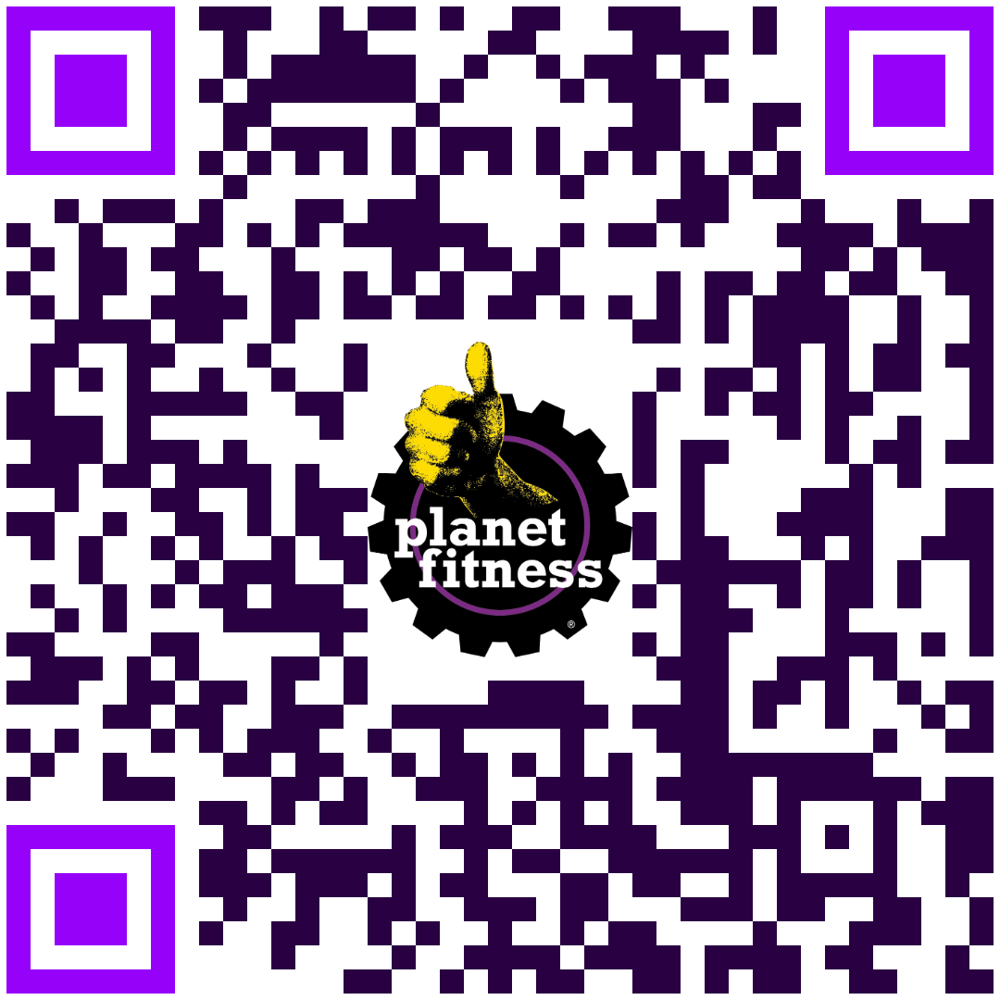

Dentro del segundo alcance (MVP 2) se liberará para los usuarios de los siguientes Gimnasios.

| Estado      | Nombre del Club        | QR     |
|:------------|:-----------------------|:-------|
| Leon.       | PUNTO LEÓN             |   |
| Queretaro.  | CANDILES               |   |
| San Luis.   | GLORIETA               |   |
| Queretaro.  | ANTEA                  |   |
| Guadalajara.| PLAZA DEL ANGEL        |   |

