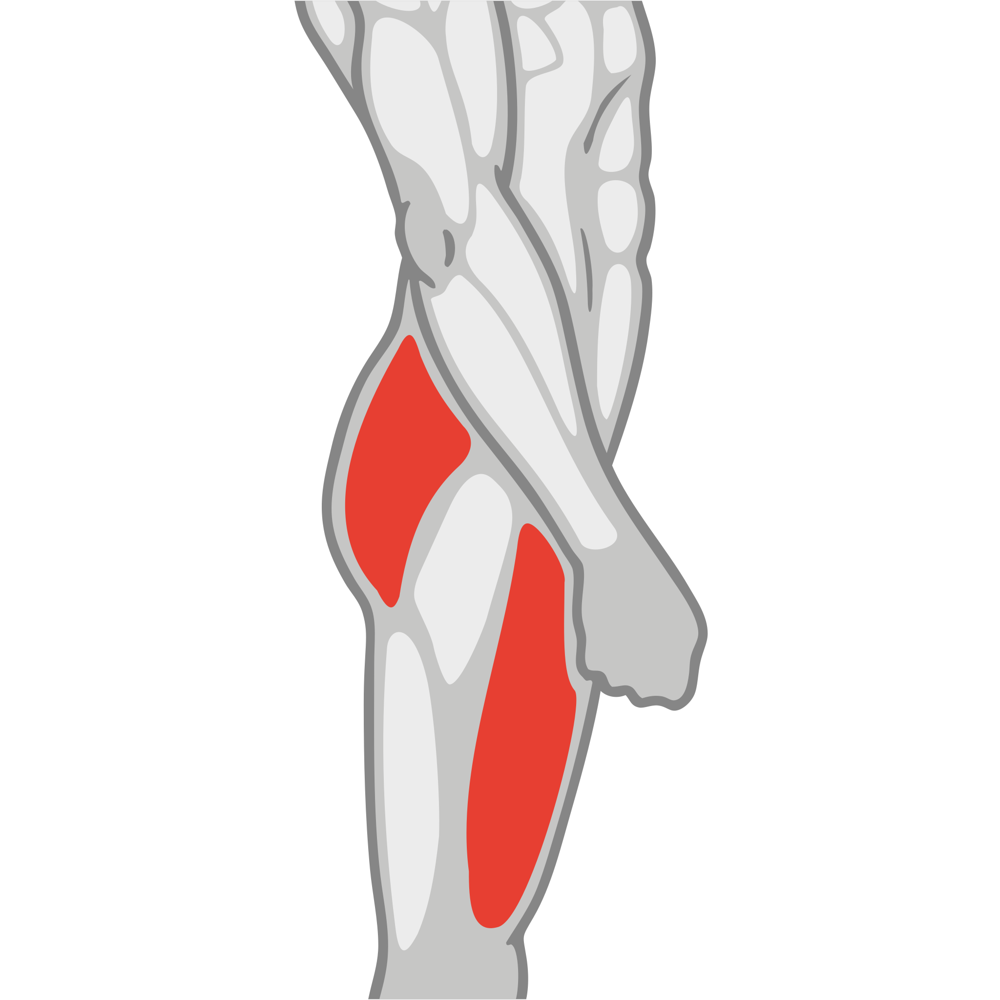
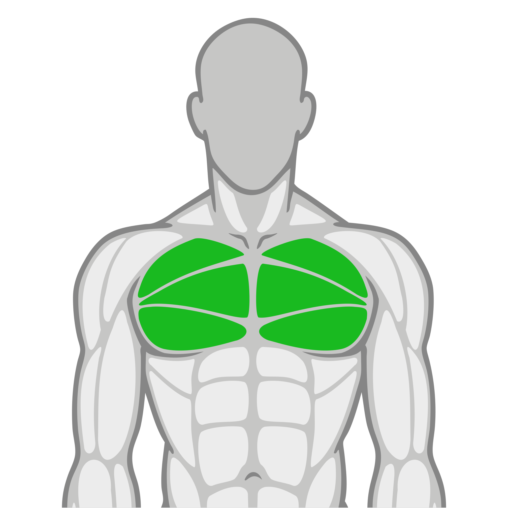

Descripción: El entrenamiento enfocado en la quema de grasa ayuda a acelerar el metabolismo,
contribuyendo a la pérdida de grasa de forma gradual.

## Nivel 1 - Acondicionamiento HIIT Básico

Frecuencia: 4 días por semana

Categorías de Zona: `Funcional`, `Cardio`

### Día 1 (Todo el cuerpo)

| Ejercicio                                | Zona      | Músculo                   | Img Músculo                                                          | Aparato       | Series   | Reps/Tiempo       | Descanso   |
|:-----------------------------------------|:----------|:--------------------------|:---------------------------------------------------------------------|:--------------|:---------|:------------------|:-----------|
| Talones alternados al glúteo             | Funcional | Cuádriceps/glúteo/femoral |  | Peso corporal | -        | 20 seg x 3 rondas | 30 seg     |
| Marcha alternada estático                | Funcional | Cuádriceps/glúteo         |                  | Peso corporal | -        | 20 seg x 3 rondas | 30 seg     |
| Sentadillas                              | Funcional | Cuádriceps/glúteo/femoral |  | Peso corporal | -        | 20 seg x 3 rondas | 30 seg     |
| Plancha con flexión y extensión de codos | Funcional | Abdomen                   |                                    | Tapete        | -        | 20 seg x 3 rondas | 30 seg     |
| Plancha estatica en Bosú                 | Funcional | Abdomen                   |                                    | Bosu          | -        | 20 seg x 3 rondas | 30 seg     |
| Escaladores cruzados                     | Funcional | Abdomen (oblicuos)        |                                  | Tapete        | -        | 20 seg x 3 rondas | 30 seg     |

### Día 2 (Cardio)

| Ejercicio       | Zona   | Músculo        | Img Músculo                              | Aparato    | Series   | Reps/Tiempo   | Descanso   |
|:----------------|:-------|:---------------|:-----------------------------------------|:-----------|:---------|:--------------|:-----------|
| Cardio a elegir | Cardio | Todo el cuerpo |  | Caminadora | -        | 1 reps        | -          |
| Cardio a elegir | Cardio | Todo el cuerpo |  | Escaladora | -        | 1 reps        | -          |

### Día 3 (Circuito express)

| Ejercicio                 | Zona      | Músculo        | Img Músculo                              | Aparato      | Series   | Reps/Tiempo   | Descanso   |
|:--------------------------|:----------|:---------------|:-----------------------------------------|:-------------|:---------|:--------------|:-----------|
| Clase de circuito express | Funcional | Todo el cuerpo |  | Clase grupal | -        | 1 reps        | -          |

### Día 4 (Mixto)

| Ejercicio       | Zona   | Músculo        | Img Músculo                              | Aparato      | Series   | Reps/Tiempo   | Descanso   |
|:----------------|:-------|:---------------|:-----------------------------------------|:-------------|:---------|:--------------|:-----------|
| Clase PE@PF     | PE@PF  | Todo el cuerpo |  | Clase grupal | -        | 1 reps        | -          |
| Cardio a elegir | Cardio | Todo el cuerpo |  | Arc Trainer  | -        | 1 reps        | -          |

## Nivel 2 - Incremento de Intensidad

Frecuencia: 4 días por semana

Categorías de Zona: `Funcional`, `Cardio`

### Día 1 (Tren inferior y abdomen)

| Ejercicio                       | Zona      | Músculo                   | Img Músculo                                                          | Aparato       | Series   | Reps/Tiempo       | Descanso   |
|:--------------------------------|:----------|:--------------------------|:---------------------------------------------------------------------|:--------------|:---------|:------------------|:-----------|
| Paso joggie                     | Funcional | Cuádriceps/glúteo         |                  | Peso corporal | -        | 30 seg x 3 rondas | 30 seg     |
| Sentadilla en TRX con salto     | Funcional | Cuádriceps/glúteo/femoral |  | TRX           | -        | 30 seg x 3 rondas | 30 seg     |
| Plancha con apertura de piernas | Funcional | Abdomen                   |                                    | Tapete        | -        | 30 seg x 3 rondas | 30 seg     |
| Sentadilla sobre Bosú           | Funcional | Cuádriceps/glúteo/femoral |  | Bosu          | -        | 30 seg x 3 rondas | 30 seg     |
| Tijeras frontales en tapete     | Funcional | Abdomen                   |                                    | Tapete        | -        | 30 seg x 3 rondas | 30 seg     |
| Cangrejo codo a la rodilla      | Funcional | Abdomen (oblicuos)        |                                  | Tapete        | -        | 30 seg x 3 rondas | 30 seg     |

### Día 2 (Cardio)

| Ejercicio       | Zona   | Músculo        | Img Músculo                              | Aparato    | Series   | Reps/Tiempo   | Descanso   |
|:----------------|:-------|:---------------|:-----------------------------------------|:-----------|:---------|:--------------|:-----------|
| Cardio a elegir | Cardio | Todo el cuerpo |  | Elíptica   | -        | 1 reps        | -          |
| Cardio a elegir | Cardio | Todo el cuerpo |  | Caminadora | -        | 1 reps        | -          |

### Día 3 (Clase PE@PF)

| Ejercicio            | Zona      | Músculo        | Img Músculo                              | Aparato      | Series   | Reps/Tiempo   | Descanso   |
|:---------------------|:----------|:---------------|:-----------------------------------------|:-------------|:---------|:--------------|:-----------|
| Clase PE@PF a elegir | Funcional | Todo el cuerpo |  | Clase grupal | -        | 1 reps        | -          |

### Día 4 (Mixto)

| Ejercicio            | Zona   | Músculo        | Img Músculo                              | Aparato      | Series   | Reps/Tiempo   | Descanso   |
|:---------------------|:-------|:---------------|:-----------------------------------------|:-------------|:---------|:--------------|:-----------|
| Clase PE@PF a elegir | PE&PF  | Todo el cuerpo |  | Clase grupal | -        | 1 reps        | -          |
| Cardio a elegir      | Cardio | Todo el cuerpo |  | Arc Trainer  | -        | 1 reps        | -          |

## Nivel 3 -  Resistencia Muscular

Frecuencia: 4 días por semana

Categorías de Zona: `Funcional`, `Cardio`

### Día 1 (Todo el cuerpo)

| Ejercicio                                | Zona      | Músculo                   | Img Músculo                                                          | Aparato                | Series   | Reps/Tiempo       | Descanso   |
|:-----------------------------------------|:----------|:--------------------------|:---------------------------------------------------------------------|:-----------------------|:---------|:------------------|:-----------|
| Oruga                                    | Funcional | Abdomen                   |                                    | Peso corporal          | -        | 30 seg x 3 rondas | 20 seg     |
| Plancha con rotacion de torso            | Funcional | Abdomen (oblicuos)        |                                  | Tapete                 | -        | 30 seg x 3 rondas | 20 seg     |
| Plancha con apertura de piernas          | Funcional | Abdomen                   |                                    | Tapete                 | -        | 30 seg x 3 rondas | 20 seg     |
| Sentadilla con salto en TRX              | Funcional | Cuádriceps/glúteo/femoral |  | TRX                    | -        | 30 seg x 3 rondas | 20 seg     |
| Azote en cuerda en sentadilla isometrica | Funcional | Cuádriceps/glúteo/hombro  |    | Cuerdas (battle ropes) | -        | 30 seg x 3 rondas | 20 seg     |
| Desplante alternado con salto            | Funcional | Cuádriceps/glúteo/femoral |  | Peso corporal          | -        | 30 seg x 3 rondas | 20 seg     |

### Día 2 (Cardio)

| Ejercicio       | Zona   | Músculo        | Img Músculo                              | Aparato    | Series   | Reps/Tiempo   | Descanso   |
|:----------------|:-------|:---------------|:-----------------------------------------|:-----------|:---------|:--------------|:-----------|
| Cardio a elegir | Cardio | Todo el cuerpo |  | Elíptica   | -        | 30 min        | -          |
| Cardio a elegir | Cardio | Todo el cuerpo |  | Caminadora | -        | 30 min        | -          |

### Día 3 (Tren superior)

| Ejercicio                             | Zona      | Músculo            | Img Músculo                          | Aparato       | Series   | Reps/Tiempo       | Descanso   |
|:--------------------------------------|:----------|:-------------------|:-------------------------------------|:--------------|:---------|:------------------|:-----------|
| Curl martillo alternado con mancuerna | Funcional | Bicep              |      | Mancuernas    | -        | 30 seg x 3 rondas | 20 seg     |
| Tijeras frontales en tapete           | Funcional | Abdomen            |    | Tapete        | -        | 30 seg x 3 rondas | 20 seg     |
| Plancha lateral                       | Funcional | Abdomen (oblicuos) |  | Tapete        | -        | 30 seg x 3 rondas | 20 seg     |
| Lagartijas                            | Funcional | Pectoral           |  | Peso corporal | -        | 30 seg x 3 rondas | 20 seg     |
| Escaladores                           | Funcional | Abdomen (oblicuos) |  | Tapete        | -        | 30 seg x 3 rondas | 20 seg     |
| Cangrejo codo a la rodilla            | Funcional | Abdomen (oblicuos) |  | Tapete        | -        | 30 seg x 3 rondas | 20 seg     |

### Día 4 (Circuito express)

| Ejercicio                 | Zona             | Músculo        | Img Músculo                              | Aparato      | Series   | Reps/Tiempo   | Descanso   |
|:--------------------------|:-----------------|:---------------|:-----------------------------------------|:-------------|:---------|:--------------|:-----------|
| Clase de circuito express | Circuito Express | Todo el cuerpo |  | Clase grupal | -        | 1 reps        | -          |

## Nivel 4 - HIIT Avanzado

Frecuencia: 4 días por semana

Categorías de Zona: `Funcional`, `Cardio`

### Día 1 (Tren inferior y abdomen)

| Ejercicio                              | Zona      | Músculo                   | Img Músculo                                                          | Aparato       | Series   | Reps/Tiempo       | Descanso   |
|:---------------------------------------|:----------|:--------------------------|:---------------------------------------------------------------------|:--------------|:---------|:------------------|:-----------|
| Sentadilla TRX                         | Funcional | Cuádriceps/glúteo/femoral |  | TRX           | -        | 40 seg x 3 rondas | 20 seg     |
| Paso joggie                            | Funcional | Cuádriceps/glúteo         |                  | Peso corporal | -        | 40 seg x 3 rondas | 20 seg     |
| Oruga                                  | Funcional | Abdomen                   |                                    | Peso corporal | -        | 40 seg x 3 rondas | 20 seg     |
| Sentadilla con Salto rodillas al pecho | Funcional | Cuádriceps/glúteo         |                  | Peso corporal | -        | 40 seg x 3 rondas | 20 seg     |
| Escaladores                            | Funcional | Abdomen (oblicuos)        |                                  | Tapete        | -        | 40 seg x 3 rondas | 20 seg     |
| Plancha con apertura de piernas        | Funcional | Abdomen                   |                                    | Tapete        | -        | 40 seg x 3 rondas | 20 seg     |

### Día 2 (Cardio)

| Ejercicio       | Zona   | Músculo        | Img Músculo                              | Aparato     | Series   | Reps/Tiempo   | Descanso   |
|:----------------|:-------|:---------------|:-----------------------------------------|:------------|:---------|:--------------|:-----------|
| Cardio a elegir | Cardio | Todo el cuerpo |  | Arc Trainer | -        | 30 min        | -          |
| Cardio a elegir | Cardio | Todo el cuerpo |  | Caminadora  | -        | 30 min        | -          |

### Día 3 (Todo el cuerpo)

| Ejercicio                             | Zona      | Músculo                   | Img Músculo                                                          | Aparato                | Series   | Reps/Tiempo       | Descanso   |
|:--------------------------------------|:----------|:--------------------------|:---------------------------------------------------------------------|:-----------------------|:---------|:------------------|:-----------|
| Sentadilla TRX con salto              | Funcional | Cuádriceps/glúteo/femoral |  | TRX                    | -        | 40 seg x 3 rondas | 20 seg     |
| Azote de cuerda sentadilla isometrica | Funcional | Cuádriceps/glúteo/hombro  |    | Cuerdas (battle ropes) | -        | 40 seg x 3 rondas | 20 seg     |
| Tijeras frontales en tapete           | Funcional | Abdomen                   |                                    | Tapete                 | -        | 40 seg x 3 rondas | 20 seg     |
| Curl martillo alternado con mancuerna | Funcional | Bicep                     |                                      | Mancuernas             | -        | 40 seg x 3 rondas | 20 seg     |
| Marcha alternada estático             | Funcional | Cuádriceps/glúteo         |                  | Peso corporal          | -        | 40 seg x 3 rondas | 20 seg     |
| Plancha con rotación de torso         | Funcional | Abdomen (oblicuos)        |                                  | Tapete                 | -        | 40 seg x 3 rondas | 20 seg     |

### Día 4 (Clase PE@PF)

| Ejercicio            | Zona      | Músculo        | Img Músculo                              | Aparato      | Series   | Reps/Tiempo   | Descanso   |
|:---------------------|:----------|:---------------|:-----------------------------------------|:-------------|:---------|:--------------|:-----------|
| Clase PE@PF a elegir | Funcional | Todo el cuerpo |  | Clase grupal | -        | 1 reps        | -          |

