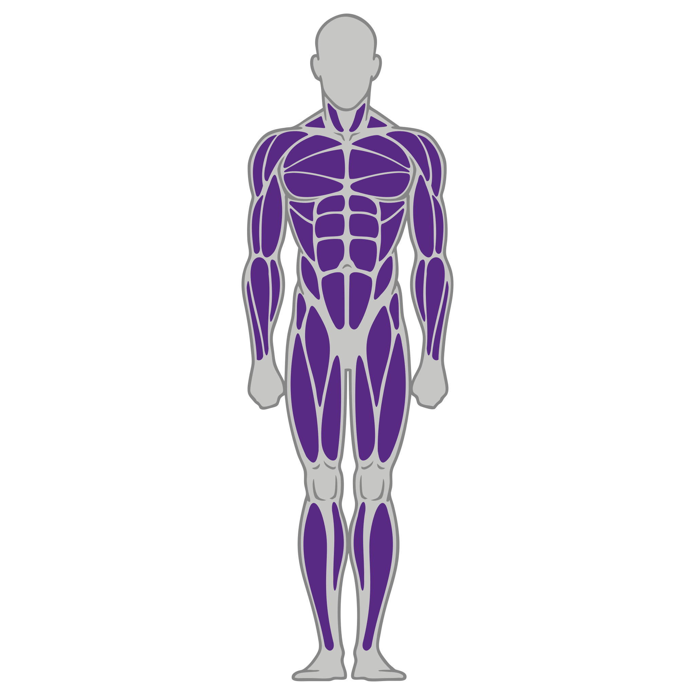
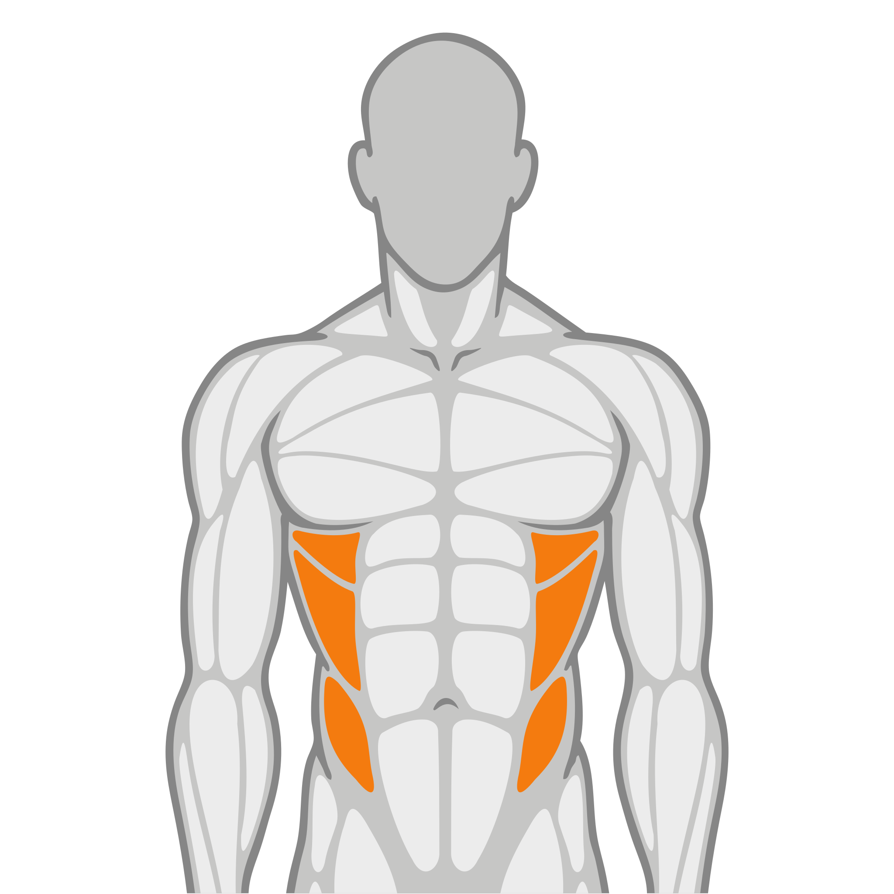
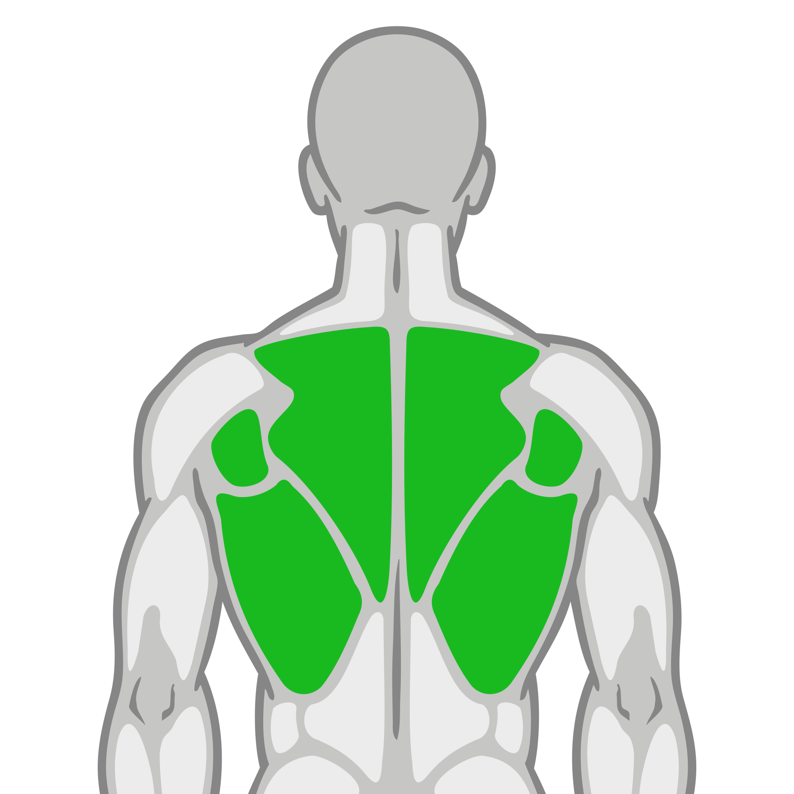

Descripción: Nuestras rutinas de salud están diseñadas para promover el bienestar físico y mental,
ayudándote a mejorar tu resistencia, tonificar tu cuerpo y disfrutar de un descanso más reparador.

## Nivel 1 - Acondicionamiento General

Frecuencia: 2 días por semana

Categorías de Zona: `Funcional`, `Peso integrado`, `Cardio`

### Día 1 (Tren superior)

| Ejercicio                  | Zona           | Músculo                   | Img Músculo                                                           | Aparato              |   Series | Reps/Tiempo   |
|:---------------------------|:---------------|:--------------------------|:----------------------------------------------------------------------|:---------------------|---------:|:--------------|
| Sentadilla TRX             | Funcional      | Cuádriceps/glúteo/femoral |   | TRX                  |        3 | 10 reps       |
| Marcha alternando estático | Funcional      | Cuádriceps/glúteo         |                   | Peso corporal        |        3 | 10 reps       |
| Curl de biceps             | Peso integrado | Biceps                    |                                       | Mancuernas o máquina |        3 | 10 reps       |
| Press de Triceps           | Peso integrado | Triceps                   |                                     | Máquina o polea      |        3 | 10 reps       |
| Abdominal crunch           | Peso integrado | Abdomen                   |                                     | Máquina de crunch    |        3 | 10 reps       |

### Día 2 (Cardio)

| Ejercicio   | Zona   | Músculo        | Img Músculo                               | Aparato    | Series   | Reps/Tiempo   |
|:------------|:-------|:---------------|:------------------------------------------|:-----------|:---------|:--------------|
| Elíptica    | Cardio | Todo el cuerpo |    | Elíptica   | -        | 1 reps        |
| Caminadora  | Cardio | Todo el cuerpo |    | Caminadora | -        | 1 reps        |

## Nivel 2 - Fuerza y Resistencia

Frecuencia: 4 días por semana

Categorías de Zona: `Funcional`, `Peso integrado`, `Cardio`

### Día 1 (Todo el cuerpo)

| Ejercicio                    | Zona           | Músculo                    | Img Músculo               | Aparato                                  |   Series | Reps/Tiempo   |
|:-----------------------------|:---------------|:---------------------------|:--------------------------|:-----------------------------------------|---------:|:--------------|
| Sentadilla trx con salto     | Funcional      | Cuádriceps/glúteos/femoral |   | TRX                     |        4 | 12 reps       |
| Talones alternados al glúteo | Funcional      | Cuádriceps/glúteo          |                   | Peso corporal           |        4 | 12 reps       |
| Curl de bíceps               | Peso integrado | Biceps                     |                                       | Mancuernas o máquina    |        4 | 12 reps       |
| Extensión de tricep en polea | Peso integrado | Triceps                    |                                     | Máquina de poleas       |        4 | 12 reps       |
| Rotación de torso            | Funcional      | Abdomen (oblicuos)         |                                   | Máquina o peso corporal |        4 | 12 reps       |

### Día 2 (Cardio)

| Ejercicio   | Zona   | Músculo        | Img Músculo                               | Aparato    | Series   | Reps/Tiempo   |
|:------------|:-------|:---------------|:------------------------------------------|:-----------|:---------|:--------------|
| Elíptica    | Cardio | Todo el cuerpo |    | Elíptica   | -        | 1 reps        |
| Caminadora  | Cardio | Todo el cuerpo |    | Caminadora | -        | 1 reps        |

### Día 3 (Circuito express)

| Ejercicio                 | Zona             | Músculo        | Img Músculo                               | Aparato      | Series   | Reps/Tiempo   |
|:--------------------------|:-----------------|:---------------|:------------------------------------------|:-------------|:---------|:--------------|
| Clase de circuito express | Circuito Express | Todo el cuerpo |    | Clase grupal | -        | 1 reps        |

### Día 4 (Cardio)

| Ejercicio       | Zona   | Músculo        | Img Músculo                               | Aparato    | Series   | Reps/Tiempo   |
|:----------------|:-------|:---------------|:------------------------------------------|:-----------|:---------|:--------------|
| Cardio a elegir | Cardio | Todo el cuerpo |    | Elíptica   | -        | 1 reps        |
| Caminadora      | Cardio | Todo el cuerpo |    | Caminadora | -        | 1 reps        |

## Nivel 3 - Hipertrofia y Resistencia

Frecuencia: 4 días por semana

Categorías de Zona: `Peso integrado`, `Funcional`, `Cardio`

### Día 1 (Tren inferior)

| Ejercicio                                | Zona           | Músculo                   | Img Músculo                                                         | Aparato                 |   Series | Reps/Tiempo   |
|:-----------------------------------------|:---------------|:--------------------------|:--------------------------------------------------------------------|:------------------------|---------:|:--------------|
| Extensión de cuadricep                   | Peso integrado | Cuádriceps                |                              | Máquina de extensiones  |        4 | 15 reps       |
| Curl de pierna sentado                   | Peso integrado | Femoral                   |                                    | Máquina de curl femoral |        4 | 15 reps       |
| Sentadilla TRX con salto                 | Funcional      | Cuádriceps/glúteo/femoral |  | TRX                     |        4 | 15 reps       |
| Plancha con flexión y extensión de codos | Funcional      | Abdomen                   |                                    | Tapete                  |        4 | 15 reps       |
| Plancha con apertura de piernas          | Funcional      | Abdomen                   |                                    | Tapete                  |        4 | 15 reps       |

### Día 2 (Mixto)

| Ejercicio            | Zona   | Músculo        | Img Músculo                               | Aparato      | Series   | Reps/Tiempo   |
|:---------------------|:-------|:---------------|:------------------------------------------|:-------------|:---------|:--------------|
| Clase PE@PF a elegir | PE@PF  | Todo el cuerpo |    | Clase grupal | -        | 1 reps        |
| Cardio a elegir      | Cardio | Todo el cuerpo |    | Elíptica     | -        | 1 reps        |

### Día 3 (Clase PE@PF)

| Ejercicio            | Zona   | Músculo        | Img Músculo                               | Aparato      | Series   | Reps/Tiempo   |
|:---------------------|:-------|:---------------|:------------------------------------------|:-------------|:---------|:--------------|
| Clase PE@PF a elegir | PE@PF  | Todo el cuerpo |    | Clase grupal | -        | 1 reps        |

### Día 4 (Cardio)

| Ejercicio       | Zona   | Músculo        | Img Músculo                               | Aparato    | Series   | Reps/Tiempo   |
|:----------------|:-------|:---------------|:------------------------------------------|:-----------|:---------|:--------------|
| Cardio a elegir | Cardio | Todo el cuerpo |    | Caminadora | -        | 1 reps        |

## Nivel 4 - Fuerza y Potencia

Frecuencia: 4 días por semana
Categorías de Zona: `Funcional`, `Peso integrado`, `Cardio`

### Día 1 (Todo el cuerpo)

| Ejercicio                     | Zona           | Músculo                     | Img Músculo                                                          | Aparato                     |   Series | Reps/Tiempo   |
|:------------------------------|:---------------|:----------------------------|:---------------------------------------------------------------------|:----------------------------|---------:|:--------------|
| Sentadilla TRX con salto      | Funcional      | Cuádriceps/glúteos/femoral  |   | TRX                         |        4 | 15 reps       |
| Desplante alternado con salto | Funcional      | Cuádriceps/glúteos/femoral  |   | TRX                         |        4 | 15 reps       |
| Press de hombro               | Peso integrado | Hombros (frontal y lateral) |     | Máquina de press de hombro  |        4 | 15 reps       |
| Press de pecho                | Peso integrado | Pectoral                    |                                   | Máquina de press de pecho   |        4 | 15 reps       |
| Extensión de espalda          | Peso integrado | Espalda (sin lumbar)        |                                     | Máquina de extensión lumbar |        4 | 15 reps       |

### Día 2 (Mixto)

| Ejercicio            | Zona   | Músculo        | Img Músculo                               | Aparato      | Series   | Reps/Tiempo   |
|:---------------------|:-------|:---------------|:------------------------------------------|:-------------|:---------|:--------------|
| Clase PE@PF a elegir | PE@PF  | Todo el cuerpo |    | Clase grupal | -        | 1 reps        |
| Cardio a elegir      | Cardio | Todo el cuerpo |    | Caminadora   | -        | 1 reps        |

### Día 3 (Clase PE@PF)

| Ejercicio            | Zona   | Músculo        | Img Músculo                                     | Aparato      | Series   | Reps/Tiempo   |
|:---------------------|:-------|:---------------|:------------------------------------------------|:-------------|:---------|:--------------|
| Clase PE@PF a elegir | PE@PF  | Glúteo/Abdomen |  | Clase grupal | -        | 1 reps        |

### Día 4 (Tren superior)

| Ejercicio            | Zona           | Músculo              | Img Músculo                            | Aparato                     |   Series | Reps/Tiempo   |
|:---------------------|:---------------|:---------------------|:---------------------------------------|:----------------------------|---------:|:--------------|
| Abdominal crunch     | Peso integrado | Abdomen              |       | Máquina de crunch           |        3 | 10 reps       |
| Extensión de espalda | Peso integrado | Espalda (sin lumbar) |       | Máquina de extensión lumbar |        4 | 15 reps       |
| Rotación de torso    | Funcional      | Abdomen (oblicuos)   |     | Máquina o peso corporal     |        4 | 12 reps       |

