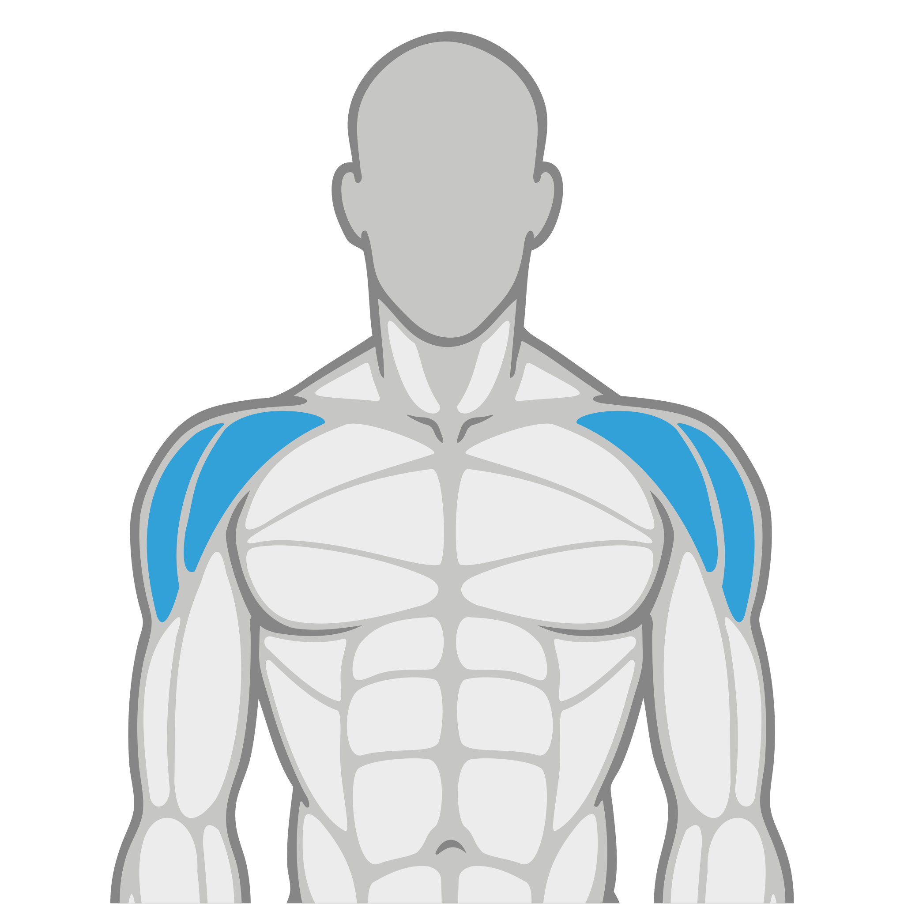
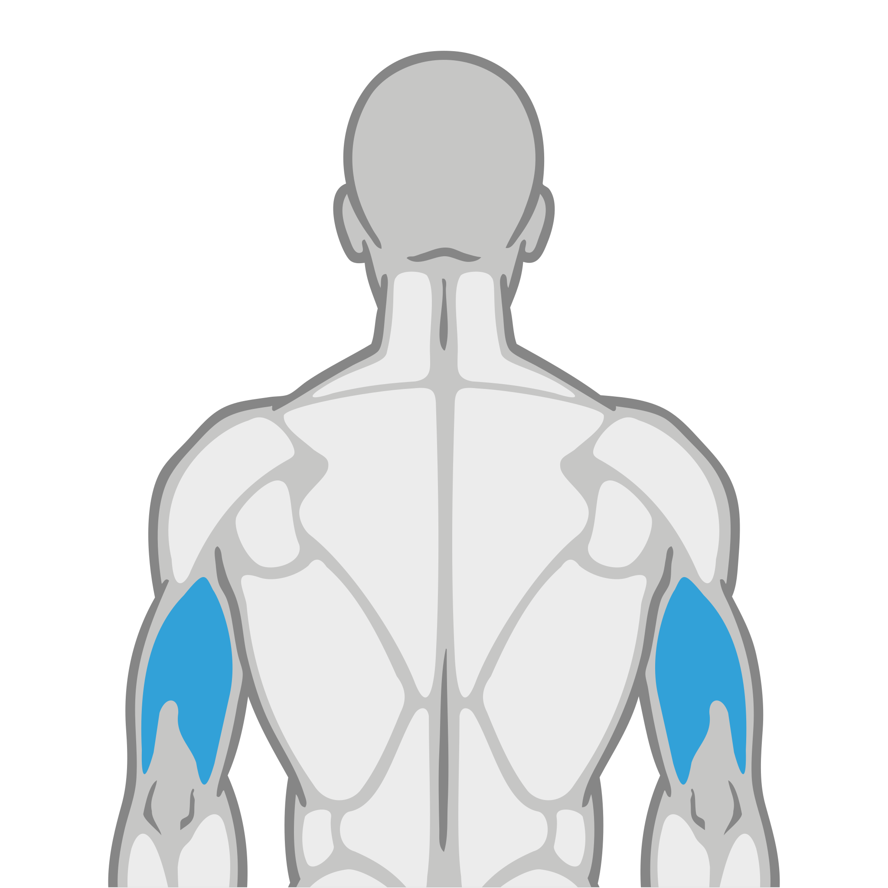
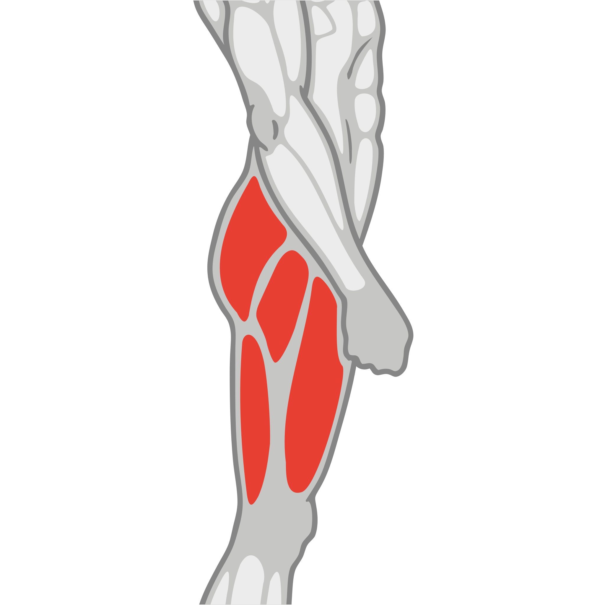
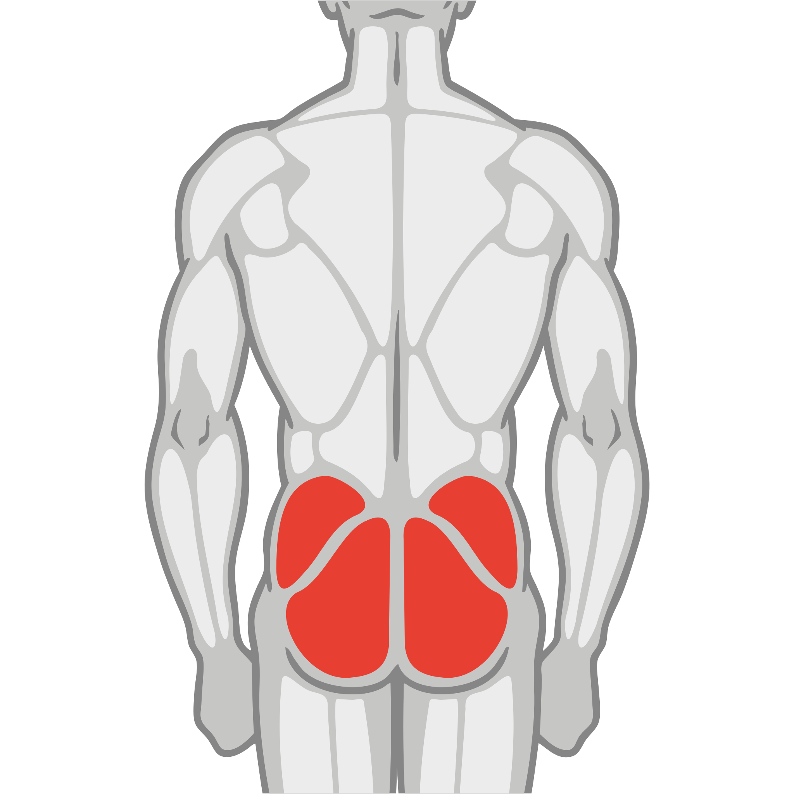
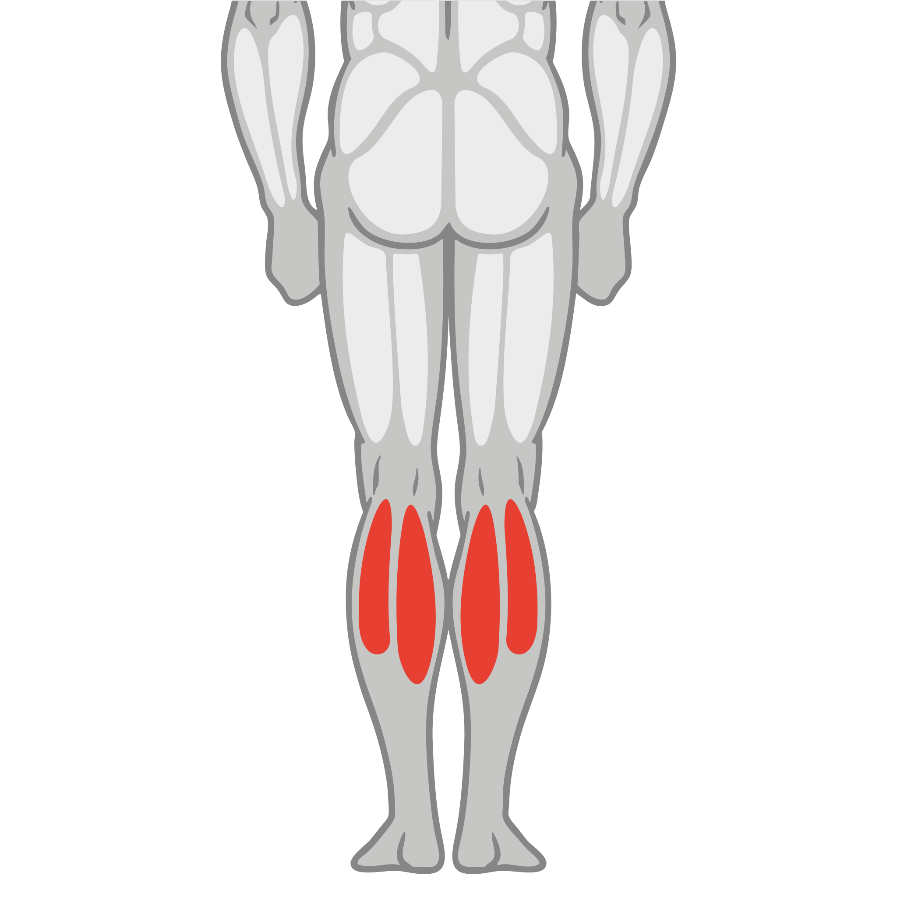

Descripción: Estás iniciando un entrenamiento enfocado en la ganancia muscular, también conocido como entrenamiento de hipertrofia.
Esta rutina se basa en una serie de factores diseñados específicamente para estimular y maximizar el crecimiento de la masa muscular.

## Nivel 1 - Fuerza General - Torso/Pierna

Frecuencia: 3 días por semana

Categorías de Zona: `Peso integrado`, `Funcional`, `Cardio`

### Día 1 (Tren superior)

| Ejercicio        | Zona           | Músculo                    | Img Músculo                                                      | Aparato              |   Series | Reps/Tiempo   |
|:-----------------|:---------------|:---------------------------|:-----------------------------------------------------------------|:---------------------|---------:|:--------------|
| Press de Hombro  | Peso integrado | Hombro (frontal y lateral) |  | Máquina o mancuernas |        3 | 15 reps       |
| Press de Pecho   | Peso integrado | Pectoral                   |                                | Máquina o barra      |        3 | 15 reps       |
| Curl de Biceps   | Peso integrado | Biceps                     |                                    | Mancuernas o máquina |        3 | 15 reps       |
| Press de Triceps | Peso integrado | Triceps                    |                                  | Máquina o polea      |        3 | 15 reps       |
| Remo sentado     | Peso integrado | Espalda (sin lumbar)       |                                  | Máquina de remo      |        3 | 15 reps       |
| Abdominal crunch | Peso integrado | Abdomen                    |                                  | Máquina de crunch    |        3 | 15 reps       |

### Día 2 (Descanso)

_Sin ejercicios disponibles para este día._

### Día 3 (Tren inferior)

| Ejercicio               | Zona           | Músculo                   | Img Músculo                                                          | Aparato                   |   Series | Reps/Tiempo   |
|:------------------------|:---------------|:--------------------------|:---------------------------------------------------------------------|:--------------------------|---------:|:--------------|
| Sentadilla TRX          | Funcional      | Cuádriceps/glúteo/femoral |  | TRX                       |        3 | 15 reps       |
| Extensión de cuadriceps | Peso integrado | Cuádriceps                |                              | Máquina de extensiones    |        3 | 15 reps       |
| Curl de Piernas Sentado | Peso integrado | Femoral                   |                                    | Máquina de curl femoral   |        3 | 15 reps       |
| Aductor                 | Funcional      | Aductores                 |                                | Máquina o peso corporal   |        3 | 15 reps       |
| Abductor                | Funcional      | Glúteo                    |                                      | Máquina o peso corporal   |        3 | 15 reps       |
| Extensión de Gemelos    | Peso integrado | Pantorrilla               |                            | Máquina para pantorrillas |        3 | 15 reps       |

### Día 4 (Clase PE@PF)

| Ejercicio            | Zona   | Músculo        | Img Músculo                              | Aparato      | Series   | Reps/Tiempo   |
|:---------------------|:-------|:---------------|:-----------------------------------------|:-------------|:---------|:--------------|
| Clase PE@PF a elegir | PE@PF  | Todo el cuerpo |  | Clase grupal | -        | 1 reps        |

## Nivel 2 - Volumen y Aislamiento

Frecuencia: 2 días por semana

Categorías de Zona: `Peso integrado`, `Funcional`, `Cardio`

### Día 1 (Tren inferior)

| Ejercicio        | Zona           | Músculo                    | Img Músculo                                                        | Aparato                   |   Series | Reps/Tiempo   |
|:-----------------|:---------------|:---------------------------|:-------------------------------------------------------------------|:--------------------------|---------:|:--------------|
| Press de Hombro  | Peso integrado | Hombro (frontal y lateral) |  | Máquina o mancuernas      |        3 | 15 reps       |
| Press de Pecho   | Peso integrado | Pectoral                   |                                | Máquina o barra           |        3 | 15 reps       |
| Curl de Biceps   | Peso integrado | Biceps                     |                                    | Mancuernas o máquina      |        3 | 15 reps       |
| Press de Triceps | Peso integrado | Triceps                    |                                  | Máquina o polea           |        3 | 15 reps       |
| Jalón al Pecho   | Peso integrado | Espalda (sin lumbar)       |                                  | Máquina de jalón al pecho |        3 | 15 reps       |
| Abdominal crunch | Peso integrado | Abdomen                    |                                  | Máquina de crunch         |        3 | 15 reps       |

### Día 2 (Descanso)

_Sin ejercicios disponibles para este día._

### Día 3 (Tren inferior)

| Ejercicio              | Zona           | Músculo                   | Img Músculo                                                          | Aparato                     | Series   | Reps/Tiempo   |
|:-----------------------|:---------------|:--------------------------|:---------------------------------------------------------------------|:----------------------------|:---------|:--------------|
| Desplante TRX          | Funcional      | Cuádriceps/glúteo/femoral |  | TRX                         | 3        | 15 reps       |
| Prensa de Pierna       | Peso integrado | Cuádriceps/glúteo/femoral |  | Máquina de prensa           | 3        | 15 reps       |
| Curl de Pierna Sentado | Peso integrado | Femoral                   |                                    | Máquina de curl femoral     | 3        | 15 reps       |
| Aductor                | Funcional      | Aductores                 |                                | Máquina o peso corporal     | 3        | 15 reps       |
| Glúteo                 | Funcional      | Glúteo                    |                                      | Máquina o peso corporal     | 3        | 15 reps       |
| Extensión de Espalda   | Peso integrado | lumbar                    |                                      | Máquina de extensión lumbar | 3        | 15 reps       |
| Clase PE@PF            | Funcional      | Todo el cuerpoLa          |                              | Clase grupal                | -        | 1 reps        |

### Día 4 (Clase PE@PF)

| Ejercicio            | Zona   | Músculo        | Img Músculo                              | Aparato      | Series   | Reps/Tiempo   |
|:---------------------|:-------|:---------------|:-----------------------------------------|:-------------|:---------|:--------------|
| Clase PE@PF a elegir | PE@PF  | Todo el cuerpo |  | Clase grupal | -        | 1 reps        |

## Nivel 3 - Alta Intensidad - Torso/Pierna

Frecuencia: 3 días por semana

Categorías de Zona: `Peso integrado`, `Funcional`, `Cardio`

### Día 1 (Tren superior)

| Ejercicio                      | Zona           | Músculo                     | Img Músculo                                                        | Aparato              |   Series | Reps/Tiempo   |
|:-------------------------------|:---------------|:----------------------------|:-------------------------------------------------------------------|:---------------------|---------:|:--------------|
| Press de hombro                | Peso integrado | Hombros (frontal y lateral) |  | Máquina o mancuernas |        4 | 10 reps       |
| Hammer Strength Shoulder Press | Peso integrado | Hombros (frontal y lateral) |  | Hammer Strength      |        4 | 10 reps       |
| Hammer Strength Chest Press    | Peso integrado | Pectoral                    |                                | Hammer Strength      |        4 | 10 reps       |
| Hammer Strength incline Chest  | Peso integrado | Pectoral                    |                                | Hammer Strength      |        4 | 10 reps       |
| Curl de Biceps (predicador)    | Peso integrado | Biceps                      |                                    | Banco predicador     |        4 | 10 reps       |
| Curl de Biceps                 | Peso integrado | Biceps                      |                                    | Mancuernas o máquina |        4 | 10 reps       |

### Día 2 (Tren inferior)

| Ejercicio              | Zona           | Músculo                   | Img Músculo                                                          | Aparato                   |   Series | Reps/Tiempo   |
|:-----------------------|:---------------|:--------------------------|:---------------------------------------------------------------------|:--------------------------|---------:|:--------------|
| Prensa de Pierna       | Peso integrado | Cuádriceps/glúteo/femoral |  | Máquina de prensa         |        4 | 10 reps       |
| Glúteo                 | Peso integrado | Glúteo                    |                                      | Máquina de glúteos        |        4 | 10 reps       |
| Extensión de Cuadricep | Peso integrado | Cuádriceps                |                              | Máquina de extensiones    |        4 | 10 reps       |
| Aductor                | Funcional      | Aductores                 |                                | Máquina o peso corporal   |        4 | 10 reps       |
| Curl de pierna Sentado | Peso integrado | Femoral                   |                                    | Máquina de curl femoral   |        4 | 10 reps       |
| Extensión de Gemelos   | Peso integrado | Pantorrilla               |                            | Máquina para pantorrillas |        4 | 10 reps       |

### Día 3 (Descanso)

_Sin ejercicios disponibles para este día._

### Día 4 (Tren superior)

| Ejercicio                                | Zona           | Músculo              | Img Músculo                        | Aparato                     |   Series | Reps/Tiempo   |
|:-----------------------------------------|:---------------|:---------------------|:-----------------------------------|:----------------------------|---------:|:--------------|
| Jalón al Pecho                           | Peso integrado | Espalda (sin lumbar) |  | Máquina de jalón al pecho   |        4 | 10 reps       |
| Remo en Polea                            | Peso integrado | Espalda (sin lumbar) |  | Máquina de poleas           |        4 | 10 reps       |
| Extensión de espalda                     | Peso integrado | lumbar               |    | Máquina de extensión lumbar |        4 | 10 reps       |
| Press de triceps                         | Peso integrado | Triceps              |  | Máquina o polea             |        4 | 10 reps       |
| Extensión de Tricep en Polea             | Peso integrado | Triceps              |  | Máquina de poleas           |        4 | 10 reps       |
| Plancha con flexión y extensión de codos | Funcional      | Abdomen              |  | Tapete                      |        4 | 10 reps       |

## Nivel 4 - Máxima Fuerza

Frecuencia: 3 días por semana
Categorías de Zona: Peso integrado, Funcional

### Día 1 (Tren superior)

| Ejercicio                      | Zona           | Músculo                     | Img Músculo                                                        | Aparato              |   Series | Reps/Tiempo   |
|:-------------------------------|:---------------|:----------------------------|:-------------------------------------------------------------------|:---------------------|---------:|:--------------|
| Press de Hombro                | Peso integrado | Hombros (frontal y lateral) |  | Máquina o mancuernas |        4 | 8 reps        |
| Hammer Strength Shoulder Press | Peso integrado | Hombros (frontal y lateral) |  | Hammer Strength      |        4 | 8 reps        |
| Hammer Strength Chest Press    | Peso integrado | Pectoral                    |                                | Hammer Strength      |        4 | 8 reps        |
| Hammer Strength incline Chest  | Peso integrado | Pectoral                    |                                | Hammer Strength      |        4 | 8 reps        |
| Curl de Bicep (predicador)     | Peso integrado | Biceps                      |                                    | Banco predicador     |        4 | 8 reps        |
| Curl de Bicep                  | Peso integrado | Biceps                      |                                    | Mancuernas o máquina |        4 | 8 reps        |

### Día 2 (Tren inferior)

| Ejercicio              | Zona           | Músculo                   | Img Músculo                                                          | Aparato                   |   Series | Reps/Tiempo   |
|:-----------------------|:---------------|:--------------------------|:---------------------------------------------------------------------|:--------------------------|---------:|:--------------|
| Desplante en TRX       | Funcional      | Cuádriceps/glúteo/femoral |  | TRX                       |        4 | 8 reps        |
| Prensa de Pierna       | Peso integrado | Cuádriceps/glúteo/femoral |  | Máquina de prensa         |        4 | 8 reps        |
| Extensión de Cuádricep | Peso integrado | Cuádriceps                |                              | Máquina de extensiones    |        4 | 8 reps        |
| Aductor                | Peso integrado | Aductores                 |                                | Máquina de aductores      |        4 | 8 reps        |
| Abductor               | Peso integrado | Glúteo                    |                                      | Máquina de abductores     |        4 | 8 reps        |
| Extensión de Gemelos   | Peso integrado | Pantorrilla               |                            | Máquina para pantorrillas |        4 | 8 reps        |

### Día 3 (Descanso)

_Sin ejercicios disponibles para este día._

### Día 4 (Tren superior)

| Ejercicio                       | Zona           | Músculo              | Img Músculo                        | Aparato                   |   Series | Reps/Tiempo   |
|:--------------------------------|:---------------|:---------------------|:-----------------------------------|:--------------------------|---------:|:--------------|
| Jalón al Pecho                  | Peso integrado | Espalda (sin lumbar) |  | Máquina de jalón al pecho |        4 | 8 reps        |
| Remo Sentado                    | Peso integrado | Espalda (sin lumbar) |  | Máquina de remo           |        4 | 8 reps        |
| Hammer Strength mts remo        | Peso integrado | Espalda (sin lumbar) |  | Hammer Strength           |        4 | 8 reps        |
| Hammer Strength Mts front Pulld | Peso integrado | Espalda (sin lumbar) |  | Hammer Strength           |        4 | 8 reps        |
| Press de Triceps                | Peso integrado | Triceps              |  | Máquina o polea           |        4 | 8 reps        |
| Extensión de triceps            | Peso integrado | Triceps              |  | Máquina o polea           |        4 | 8 reps        |

