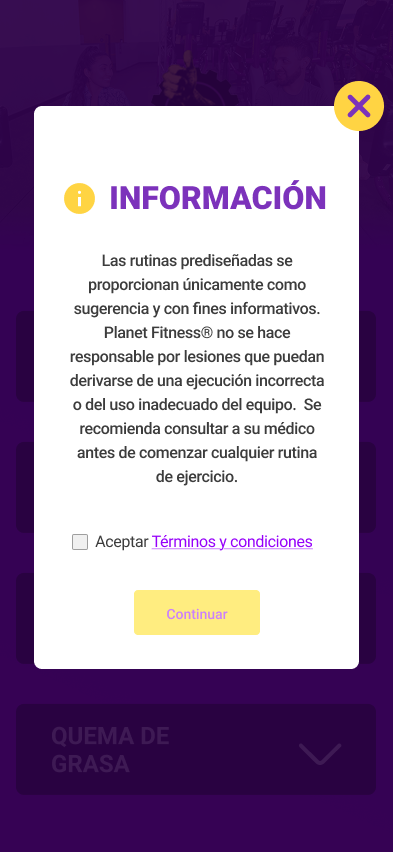
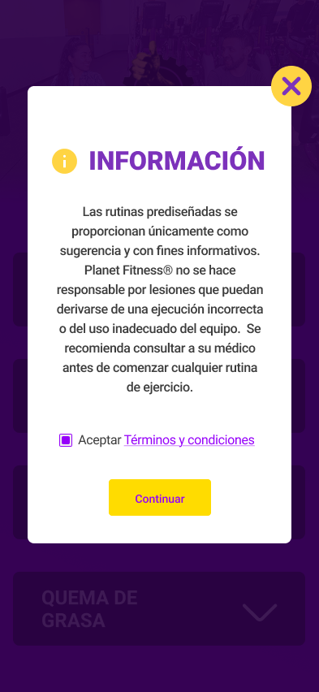

Dentro de la definiciones, se detecto que el disclamer debe aparecer
al iniciar el sitio (despues de escanear el Codigo QR)

## Disclamer Propuesta 1

Tiene como el objetivo, mostrar una información y hacer que el usuario marque un checkbox para aceptar la información.

## Vista cuando el checkbox esta marcado.

## Disclamer Propuesta 2
Tiene como el objetivo, mostrar una información y que el usuario acepte/rechace mediante botnes

