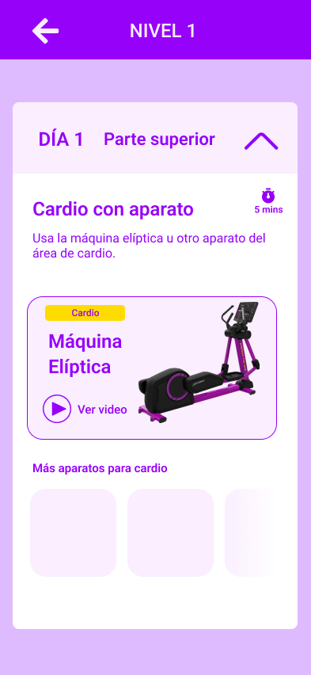
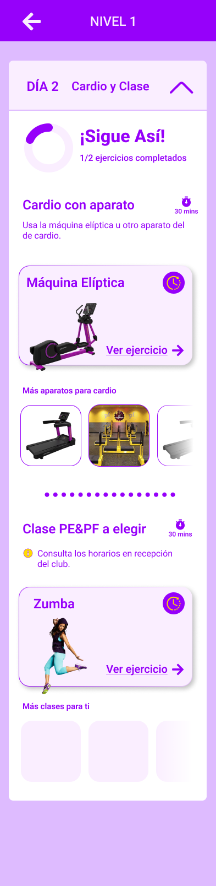

Dentro del listado exisiten dias con ejercicios de cardio y clases para ello se debe diferenciar por la naturaleza de la rutina.

## Escenario 1 - Solo un ejercicio especial (Cardio o Clases)

La idea general es mostrar un ejercicio principal y una seccion de scroll para elegir otras opciones.

## Escenario 2 - Listado de ejercicios especiales (Cardio y Clases)
Cuando existen escenarios que hay días con cardio y clases debemos mostrar ambos ejercicios en la tarjeta del día.

