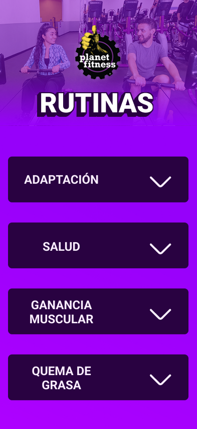
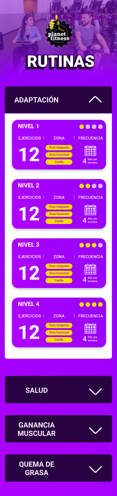
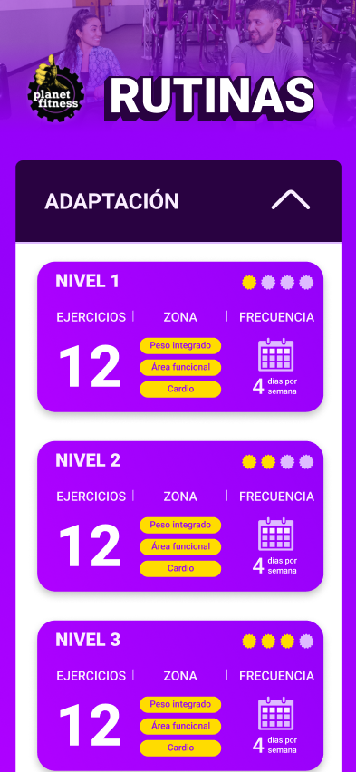

Este diseño parte de la estructura original, incorporando mejoras visuales
alineadas con el look and feel de la marca Planet Fitness, con el objetivo
de reforzar la identidad visual y optimizar la experiencia del usuario.

### Colapsado

Esta nueva versión representa un refinamiento tanto visual como funcional.
Mejora la jerarquía, accesibilidad y claridad sin alterar la estructura principal,
lo que permite una interfaz más intuitiva, atractiva y fácil de navegar para el
usuario final. Además, se incorpora un difuminado sutil entre la imagen y el contenido,
lo cual suaviza la transición entre secciones y aporta una experiencia visual más
amigable y fluida.

### Expandido

Esta nueva versión refuerza la claridad visual, la jerarquía y la
experiencia de navegación. El uso de difuminado, tarjetas más definidas
y botones contrastados no solo embellece la interfaz, sino que también
mejora la comprensión y usabilidad general. Se percibe más profesional,
moderna y amigable para el usuario. En este sentido se agrega una sección
de Frecuencia dando simetria a los titulos de ejercicios y zona.

‼️ **Frecuencia** es opcional el titulo puede ser otro.

### Scoll

Esta nueva versión transmite una interfaz más sólida, limpia y profesional.
Las mejoras en color, distribución y consistencia elevan la percepción general
del diseño, sin necesidad de alterar la estructura base. El resultado es una
interfaz más amigable, clara y atractiva para el usuario final, alineada con
estándares visuales modernos.

