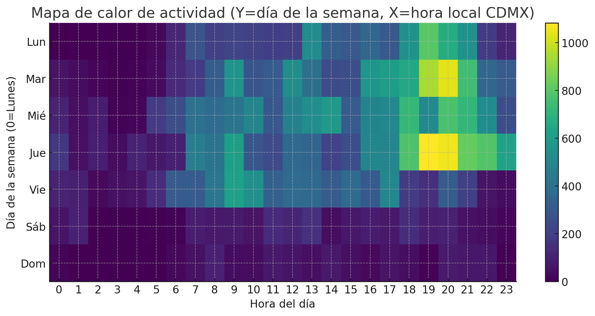
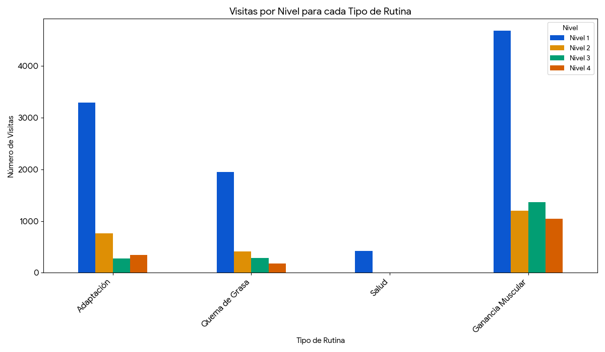
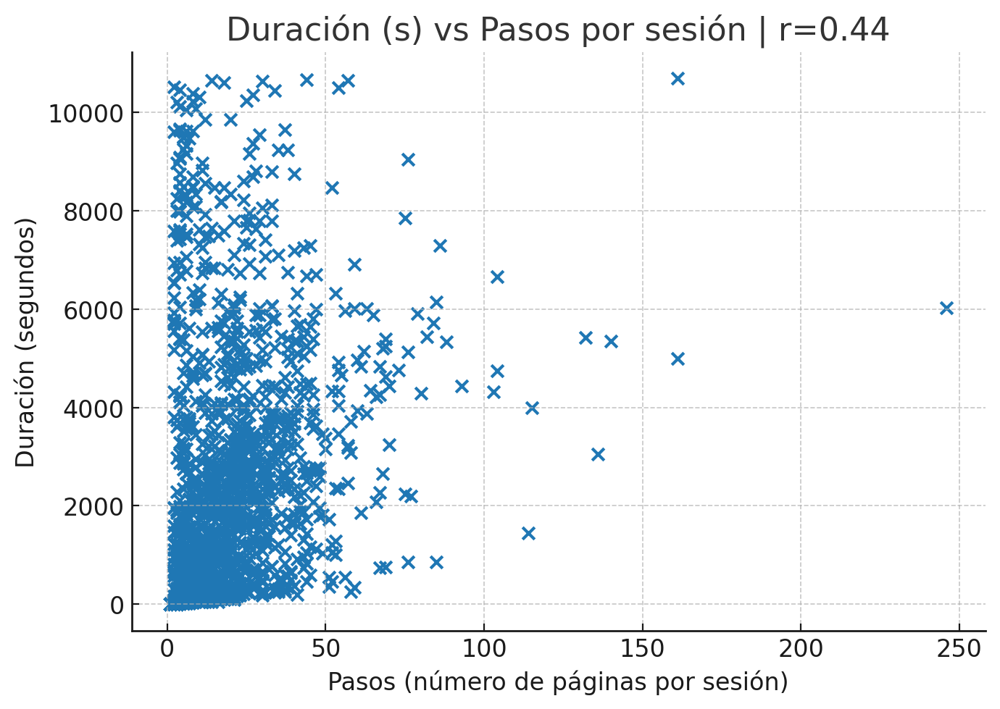

### Inicio del registro: 08 de agosto de 2025
### Final del registro: 15 de agosto de 2025

El conjuto de datos abarca un total de **42,622 de eventos** registrados a travéz de **2,922 sesiones únicas**.

En promedio, las sesiones de los usuarios son bastante activas, con una duración media de **24.37 minutos**
y un promedio de **14.59 páginas** vistas por sesión.

---------

# Trafico y Actividad

La actividad de los usuarios se concentra en dos franjas horarias principales durante el día:

Analicé los momentos de mayor y menor actividad de los usuarios.

* Pico de máxima actividad: La hora con más eventos registrados fue el 2025-08-12 a las 20:00 (hora de CDMX).

* Día más concurrido: El miercoles 13 es el día con mayor número de interacciones.

* Hora más popular: La franja horaria más activa es entre las 19:00 y las 20:00.

---------

# Comportamiento del Usuario y Navegación

El análisis por categorías revela lo siguiente:

La sección de Rutinas es, por mucho, la más popular, acumulando un total de 16,200 visitas.

Esto sugiere que la mayoría de los usuarios que visitan el sitio están interesados principalmente en seguir rutinas de ejercicio estructuradas.
Las secciones de "Discalmer", "Inicio" y "Eejercicio" tienen un número de visitas similar entre ellas.

el Nivel 1 es el más visitado con una gran diferencia, alcanzando 20,590 visitas.
Esto indica que la mayoría de los usuarios son principiantes o prefieren comenzar con el nivel de dificultad más bajo.
La popularidad de los niveles disminuye a medida que aumenta la dificultad.

Se podría poner más esfuerzos en crear más contenido de rutinas de Nivel 1 o en estrategias para motivar a los usuarios a avanzar a los siguientes niveles.

| Página                                                                                            | Visita |
| :---                                                                                              | :---   |
| Inicio                                                                                            | 6205   |
| Rutina Ganancia Muscular - Nivel 1                                                                | 4675   |
| Rutina Adaptación - Nivel 1                                                                       | 3292   |
| Rutina Quema de grasa - Nivel 1                                                                   | 1948   |
| Disclamer Ganancia Muscular - Nivel 1                                                             | 1573   |
| Rutina Ganancia Muscular - Nivel 3                                                                | 1366   |
| Disclamer Adaptación - Nivel 1                                                                    | 1203   |
| Rutina Ganancia Muscular - Nivel 2                                                                | 1196   |
| Rutina Ganancia Muscular - Nivel 4                                                                | 1045   |
| Disclamer Quema de grasa - Nivel 1                                                                | 1038   |
| Envío de Feedback                                                                                 | 868    |
| Rutina Adaptación - Nivel 2                                                                       | 763    |
| Ejercicio Press de hombro - Nivel 1 - Día 1 - Categoría Ganancia muscular                         | 665    |
| Ejercicio Press de hombre - Nivel 1 - Día 1 - Categoría Adaptación                                | 538    |
| Disclamer Ganancia Muscular - Nivel 2                                                             | 465    |
| Disclamer Ganancia Muscular - Nivel 3                                                             | 453    |
| Rutina Salud - Nivel 1                                                                            | 423    |
| Rutina Quema de grasa - Nivel 2                                                                   | 411    |
| Ejercicio Talones alternados al glúteo - Nivel 1 - Día 1 - Categoría Quema de grasa               | 406    |
| Ejercicio Press de Pecho - Nivel 1 - Día 1 - Categoría Ganancia muscular                          | 393    |
| Disclamer Ganancia Muscular - Nivel 4                                                             | 387    |
| Ejercicio Curl de Biceps - Nivel 1 - Día 1 - Categoría Ganancia muscular                          | 363    |
| Rutina Adaptación - Nivel 4                                                                       | 342    |
| Ejercicio Sentadilla TRX - Nivel 1 - Día 3 - Categoría Ganancia muscular                          | 315    |
| Disclamer Adaptación - Nivel 2                                                                    | 308    |
| Ejercicio Remo Sentado - Nivel 1Día 1 - Categoría Ganancia muscular                               | 297    |
| Rutina Quema de grasa - Nivel 3                                                                   | 284    |
| Ejercicio Press de Triceps - Nivel 1 - Día 1 - Categoría Ganancia muscular                        | 280    |
| Ejercicio Press de Pecho - Nivel 1 - Día 1 - Categoría Adaptación                                 | 277    |
| Rutina Adaptación - Nivel 3                                                                       | 276    |
| Ejercicio Curl de Biceps - Nivel 1 - Día 1 - Categoría Adaptación                                 | 265    |
| Ejercicio Abdominal crunch - Nivel 1 - Día 1 - Categoría Ganancia muscular                        | 264    |
| Ejercicio Sentadilla TRX con salto - Nivel 1 - Día 1 - Categoría Adaptación                       | 259    |
| Ejercicio Extensión de cuadriceps - Nivel 1 - Día 3 - Categoría Ganancia muscular                 | 255    |
| Disclamer Salud - Nivel 1                                                                         | 240    |
| Ejercicio Plancha con flexión y extensión de codos - Nivel 1 - Día 1 - Categoría Quema de grasa   | 233    |
| Ejercicio Abdominal crunch - Nivel 1 - Día 1 - Categoría Adaptación                               | 218    |
| Ejercicio Marcha alternada estático - Nivel 1 - Día 1 - Categoría Quema de grasa                  | 193    |
| Ejercicio Saltos rodillas al pecho - Nivel 1 - Día 1 - Categoría Adaptación                       | 191    |
| Disclamer Quema de grasa - Nivel 2                                                                | 188    |
| Ejercicio Curl de Piernas Sentado - Nivel 1 - Día 3 - Categoría Ganancia muscular                 | 187    |
| Rutina Quema de grasa - Nivel 4                                                                   | 179    |
| Ejercicio Extensión de Gemelos - Nivel 1 - Día 3 - Categoría Ganancia muscular                    | 162    |
| Ejercicio Aductor - Nivel 1 - Día 3 - Categoría Ganancia muscular                                 | 157    |
| Disclamer Adaptación - Nivel 4                                                                    | 147    |
| Ejercicio Remo sentado - Nivel 1 - Día 3 - Categoría Adaptación                                   | 147    |
| Disclamer Quema de grasa - Nivel 3                                                                | 137    |
| Ejercicio Abductor - Nivel 1 - Día 3 - Categoría Ganancia muscular                                | 133    |
| Disclamer Adaptación - Nivel 3                                                                    | 131    |

---------

# Tecnología Utilizada

### Navegadores

La tendencia móvil continúa. Mobile Chrome, especialmente la versión 139, es el navegador más popular, seguido de cerca por su versión anterior (138).
Mobile Safari también tiene una presencia muy fuerte, correspondiendo a los usuarios de iOS. Esto confirma que la gran mayoría de tu tráfico proviene de dispositivos móviles.

### Sistemas Operativos

Android 10 es el sistema operativo dominante con una gran ventaja, acumulando más de 27,000 sesiones.
Le siguen las versiones más recientes de iOS (18.5 y 18.6), lo que indica una audiencia principalmente móvil y dividida entre estas dos plataformas.

### Dispositivos comunes

Hay un dispositivo identificado como "K" podría ser un dispositivo oculto que registra la inmensa mayoría de las sesiones (más de 27,000). Justo después, se encuentra el "Apple iPhone".

---------

# Navegación

El análisis revela un "embudo" o ruta de navegación principal que siguen la mayoría de los usuarios. El patrón es el siguiente:

Llegada a la Homepage: La página de inicio es el punto de partida principal.

Selección de un Objetivo (Páginas "Attention"): Desde la Homepage, los usuarios navegan a una página de "atención" para elegir su meta (por ejemplo, Attention: Ganancia Muscular).

Inicio de la Rutina (Páginas "Routine"): Una vez que eligen su objetivo, el siguiente paso es ir directamente a la rutina correspondiente (por ejemplo, Routine: Ganancia Muscular).

Los 5 flujos más comunes confirman este patrón exacto:

Attention: Ganancia Muscular → Routine: Ganancia Muscular (1,249 viajes)

Homepage → Attention: Ganancia Muscular (1,139 viajes)

Attention: Adaptación → Routine: Adaptación (958 viajes)

Homepage → Attention: Adaptación (890 viajes)

Attention: Quema de Grasa → Routine: Quema de Grasa (775 viajes)

El "Ciclo de Entrenamiento"

Una vez que el usuario está en una rutina, vemos un comportamiento muy interesante y positivo: un ciclo entre las páginas de Routine y Exercise. Los datos muestran una cantidad casi idéntica de viajes de ida y vuelta:

De Rutina a Ejercicio: 7 flujos principales con un total de 2,851 viajes.

De Ejercicio a Rutina: 7 flujos principales con un total de 2,680 viajes.

Esto crea un "ciclo de entrenamiento", donde los usuarios consultan la rutina, van a un ejercicio específico y luego regresan a la rutina para continuar. Este es el comportamiento ideal de un usuario comprometido.

Top 15 Flujos de Navegación del Usuario

Conectando Todo

Este análisis de flujos une todo lo que hemos descubierto:

Confirma por qué ciertas páginas son populares: Las páginas más visitadas (como Routine: Ganancia Muscular L1) lo son porque se encuentran en el centro de estas rutas de navegación de alto tráfico.

Contextualiza la tecnología: Ahora sabemos que estas rutas son recorridas principalmente por los usuarios de Android 10 (el misterioso dispositivo "K") y Apple iPhone que identificamos en el análisis anterior.

| De.                                                           | A                                                                | Contador |
| :---                                                          | :---                                                             | :---     |
|   /attention/muscle_gain/?&level=1                            |    /routine/muscle_gain/?level=1                                 |   1249   |
|   /                                                           |    /attention/muscle_gain/?&level=1                              |   1139   |
|   /attention/adaptation/?level=1                              |    /routine/adaptation/?level=1                                  |   958    |
|   /                                                           |    /attention/adaptation/?level=1                                |   890    |
|   /attention/fat_burning/?&level=1                            |    /routine/fat_burning/?level=1                                 |   775    |
|   /                                                           |    /attention/fat_burning/?&level=1                              |   728    |
|   /routine/muscle_gain/?level=1                               |    /exercise/a1b2c3d4/?level=1&day=1&category=muscle_gain        |   634    |
|   /exercise/a1b2c3d4/?level=1&day=1&category=muscle_gain      |    /routine/muscle_gain/?level=1                                 |   582    |
|   /_actions/CreateFeedback/                                   |    /_actions/UpdateCommentFeedback/                              |   539    |
|   /routine/adaptation/?level=1                                |    /exercise/f3b9a1e8/?level=1&day=1&category=adaptation         |   509    |
|   /exercise/f3b9a1e8/?level=1&day=1&category=adaptation       |    /routine/adaptation/?level=1                                  |   469    |
|   /routine/muscle_gain/?level=1                               |    /                                                             |   460    |
|   /routine/fat_burning/?level=1                               |    /exercise/e4f1c9a8/?level=1&day=1&category=fat_burning        |   385    |
|   /routine/muscle_gain/?level=1                               |    /exercise/e5f6g7h8/?level=1&day=1&category=muscle_gain        |   378    |
|   /exercise/e4f1c9a8/?level=1&day=1&category=fat_burning      |    /routine/fat_burning/?level=1                                 |   369    |
|   /exercise/e5f6g7h8/?level=1&day=1&category=muscle_gain      |    /routine/muscle_gain/?level=1                                 |   359    |
|   /attention/muscle_gain/?&level=3                            |    /routine/muscle_gain/?level=3                                 |   357    |
|   /routine/muscle_gain/?level=1                               |    /exercise/i9j1k2l3/?level=1&day=1&category=muscle_gain        |   352    |
|   /attention/muscle_gain/?&level=2                            |    /routine/muscle_gain/?level=2                                 |   349    |
|   /routine/adaptation/?level=1                                |    /                                                             |   338    |
|   /                                                           |    /attention/muscle_gain/?&level=2                              |   336    |
|   /exercise/i9j1k2l3/?level=1&day=1&category=muscle_gain      |    /routine/muscle_gain/?level=1                                 |   333    |
|   /                                                           |    /attention/muscle_gain/?&level=3                              |   333    |
|   /attention/muscle_gain/?&level=4                            |    /routine/muscle_gain/?level=4                                 |   307    |
|   /routine/muscle_gain/?level=1                               |    /exercise/y7z8a9b1/?level=1&day=3&category=muscle_gain        |   303    |
|   /routine/muscle_gain/?level=1                               |    /attention/muscle_gain/?&level=1                              |   302    |
|   /                                                           |    /attention/muscle_gain/?&level=4                              |   292    |
|   /routine/muscle_gain/?level=1                               |    /exercise/q8r9s1t2/?level=1&day=1&category=muscle_gain        |   290    |
|   /exercise/y7z8a9b1/?level=1&day=3&category=muscle_gain      |    /routine/muscle_gain/?level=1                                 |   288    |
|   /exercise/q8r9s1t2/?level=1&day=1&category=muscle_gain      |    /routine/muscle_gain/?level=1                                 |   280    |

## Duración vs pasos por sesión

-------

# Feeback Calificación

## Sede: Saltillo - Santa Isabel

### Estadísticas de Emojis:

| Calificación | Conteo  |
| :---:        | :---    |
| Buena        | 27       |
| Neutral      | 2      |
| Mala         | 0      |
| **Total**    | 29       |

### Total de comentarios:

#### Comentarios:

| Calificación | Comentario   |
| :---:        | :---         |
| Buena        | 
| Buena        | 
| Buena        | 
| Buena        | Excelente! Me ayuda mucho en el aprendizaje del equipo ya que son nuevas en el gym, es muy amplio.
| Buena        | 
| Buena        | 
| Buena        | 
| Neutral      | Porque svoy empezando
| Buena        | 
| Buena        | 
| Buena        | Solo falta poner cuánto reposo entre cada serie
| Buena        | 
| Buena        | Me agrada mucho así puedo venir a cualquier hora
| Buena        | buena
| Buena        | N/A
| Buena        | N/A
| Buena        | Buena
| Buena        | N/A
| Buena        | Prueba de rutinas
| Buena        | N/A
| Buena        | Good
| Neutral      | N/A
| Buena        | N/A
| Buena        | N/A
| Buena        | Muy específico
| Buena        | N/A
| Buena        | N/A
| Buena        | N/A
| Buena        | Muy buenas maquinas, buena atención a clientes y disponibilidad de trainers

-----------

## Sede: CDMX - Acueducto

### Estadísticas de Emojis:

| Calificación | Conteo  |
| :---:        | :---    |
| Buena        | 18       |
| Neutral      | 2      |
| Mala         | 0      |
| **Total**    | 20       |

### Total de comentarios:

#### Comentarios:

| Calificación | Comentario   |
| :---:        | :---         |
| Buena   | Buena |
| Neutral | N/A |
| Buena   |  |
| Buena   |  |
| Buena   | Ya |
| Buena   |  |
| Buena   |  |
| Buena   |  |
| Buena   |  |
| Buena   |  |
| Buena   |  |
| Buena   |  |
| Buena   | Ok |
| Neutral | Cxoxid |
| Buena   | N/A |
| Buena   | N/A |
| Buena   | N/A |
| Buena   | Buena |
| Buena   | Buena |
| Buena   | N/A |

-----------

## Sede: Monterrey - Santa Catarina

### Estadísticas de Emojis:

| Calificación | Conteo  |
| :---:        | :---    |
| Buena        | 4       |
| Neutral      | 1      |
| Mala         | 0      |
| **Total**    | 5       |

### Total de comentarios:

#### Comentarios:

| Calificación | Comentario   |
| :---:        | :---         |
| Buena   | N/A |
| Buena   | Me gusto la instalación |
| Buena   | Buena |
| Neutral | N/A |
| Buena   | N/A |

-----------

## Sede: Guadalajara - Punto Rio Nilo

### Estadísticas de Emojis:

| Calificación | Conteo  |
| :---:        | :---    |
| Buena        | 27       |
| Neutral      | 2      |
| Mala         | 3      |
| **Total**    | 32       |

### Total de comentarios:

#### Comentarios:

| Calificación | Comentario   |
| :---:        | :---         |
| Buena   |    |
| Buena   |    |
| Buena   | Buena   |
| Buena   | Excelente aplicación   |
| Buena   | N/A   |
| Buena   | Super bien   |
| Buena   | Excelente rutina rápida y sencilla   |
| Buena   | Me parece práctico   |
| Mala     |    |
| Buena   | Buena   |
| Buena   | Super práctico   |
| Buena   |    |
| Buena   |    |
| Buena   | Muy práctica   |
| Buena   | Super exelente   |
| Buena   | N/A   |
| Buena   | Excelente aplicación   |
| Buena   | N/A   |
| Buena   | N/A   |
| Buena   | N/A   |
| Neutral | Faltan entrenadores para q te digan si estas haciendo bien el trabajo   |
| Buena   | N/A   |
| Buena   | Excelente   |
| Buena   | Estoy viniendo desde febrero soy una persona de la tercera edad y e podido mejorar todo mi cuerpo pues ya estaba asta usando bastón y hoy en día ya no lo usó   |
| Buena   | Risueña bien   |
| Buena   | N/A   |
| Buena   | Buenas   |
| Mala     | Está horrible   |
| Buena   | N/A   |
| Mala     | Excelente experiencia   |
| Neutral | N/A   |
| Buena   | Muy fácil de usar   |

-----------

## Sede: Veracruz - Center Plazas

### Estadísticas de Emojis:

| Calificación | Conteo  |
| :---:        | :---    |
| Buena        | 22       |
| Neutral      | 4      |
| Mala         | 0      |
| **Total**    | 26       |

### Total de comentarios:

#### Comentarios:

| Calificación | Comentario   |
| :---:        | :---         |
| Buena   | Todo muy bien 👍🏻.   |
| Buena   | .   |
| Buena   | .   |
| Buena   | .   |
| Buena   | .   |
| Buena   | Más amables y empáticos.   |
| Buena   | Excelente.   |
| Buena   | Muy buena pagina.   |
| Buena   | N/A.   |
| Neutral | N/A.   |
| Buena   | N/A.   |
| Buena   | N/A.   |
| Buena   | Bueno.   |
| Buena   | Falta mas apoyo de entrenador.   |
| Buena   | Buena rutina.   |
| Buena   | Muy cool.   |
| Buena   | Na.   |
| Buena   | N/A.   |
| Buena   | Tranquila.   |
| Neutral | No hay instructores que te den una rutina , solo es escaneando el código no tiene chiste.   |
| Buena   | N/A.   |
| Buena   | N/A.   |
| Neutral | Porque están un poco sucios los baños.   |
| Buena   | Buenos ejercicios.   |
| Buena   | N/A.   |
| Neutral | Falta instrucción del coach.   |

-----------

## Sede: San Luis - Glorieta

### Estadísticas de Emojis:

| Calificación | Conteo  |
| :---:        | :---    |
| Buena        | 28       |
| Neutral      | 4      |
| Mala         | 0      |
| **Total**    | 32       |

### Total de comentarios:

#### Comentarios:

| Calificación | Comentario   |
| :---:        | :---         |
| Buena   | N/A
| Buena   |     |
| Buena   | Buena opción    |
| Buena   |     |
| Buena   |     |
| Buena   | Buena    |
| Buena   | N/A    |
| Buena   | N/A    |
| Buena   | N/A    |
| Buena   | N/A    |
| Buena   | Buen equipo    |
| Neutral | Siento que el medidor de multitudes no es tan cierto. Desde mi percepcion Hay mas gente que la que se pone en el marcador    |
| Buena   | .buena    |
| Buena   | N/A    |
| Buena   | Chido    |
| Buena   | Muy buena    |
| Buena   | Muy bien todo    |
| Neutral | Los entrenadores no siempre quieren ayudarte a ver cómo se usan las máquinas (en la mañana). En la tarde, damos gracias a Jessie por su disponibilidad y apoyo.    |
| Neutral | N/A    |
| Buena   | Bien    |
| Buena   | CanMalaa pero bien    |
| Buena   | N/A    |
| Buena   | Muy buena    |
| Buena   | Muy buena experiencia    |
| Buena   | N/A    |
| Buena   | Buena    |
| Buena   | N/A    |
| Buena   | Gracias    |
| Buena   | Buena    |
| Buena   | Buena    |
| Buena   | Muy buena    |
| Neutral | Aún falta agregar más aparatos a las rutinas    |

-----------

## Sede: CDMX - Cumbres 1188

### Estadísticas de Emojis:

| Calificación | Conteo  |
| :---:        | :---    |
| Buena        | 14       |
| Neutral      | 2      |
| Mala         | 1      |
| **Total**    | 17       |

### Total de comentarios:

#### Comentarios:

| Calificación | Comentario   |
| :---:        | :---         |
| Buena   |     |
| Buena   | N/A    |
| Buena   | N/A    |
| Buena   | Excelente    |
| Buena   | ME gusta el video    |
| Buena   | N/A    |
| Mala     | N/A    |
| Buena   | By TV    |
| Buena   | Apenas voy a iniciar    |
| Buena   | Excelente servicio e instalaciones    |
| Buena   | N/A    |
| Buena   | El lugar me parece bueno funcional para mis requerimientos diarios de ejercicio    |
| Neutral | N/A    |
| Buena   | Excelente    |
| Buena   | Perfecta    |
| Buena   | N/A    |
| Neutral | Hhh    |

-----------

## Sede: Leon - Lindavista

### Estadísticas de Emojis:

| Calificación | Conteo  |
| :---:        | :---    |
| Buena        | 10       |
| Neutral      | 1      |
| Mala         | 0      |
| **Total**    | 11       |

### Total de comentarios:

#### Comentarios:

| Calificación | Comentario   |
| :---:        | :---         |
| Buena   | Excelente la app y el apoyo deo entrenador cristofer de linda vista.   |
| Buena   | Todo.   |
| Buena   | N/A.   |
| Buena   | Buena.   |
| Buena   | Buena.   |
| Buena   | Muy buena.   |
| Buena   | Buena.   |
| Buena   | N/A.   |
| Neutral | Me tebuelvo.   |
| Buena   | N/A.   |
| Buena   | Buena.   |

-----------

## Sede: Edo de Mex - Centro Las Americas

### Estadísticas de Emojis:

| Calificación | Conteo  |
| :---:        | :---    |
| Buena        | 25       |
| Neutral      | 1      |
| Mala         | 3      |
| **Total**    | 29       |

### Total de comentarios:

#### Comentarios:

| Calificación | Comentario   |
| :---:        | :---         |
| Buena   | N/A.   |
| Buena   | Me gustan los videos.   |
| Neutral | N/A.   |
| Buena   | .   |
| Buena   | .   |
| Buena   | N/A.   |
| Neutral | .   |
| Buena   | .   |
| Buena   | N/A.   |
| Buena   | N/A.   |
| Buena   | N/A.   |
| Buena   | Muy bueno.   |
| Buena   | todo bn.   |
| Buena   | N/A.   |
| Neutral | Algunos videos no se pueden visualizar.   [ALERT]| 
| Buena   | N/A.   |
| Buena   | N/A.   |
| Neutral | N/A.   |
| Buena   | Excelente.   |
| Buena   | N/A.   |
| Buena   | Completa y fácil de entender..   |
| Buena   | Hasta este momento bueno.   |
| Buena   | Muy.   |
| Buena   | N/A.   |
| Buena   | N/A.   |
| Buena   | So far so good, I have three days. [IMPORTANT]  |
| Buena   | N/A.   |
| Buena   | Todo bien.   |
| Buena   | Buena.   |

-----------

## Sede: Puebla - Serviplaza Villa Verde

### Estadísticas de Emojis:

| Calificación | Conteo  |
| :---:        | :---    |
| Buena        | 23       |
| Neutral      | 1      |
| Mala         | 2      |
| **Total**    | 26       |

### Total de comentarios:

#### Comentarios:

| Calificación | Comentario   |
| :---:        | :---         |
| Buena   |     |
| Buena   |     |
| Buena   |     |
| Mala     |     |
| Buena   |     |
| Buena   | Hoy cambie la aplicación y me gizto    |
| Buena   | N/A    |
| Buena   | N/A    |
| Buena   | N/A    |
| Buena   | N/A    |
| Buena   | N/A    |
| Buena   | N/A    |
| Buena   | Todo está excelentes    |
| Buena   | Jajaja    |
| Buena   | N/A    |
| Buena   | Sientes que el músculo está trabajando    |
| Buena   | N/A    |
| Buena   | Excelente app    |
| Buena   | N/A    |
| Neutral | N/A    |
| Buena   | Muy buena y fácil de entender    |
| Buena   | Excelente    |
| Mala     | N/A    |
| Buena   | N/A    |
| Buena   | N/A    |
| Buena   | N/A    |

-----------

## Sede: Mazatlan - Gran Plaza Mazatlan

### Estadísticas de Emojis:

| Calificación | Conteo  |
| :---:        | :---    |
| Buena        | 17       |
| Neutral      | 4      |
| Mala         | 1      |
| **Total**    | 22       |

### Total de comentarios:

#### Comentarios:

| Calificación | Comentario   |
| :---:        | :---         |
| Neutral |   |
| Buena   |   |
| Buena   | N/A  |
| Buena   | N/A  |
| Buena   |   |
| Mala     | N/A  |
| Buena   | Hola  |
| Neutral | soso  |
| Buena   | N/A  |
| Buena   | Muy útil los qr  |
| Buena   | Buena  |
| Buena   | N/A  |
| Neutral | N/A  |
| Buena   | N/A  |
| Neutral | Bueno  |
| Buena   | Muy bien  |
| Buena   | Hola  |
| Buena   | Bien  |
| Buena   | N/A  |
| Buena   | Muy buena  |
| Buena   | N/A  |
| Buena   | N/A  |

-----------

## Sede: Edo de Mex - Valle Dorado

### Estadísticas de Emojis:

| Calificación | Conteo  |
| :---:        | :---    |
| Buena        | 26       |
| Neutral      | 0      |
| Mala         | 2      |
| **Total**    | 28       |

### Total de comentarios:

#### Comentarios:

| Calificación | Comentario   |
| :---:        | :---         |
| Buena |     |
| Buena |     |
| Buena |     |
| Buena |     |
| Buena | Exelente    |
| Buena |     |
| Buena |     |
| Buena |     |
| Buena |     |
| Buena | A sido muy buena    |
| Buena | N/A    |
| Buena | Buena    |
| Buena | Deli    |
| Buena | Lol    |
| Buena | De    |
| Buena | N/A    |
| Buena | Muy buena    |
| Buena | muy bueno    |
| Buena | Ta chido    |
| Buena | Está mejor explicado.    |
| Buena | N/A    |
| Mala   | N/A    |
| Buena | Buena    |
| Buena | N/A    |
| Buena | Ok    |
| Mala   | N/A    |
| Buena | N/A    |
| Buena | Atención muy buena    |

-----------

## Sede: Puebla - Angelópolis

### Estadísticas de Emojis:

| Calificación | Conteo  |
| :---:        | :---    |
| Buena        | 15       |
| Neutral      | 1      |
| Mala         | 3      |
| **Total**    | 19       |

### Total de comentarios:

#### Comentarios:

| Calificación | Comentario   |
| :---:        | :---         |
| Mala     |  |
| Mala     | Dont mexican [IMPORTANT] |
| Buena   |  |
| Buena   | N/A |
| Buena   |  |
| Buena   | Está bien si es una gran ayuda |
| Buena   |  |
| Buena   |  |
| Buena   | N/A |
| Buena   | N/A |
| Buena   | N/A |
| Buena   | Buena experiencia |
| Buena   | Ggg |
| Mala     | N/A |
| Neutral | Es mi primer dia |
| Buena   | BASTANTE FUNCIONAL |
| Buena   | N/A |
| Buena   | N/A |
| Buena   | Muy buena la experiencia |

-----------

## Sede: Monterrey - La Estanzuela

### Estadísticas de Emojis:

| Calificación | Conteo  |
| :---:        | :---    |
| Buena        | 8       |
| Neutral      | 1      |
| Mala         | 0      |
| **Total**    | 9       |

### Total de comentarios:

#### Comentarios:

| Calificación | Comentario   |
| :---:        | :---         |
| Buena   |     |
| Buena   | Muy buena, solo deberían poner tiempos de descanso    |
| Neutral | Siguen siendo los mismos ejercicios de siempre    |
| Buena   | Xx    |
| Buena   | Excelente    |
| Buena   | Fee    |
| Buena   | Buen entrena    |
| Buena   | Dd    |
| Buena   | Ggh    |

-----------

## Sede: Queretaro - Cimatario

### Estadísticas de Emojis:

| Calificación | Conteo  |
| :---:        | :---    |
| Buena        | 30       |
| Neutral      | 0      |
| Mala         | 1      |
| **Total**    | 31       |

### Total de comentarios:

#### Comentarios:

| Calificación | Comentario   |
| :---:        | :---         |
| Buena | N/A.   |
| Buena | .   |
| Buena | .   |
| Buena | .   |
| Buena | .   |
| Buena | .   |
| Buena | Han sido amable en todas las unidades y me explican sin detalle.   |
| Buena | .   |
| Buena | Me gusta que todo es muy libre.   |
| Buena | Me encanta!.   |
| Buena | Me encanta la experiencia es muy intuitiva..   |
| Buena | N/A.   |
| Buena | .   |
| Buena | N/A.   |
| Buena | N/A.   |
| Buena | Vueno.   |
| Buena | Bien.   |
| Buena | Bien.   |
| Buena | N/A.   |
| Buena | N/A.   |
| Buena | Me incomoda que la gente se haga "lenta" en los aparatos de ejercicio, "haciendo tiempo para descansar" Solo ven sus redes calientan el lugar y no permiten que uno lo ocupe. Si pudieran estar al pendiente de ello..   |
| Buena | Buenas rutinas.   |
| Buena | N/A.   |
| Buena | N/A.   |
| Buena | Muy bien atención personalizada Gracias.   |
| Buena | Todo bien gracias la entrenadora Mary Carmen muy linda y atenta, cuidando que haga bien los ejercicios. Gracias.   |
| Buena | N/A.   |
| Buena | Bien.   |
| Mala   | N/A.   |
| Buena | Súper!!.   |
| Buena | Todo bien.   |

-----------

## Sede: CDMX - Paseo Acoxpa

### Estadísticas de Emojis:

| Calificación | Conteo  |
| :---:        | :---    |
| Buena        | 5       |
| Neutral      | 0      |
| Mala         | 0      |
| **Total**    | 5       |

### Total de comentarios:

#### Comentarios:

| Calificación | Comentario   |
| :---:        | :---         |
| Buena | N/A.  |
| Buena | Todo bien.  |
| Buena | Todo bien.  |
| Buena | Buen ejercicio.  |
| Buena | N/A.  |

-----------

## Sede: Leon - Punto León

### Estadísticas de Emojis:

| Calificación | Conteo  |
| :---:        | :---    |
| Buena        | 15       |
| Neutral      | 0      |
| Mala         | 0      |
| **Total**    | 15       |

### Total de comentarios:

#### Comentarios:

| Calificación | Comentario   |
| :---:        | :---         |
| Buena |     |
| Buena |     |
| Buena | N/A    |
| Buena | Me gusta    |
| Buena | Bien ojalá y suban los entrenamientos a la app    |
| Buena | Mi segunda semana y mi buen    |
| Buena | N/A    |
| Buena | N/A    |
| Buena | N/A    |
| Buena | Bien    |
| Buena | N/A    |
| Buena | N/A    |
| Buena | Excelente    |
| Buena | Ok    |
| Buena | Buen servicio    |

-----------

## Sede: Edo de Mex - Coacalco

### Estadísticas de Emojis:

| Calificación | Conteo  |
| :---:        | :---    |
| Buena        | 13       |
| Neutral      | 2      |
| Mala         | 1      |
| **Total**    | 16       |

### Total de comentarios:

#### Comentarios:

| Calificación | Comentario   |
| :---:        | :---         |
| Buena   |    |
| Neutral | N/A   |
| Buena   |    |
| Buena   | N/A   |
| Buena   |    |
| Buena   | Me encanta muy explicada y con imágenes visuales   |
| Buena   | Buena   |
| Buena   | N/A   |
| Neutral | N/A   |
| Buena   | Todo ok   |
| Buena   | N/A   |
| Mala     | N/A   |
| Buena   | Todo esta muy bien   |
| Buena   | Todo es muy limpio y cómodo   |
| Buena   | Buen cambio al plan de rutinas   |
| Buena   | Muy bien   |

-----------

## Sede: Edo de Mex - San Marcos

### Estadísticas de Emojis:

| Calificación | Conteo  |
| :---:        | :---    |
| Buena        | 24       |
| Neutral      | 2      |
| Mala         | 1      |
| **Total**    | 27       |

### Total de comentarios:

#### Comentarios:

| Calificación | Comentario   |
| :---:        | :---         |
| Buena   | Bien.   |
| Buena   | N/A.   |
| Neutral | .   |
| Buena   | N/A.   |
| Buena   | .   |
| Buena   | N/A.   |
| Mala     | N/A.   |
| Buena   | Muy buena aplicación.   |
| Buena   | bueno.   |
| Neutral | N/A.   |
| Buena   | Muy buena la aplicación.   |
| Buena   | Excelente para principiantes.   |
| Buena   | falta entrenador.   |
| Buena   | Buena.   |
| Buena   | N/A.   |
| Buena   | Exelente.   |
| Buena   | N/A.   |
| Buena   | N/A.   |
| Buena   | Buena.   |
| Buena   | N/A.   |
| Buena   | Buena..   |
| Buena   | Buena atención.   |
| Buena   | N/A.   |
| Buena   | .buena.   |
| Buena   | Excelente aplicación, la asesoría de Gaby muy buena.   |
| Buena   | bien.   |
| Buena   | N/A.   |

-----------

## Sede: Queretaro - Antea

### Estadísticas de Emojis:

| Calificación | Conteo  |
| :---:        | :---    |
| Buena        | 33       |
| Neutral      | 3      |
| Mala         | 0      |
| **Total**    | 36       |

### Total de comentarios:

#### Comentarios:

| Calificación | Comentario   |
| :---:        | :---         |
| Buena   |     |
| Buena   |     |
| Buena   |     |
| Buena   |     |
| Buena   |     |
| Buena   |     |
| Buena   |     |
| Buena   |     |
| Buena   |     |
| Buena   | Me encanta    |
| Buena   |     |
| Neutral |     |
| Buena   | Bonita aplicación    |
| Buena   | Muy buena, de inicio le estoy metiendo poco peso, pero sentí el trabajo en el músculo.    |
| Buena   | Yhaba    |
| Buena   | Gracias    |
| Buena   | N/A    |
| Buena   | N/A    |
| Buena   | N/A    |
| Buena   | N/A    |
| Buena   | Bien    |
| Buena   | N/A    |
| Buena   | Muy bien todo    |
| Buena   | De momento todo va bien    |
| Neutral | Jj    |
| Buena   | Me gustan las rutinas con los ejercicios ejemplificados    |
| Neutral | N/A    |
| Buena   | Gracias    |
| Buena   | Bien    |
| Buena   | N/A    |
| Buena   | N/A    |
| Buena   | Buena    |
| Buena   | Super    |
| Buena   | N/A    |
| Buena   | N/A    |
| Buena   | N/A    |

-----------

## Sede: San Luis - The Park

### Estadísticas de Emojis:

| Calificación | Conteo  |
| :---:        | :---    |
| Buena        | 14       |
| Neutral      | 4      |
| Mala         | 2      |
| **Total**    | 20       |

### Total de comentarios:

#### Comentarios:

| Calificación | Comentario   |
| :---:        | :---         |
| Buena   |     |
| Neutral |     |
| Buena   |     |
| Buena   |     |
| Mala     |     |
| Buena   |     |
| Buena   | Todo bien    |
| Buena   | N/A    |
| Buena   |     |
| Mala     | N/A    |
| Buena   | N/A    |
| Buena   | Todo bien    |
| Buena   | N/A    |
| Buena   | Es buena hasta ahorita    |
| Neutral | Pocas maquinas    |
| Buena   | Todo bien    |
| Buena   | Excelente    |
| Neutral | No le entiendo a los ejercicios    |
| Buena   | Ok    |
| Neutral | Ok    |

-----------

## Sede: Veracruz - Andamar

### Estadísticas de Emojis:

| Calificación | Conteo  |
| :---:        | :---    |
| Buena        | 13       |
| Neutral      | 0      |
| Mala         | 2      |
| **Total**    | 15       |

### Total de comentarios:

#### Comentarios:

| Calificación | Comentario   |
| :---:        | :---         |
| Buena | Esta nueva versión está muchísimo mejor que la anterior, ya que los nuevos chicos que van entrando y no tienen conocimiento no saben qué hacer y con esta versión ya se puede ver hasta en qué aparato podemos entrenar correctamente.   |
| Buena | Estoy en la clase con la entrenadora Paloma y estoy muy contenta con las rutinas..   |
| Buena | Me ayudan con mis dudas de los ejerció s.   |
| Mala   | Por error de dedo se puso esa carita. Me parece una buena aplicación de apoyo principalmente para los principiantes. Gracias por pensar en nuestra salud. Aprovecho para comentar que he recibido aquí en sucursal andamar muy buena asesoría en rutinas por parte de los couch Paloma y Joe..   |
| Buena | .   |
| Buena | Bien.   |
| Buena | .   |
| Buena | N/A.   |
| Buena | N/A.   |
| Buena | N/A.   |
| Buena | N/A.   |
| Buena | N/A.   |
| Buena | Está excelente esta aplicación , más claro mejor ilustrado y sin perder tiempo..   |
| Mala   | Nsnzs.   |
| Buena | La verdad es una M buena opción para hacer los ejercicios, de manera práctica y sencilla muy bien ilustrados los videos y los tiempos, el objetivo que sencilla busca sin perder tiempo Gracias.   |

-----------

## Sede: Edo de Mex - Satelite

### Estadísticas de Emojis:

| Calificación | Conteo  |
| :---:        | :---    |
| Buena        | 9       |
| Neutral      | 0      |
| Mala         | 1      |
| **Total**    | 10       |

### Total de comentarios:

#### Comentarios:

| Calificación | Comentario   |
| :---:        | :---         |
| Buena | N/A.   |
| Buena | N/A.   |
| Buena | N/A.   |
| Buena | Bien.   |
| Buena | N/A.   |
| Buena | N/A.   |
| Buena | Muy bien.   |
| Buena | N/A.   |
| Mala   | No muy buena.   |
| Buena | N/A.   |

-----------

## Sede: CDMX - Mixcoac

### Estadísticas de Emojis:

| Calificación | Conteo  |
| :---:        | :---    |
| Buena        | 11       |
| Neutral      | 1      |
| Mala         | 1      |
| **Total**    | 13       |

### Total de comentarios:

#### Comentarios:

| Calificación | Comentario   |
| :---:        | :---         |
| Buena   |    |
| Buena   | Se está aprovechando adecuadamente   |
| Buena   | Gracias   |
| Buena   | N/A   |
| Buena   | N/A   |
| Buena   | N/A   |
| Buena   | Buena en todo mas específica   |
| Mala     | N/A   |
| Buena   | Buen   |
| Buena   | Me gusta   |
| Buena   | N/A   |
| Buena   | N/A   |
| Neutral | N/A   |

-----------

## Sede: Cuernavaca - Galerías Cuernavaca

### Estadísticas de Emojis:

| Calificación | Conteo  |
| :---:        | :---    |
| Buena        | 12       |
| Neutral      | 0      |
| Mala         | 1      |
| **Total**    | 13       |

### Total de comentarios:

#### Comentarios:

| Calificación | Comentario   |
| :---:        | :---         |
| Buena | N/A.    |
| Mala   | N/A.    |
| Buena | Todo bien.    |
| Buena | N/A.    |
| Buena | Gracias por actualizar.    |
| Buena | Gracias.    |
| Buena | N/A.    |
| Buena | N/A.    |
| Buena | buenas persona.    |
| Buena | Muy buena.    |
| Buena | Bien.    |
| Buena | Si.    |
| Buena | Bueno.    |

-----------

## Sede: Edo de Mex - TolLocan

### Estadísticas de Emojis:

| Calificación | Conteo  |
| :---:        | :---    |
| Buena        | 13       |
| Neutral      | 3      |
| Mala         | 0      |
| **Total**    | 16       |

### Total de comentarios:

#### Comentarios:

| Calificación | Comentario   |
| :---:        | :---         |
| Neutral | N/A.   |
| Buena   | .   |
| Buena   | Excelente servicio.   |
| Buena   | Gracias.   |
| Buena   | N/A.   |
| Neutral | N/A.   |
| Buena   | Apenas la estoy iniciando a utilizar.   |
| Buena   | N/A.   |
| Buena   | N/A.   |
| Buena   | Bonito gym.   |
| Buena   | N/A.   |
| Buena   | N/A.   |
| Buena   | Ok.   |
| Buena   | Excelente servicio.   |
| Neutral | N/A.   |
| Buena   | N/A.   |

-----------

## Sede: VER - Jardines Xalapa

### Estadísticas de Emojis:

| Calificación | Conteo  |
| :---:        | :---    |
| Buena        | 1       |
| Neutral      | 0      |
| Mala         | 1      |
| **Total**    | 2       |

### Total de comentarios:

#### Comentarios:

| Calificación | Comentario   |
| :---:        | :---         |
| Buena | Perfectamente explicados los ejercicios.  |
| Mala   | No puedo ver el video.  |

-----------

## Sede: CDMX - Tlatelolco

### Estadísticas de Emojis:

| Calificación | Conteo  |
| :---:        | :---    |
| Buena        | 18       |
| Neutral      | 1      |
| Mala         | 2      |
| **Total**    | 21       |

### Total de comentarios:

#### Comentarios:

| Calificación | Comentario   |
| :---:        | :---         |
| Buena   | .      |
| Buena   | Cg      |
| Neutral | N/A      |
| Buena   | Xnjf      |
| Buena   | N/A      |
| Buena   | Me gustó mucho !      |
| Buena   | Bien      |
| Buena   | N/A      |
| Buena   | Excelente está información y poner en práctica .      |
| Buena   | Bien      |
| Buena   | N/A      |
| Buena   | Bien      |
| Buena   | N/A      |
| Buena   | Me parece muy bien este entrenamiento para empezar.      |
| Buena   | N/A      |
| Mala     | N/A      |
| Buena   | Me hacía falta      |
| Mala     | N/A      |
| Buena   | N/A      |
| Buena   | N/A      |
| Buena   | Muy buena      |

-----------

## Sede: Queretaro - Candiles

### Estadísticas de Emojis:

| Calificación | Conteo  |
| :---:        | :---    |
| Buena        | 16       |
| Neutral      | 2      |
| Mala         | 0      |
| **Total**    | 18       |

### Total de comentarios:

#### Comentarios:

| Calificación | Comentario   |
| :---:        | :---         |
| Buena   |     |
| Buena   |     |
| Buena   |     |
| Neutral |     |
| Neutral | Me gustaria que si es la primera vez o las primeras veces estuviera mas al pendiente.    |
| Buena   | N/A    |
| Buena   | N/A    |
| Buena   | Fortalecida    |
| Buena   | Muy buen gimnasio    |
| Buena   | N/A    |
| Buena   | Apenas estoy empezando    |
| Buena   | Todo bien    |
| Buena   | N/A    |
| Buena   | Sería bueno que lograra explicar cómo posicionar los aparatos    |
| Buena   | N/A    |
| Buena   | Si    |
| Buena   | Buena    |
| Buena   | Excelente    |

-----------

## Sede: Puebla - Torrecillas

### Estadísticas de Emojis:

| Calificación | Conteo  |
| :---:        | :---    |
| Buena        | 33       |
| Neutral      | 6      |
| Mala         | 1      |
| **Total**    | 40       |

### Total de comentarios:

#### Comentarios:

| Calificación | Comentario   |
| :---:        | :---         |
| Buena   |     |
| Neutral |     |
| Buena   | Muy bien    |
| Buena   |     |
| Buena   | N/A    |
| Mala     | N/A    |
| Buena   |     |
| Neutral |     |
| Buena   |     |
| Buena   |     |
| Buena   | N/A    |
| Buena   |     |
| Buena   | Muy util    |
| Buena   | Bueno    |
| Buena   | Excelente    |
| Neutral | Films    |
| Neutral | La gente acapara las máquinas mucho tiempo    |
| Buena   | Bien    |
| Buena   | N/A    |
| Neutral | N/A    |
| Buena   | Muy util    |
| Buena   | N/A    |
| Buena   | Ok    |
| Buena   | N/A    |
| Buena   | Muy amable    |
| Buena   | Buen lugar    |
| Buena   | Bien    |
| Buena   | N/A    |
| Buena   | Buen servicio    |
| Buena   | Buena    |
| Buena   | N/A    |
| Buena   | N/A    |
| Buena   | Entendible    |
| Buena   | Muy entendible    |
| Buena   | N/A    |
| Buena   | N/A    |
| Neutral | N/A    |
| Buena   | Buena, pero quisiera más variedad de ejercicios    |
| Buena   | Excelente    |
| Buena   | Excelente    |

-----------

## Sede: Veracruz - Los Pinos

### Estadísticas de Emojis:

| Calificación | Conteo  |
| :---:        | :---    |
| Buena        | 63       |
| Neutral      | 8      |
| Mala         | 2      |
| **Total**    | 73       |

### Total de comentarios:

#### Comentarios:

| Calificación | Comentario   |
| :---:        | :---         |
| Buena   | N/A.     |
| Buena   | .     |
| Neutral | N/A.     |
| Buena   | .     |
| Buena   | .     |
| Buena   | .     |
| Buena   | .     |
| Buena   | .     |
| Buena   | .     |
| Buena   | N/A.     |
| Neutral | .     |
| Buena   | .     |
| Buena   | .     |
| Neutral | .     |
| Buena   | Hasta ahirs bien.     |
| Buena   | .     |
| Buena   | Exelente.     |
| Neutral | .     |
| Buena   | .     |
| Buena   | .     |
| Buena   | .     |
| Buena   | .     |
| Buena   | .     |
| Buena   | N/A.     |
| Buena   | .     |
| Buena   | .     |
| Mala     | N/A.     |
| Buena   | Muy satisfecha.     |
| Buena   | N/A.     |
| Buena   | Pues muy ilustrativo.     |
| Buena   | N/A.     |
| Buena   | N/A.     |
| Buena   | Excelente.     |
| Neutral | Creo que debería haber una alarma para quienes pierden tiempo en el celular, como tal si todos fuéramos disciplinadanados en nuestro tiempo en el gimnasio ayudariamos con la saturación de equipos y del espacio.     |
| Buena   | N/A.     |
| Buena   | Dudj.     |
| Buena   | N/A.     |
| Buena   | Mucho mejor.     |
| Buena   | N/A.     |
| Buena   | N/A.     |
| Buena   | N/A.     |
| Buena   | N/A.     |
| Buena   | Muy buena.     |
| Buena   | N/A.     |
| Buena   | Buena.     |
| Buena   | Muy buena rutina.     |
| Buena   | Excelente y más por que recibo indicaciones de la entrenadora.     |
| Neutral | N/A.     |
| Buena   | N/A.     |
| Buena   | N/A.     |
| Buena   | N/A.     |
| Neutral | Se traban la página.     |
| Buena   | N/A.     |
| Buena   | Es mi primer día y el ambiente es bueno.     |
| Buena   | Muy buena.     |
| Buena   | N/A.     |
| Buena   | N/A.     |
| Buena   | N/A.     |
| Buena   | Excelente.     |
| Buena   | Excelente.     |
| Buena   | Excelente servicio.     |
| Buena   | N/A.     |
| Buena   | N/A.     |
| Buena   | fácil uso.     |
| Buena   | N/A.     |
| Mala     | N/A.     |
| Buena   | Mmm.     |
| Neutral | Hahs.     |
| Buena   | N/A.     |
| Buena   | N/A.     |
| Buena   | Excelente.     |
| Buena   | Me está gustando mucho gracias.     |
| Buena   | N/A.     |

-----------

## Sede: Monterrey - Arcadia

### Estadísticas de Emojis:

| Calificación | Conteo  |
| :---:        | :---    |
| Buena        | 9       |
| Neutral      | 2      |
| Mala         | 1      |
| **Total**    | 12       |

### Total de comentarios:

#### Comentarios:

| Calificación | Comentario   |
| :---:        | :---         |
| Buena   |     |
| Buena   |     |
| Buena   |     |
| Buena   |     |
| Neutral | N/A    |
| Buena   | Bien    |
| Buena   | N/A    |
| Buena   | Si    |
| Neutral | No    |
| Buena   | N/A    |
| Buena   | N/A    |
| Mala     | N/A    |

-----------

## Sede: Puebla - La Paz Puebla

### Estadísticas de Emojis:

| Calificación | Conteo  |
| :---:        | :---    |
| Buena        | 5       |
| Neutral      | 2      |
| Mala         | 0      |
| **Total**    | 7       |

### Total de comentarios:

#### Comentarios:

| Calificación | Comentario   |
| :---:        | :---         |
  emoji  | comment  
---------+----------
| Neutral | N/A.   |
| Neutral | N/A.   |
| Buena   | N/A.   |
| Buena   | Shdo.   |
| Buena   | N/A.   |
| Buena   | N/A.   |
| Buena   | Muy bien.   |

-----------

## Sede: CDMX - Encuentro Oceania

### Estadísticas de Emojis:

| Calificación | Conteo  |
| :---:        | :---    |
| Buena        | 3       |
| Neutral      | 0      |
| Mala         | 2      |
| **Total**    | 5       |

### Total de comentarios:

#### Comentarios:

| Calificación | Comentario   |
| :---:        | :---         |
| Mala   | N/A.   |
| Mala   | Aparatos anticuados, les falta variedad de aparatos, app muy básica, falta de instructores, rutinas no personalizadas,.   |
| Buena | Muy bien prefiero estas rutinas para no tener que estar dependiendo de los entrenadores, solo en dudas específicas. Lo único es que deberían de integrarlo a la app sin tener que escanearlos.   |
| Buena | N/A.   |
| Buena | N/A.   |

-----------

## Sede: Guadalajara - Plaza Del Angel

### Estadísticas de Emojis:

| Calificación | Conteo  |
| :---:        | :---    |
| Buena        | 16       |
| Neutral      | 7      |
| Mala         | 0      |
| **Total**    | 23       |

### Total de comentarios:

#### Comentarios:

| Calificación | Comentario   |
| :---:        | :---         |
| Buena   |         |
| Neutral | Ok        |
| Buena   | 👍        |
| Buena   |         |
| Buena   |         |
| Buena   | N/A        |
| Neutral | N/A        |
| Buena   | Todo bien estaría bien que le colcarán números a los equipos para encontrar más rápido        |
| Neutral | N/A        |
| Neutral | N/A        |
| Buena   | N/A        |
| Buena   | Esta super bien esta nueva presentación muy buen trabajo        |
| Neutral | Ya        |
| Buena   | N/A        |
| Buena   | N/A        |
| Neutral | N/A        |
| Neutral | N/A        |
| Buena   | N/A        |
| Buena   | Todo bien les falta espacios para hacer ejercicios sin equipo su aplicación se traba al Pesir opinión        |
| Buena   | Buena        |
| Buena   | N/A        |
| Buena   | Excelente trato del personal, equipo moderno y en perfectas condiciones        |
| Buena   | N/A        |

-----------

## Sede: Monterrey - El Molino

### Estadísticas de Emojis:

| Calificación | Conteo  |
| :---:        | :---    |
| Buena        | 5       |
| Neutral      | 0      |
| Mala         | 1      |
| **Total**    | 6       |

### Total de comentarios:

#### Comentarios:

| Calificación | Comentario   |
| :---:        | :---         |
| Buena | N/A.   |
| Buena | .   |
| Mala   | N/A.   |
| Buena | N/A.   |
| Buena | N/A.   |
| Buena | N/A.   |

-----------

