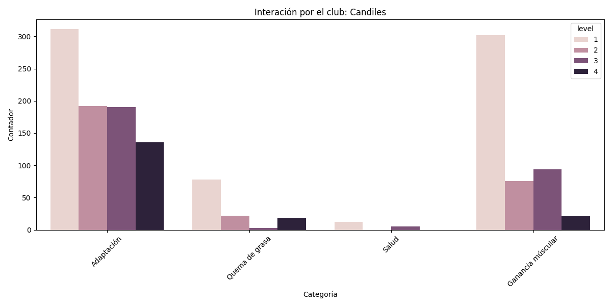
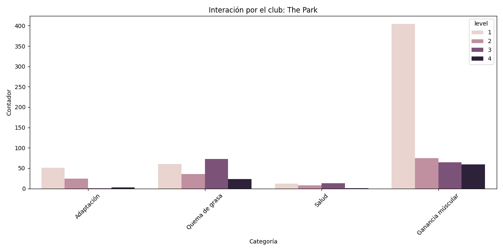

### Inicio del registro: 15 de agosto de 2025
### Final del registro: 31 de agosto de 2025

El conjuto de datos abarca un total de **132,022 de eventos** registrados a travéz de **8,355 sesiones únicas**.

En promedio, las sesiones de los usuarios son bastante activas, con una duración media de **33.96 minutos**
y un promedio de **15.80 páginas** vistas por sesión.

---------

# Trafico y Actividad

La actividad de los usuarios se concentra en dos franjas horarias principales durante el día:

Analicé los momentos de mayor y menor actividad de los usuarios.

* Pico de máxima actividad: La hora con más eventos registrados fue el 2025-08-18 a las 20:00 (hora de CDMX), con 1,587 interacciones.

* Día más concurrido: El martes 26 de agosto es el día con mayor número de interacciones con un total de 13,164.

* Hora más popular: La franja horaria más activa es entre las 18:00 y las 20:00.

---------

# Comportamiento del Usuario y Navegación

Análisis de Interacción y Preferencias de Usuario

Los datos de visitas revelan patrones de comportamiento muy claros sobre cómo los usuarios
interactúan con esta plataforma de Rutinas de Planet Fitness.

El análisis se centra en cuatro áreas clave: las metas principales de los usuarios, su nivel de experiencia, el tipo de contenido que consumen y cómo navegan a través del sitio.

1. El Objetivo Dominante: La Ganancia Muscular

  El interés principal de los usuarios que visitan la plataforma es, con una diferencia abrumadora, la ganancia muscular.
  Las páginas de rutinas (/routine/) para este objetivo son las más visitadas después de la página de inicio (/).
  En particular, la rutina de ganancia muscular de nivel 1 es el segundo destino más popular de todo el sitio,
  lo que indica que es el principal punto de entrada para la mayoría de los usuarios que buscan un plan de entrenamiento
  estructurado. Los siguientes objetivos más populares son la adaptación y la quema de grasa, aunque reciben una fracción
  del tráfico en comparación con la ganancia muscular.

2. Un Público Mayoritariamente Principiante

  Existe una tendencia clara que muestra que la gran mayoría de los usuarios son principiantes o están comenzando un nuevo
  programa. En todas las categorías de rutinas (muscle_gain, adaptation, fat_burning), el level=1 concentra la mayor cantidad
  de visitas. A medida que el nivel de dificultad aumenta (level=2, level=3, level=4), el número de visitas disminuye
  progresivamente. Esto sugiere un embudo natural: muchos usuarios comienzan en el nivel más básico, pero un número menor
  continúa hacia los niveles más avanzados, lo cual es un comportamiento esperado en plataformas de progresión.

3. El Viaje del Usuario: De la Rutina al Ejercicio Específico
  Los datos muestran un flujo de navegación lógico. Los usuarios primero buscan un plan general en las secciones
  /routine/ y /attention/ (que podría ser contenido de apoyo o guías). Una vez que tienen una rutina, acceden a las
  páginas de ejercicios individuales (/exercise/...). Aunque las páginas de rutinas generales tienen un tráfico masivo,
  las visitas a los ejercicios específicos están más fragmentadas entre cientos de páginas distintas. Esto indica que los
  usuarios consultan un plan general y luego acceden a los detalles de los ejercicios correspondientes a su día y categoría.

| Página                                                                                              | Visitas|
| :---                                                                                                | :---   |
| Inicio                                                                                              | 179 |
| Rutina Ganancia Muscular - Nivel 1                                                                  | 140 |
| Rutina Adaptación - Nivel 1                                                                         | 106 |
| Rutina Quema de grasa - Nivel 1                                                                     | 569 |
| Disclamer Ganancia Muscular en el nivel 1                                                           | 462 |
| Rutina Ganancia Muscular - Nivel 2                                                                  | 459 |
| Rutina Ganancia Muscular - Nivel 3                                                                  | 416 |
| Disclamer Adaptación en el nivel 1                                                                  | 373 |
| Rutina Adaptación - Nivel 2                                                                         | 286 |
| Disclamer Quema de grasa en el nivel 1                                                              | 279 |
| Rutina Ganancia Muscular - Nivel 4                                                                  | 255 |
| Envío de Feedback, 2                                                                                | 373 |
| Ejercicio Press de hombro - Nivel 1 - Día 1 - Categoría Ganancia Muscular                           | 182 |
| Rutina Adaptación - Nivel 3                                                                         | 178 |
| Ejercicio Press de hombro - Nivel 1 - Día 1 - Categoría Adaptación                                  | 155 |
| Disclamer Ganancia Muscular en el nivel 2                                                           | 154 |
| Rutina Salud - Nivel 1                                                                              | 127 |
| Ejercicio Press de Pecho - Nivel 1 - Día 1 - Categoría Ganancia Muscular                            | 125 |
| Rutina Adaptación - Nivel 4                                                                         | 122 |
| Disclamer Adaptación en el nivel 2                                                                  | 119 |
| Disclamer Ganancia Muscular en el nivel 3                                                           | 116 |
| Ejercicio Talones alternados al glúteo - Nivel 1 - Día 1 - Categoría Quema de grasa                 | 114 |
| Ejercicio Curl de Biceps - Nivel 1 - Día 1 - Categoría Ganancia Muscular                            | 107 |
| Rutina Quema de grasa - Nivel 2                                                                     | 100 |
| Disclamer Ganancia Muscular en el nivel 4                                                           | 982 |
| Ejercicio Press de Triceps - Nivel 1 - Día 1 - Categoría Ganancia Muscular                          | 948 |
| Ejercicio Press de Pecho - Nivel 1 - Día 1 - Categoría Adaptación                                   | 935 |
| Ejercicio Sentadilla TRX - Nivel 1 - Día 3 - Categoría Ganancia Muscular                            | 903 |
| Ejercicio Remo sentado - Nivel 1 - Día 1 - Categoría Ganancia Muscular                              | 887 |
| Ejercicio Extensión de cuadriceps - Nivel 1 - Día 3 - Categoría Ganancia Muscular                   | 868 |
| Ejercicio Curl de Biceps - Nivel 1 - Día 1 - Categoría Adaptación                                   | 862 |
| Ejercicio Sentadilla TRX con salto - Nivel 1 - Día 1 - Categoría Adaptación                         | 844 |
| Ejercicio Abdominal crunch - Nivel 1 - Día 1 - Categoría Ganancia Muscular                          | 799 |
| Ejercicio Abdominal crunch - Nivel 1 - Día 1 - Categoría Adaptación                                 | 773 |
| Disclamer Salud en el nivel 1                                                                       | 736 |
| Rutina Quema de grasa - Nivel 3                                                                     | 728 |
| Ejercicio Saltos rodillas al pecho - Nivel 1 - Día 1 - Categoría Adaptación                         | 722 |
| Ejercicio Plancha con flexión y extensión de codos - Nivel 1 - Día 1 - Categoría Quema de grasa     | 713 |
| Disclamer Adaptación en el nivel 3                                                                  | 667 |
| Rutina Quema de grasa - Nivel 4                                                                     | 637 |
| Ejercicio Curl de Piernas Sentado - Nivel 1 - Día 3 - Categoría Ganancia Muscular                   | 632 |
| Ejercicio Marcha alternada estático - Nivel 1 - Día 1 - Categoría Quema de grasa                    | 614 |
| Disclamer Quema de grasa en el nivel 2                                                              | 525 |
| Ejercicio Extensión de Gemelos - Nivel 1 - Día 3 - Categoría Ganancia Muscular                      | 509 |
| Ejercicio Aductor - Nivel 1 - Día 3 - Categoría Ganancia Muscular                                   | 506 |
| Ejercicio Remo sentado - Nivel 1 - Día 3 - Categoría Adaptación                                     | 470 |
| Disclamer Adaptación en el nivel 4                                                                  | 448 |
| Ejercicio Press de Hombro - Nivel 2 - Día 1 - Categoría Ganancia Muscular                           | 434 |
| Ejercicio Abductor - Nivel 1 - Día 3 - Categoría Ganancia Muscular                                  | 413 |
| Ejercicio Extensión de espalda - Nivel 1 - Día 3 - Categoría Adaptación                             | 392 |
| Ejercicio Press de triceps - Nivel 1 - Día 3 - Categoría Adaptación                                 | 375 |
| Ejercicio Glúteo - Nivel 2 - Día 3 - Categoría Ganancia Muscular                                    | 366 |
| Ejercicio Sentadillas - Nivel 1 - Día 1 - Categoría Quema de grasa                                  | 364 |
| Ejercicio Escaladores cruzados - Nivel 1 - Día 1 - Categoría Quema de grasa                         | 345 |
| Ejercicio Press de Pecho - Nivel 2 - Día 1 - Categoría Ganancia Muscular                            | 344 |
| Ejercicio Plancha estatica en Bosú - Nivel 1 - Día 1 - Categoría Quema de grasa                     | 341 |
| Disclamer Quema de grasa en el nivel 3                                                              | 341 |
| Disclamer Quema de grasa en el nivel 4                                                              | 335 |
| Ejercicio Tijeras frontales en tapete - Nivel 1 - Día 3 - Categoría Adaptación                      | 332 |
| Ejercicio Extensión de gemelos - Nivel 1 - Día 3 - Categoría Adaptación                             | 326 |
| Ejercicio Desplante TRX - Nivel 2 - Día 3 - Categoría Ganancia Muscular                             | 317 |
| Rutina Salud - Nivel 2                                                                              | 316 |
| Ejercicio Press de Hombro - Nivel 3 - Día 1 - Categoría Ganancia Muscular                           | 314 |
| Ejercicio Curl de Biceps - Nivel 2 - Día 1 - Categoría Ganancia Muscular                            | 308 |
| Ejercicio Press de hombro - Nivel 2 - Día 1 - Categoría Adaptación                                  | 303 |
| Ejercicio Hammer Strength Shoulder Press - Nivel 3 - Día 1 - Categoría Ganancia Muscular            | 297 |
| Ejercicio Paso joggie - Nivel 2 - Día 1 - Categoría Ganancia Muscular                               | 288 |
| Ejercicio Prensa de Pierna - Nivel 2 - Día 3 - Categoría Ganancia Muscular                          | 284 |
| Ejercicio Press de Triceps - Nivel 2 - Día 1 - Categoría Ganancia Muscular                          | 280 |
| Ejercicio Hammer Strength Chest Press - Nivel 3 - Día 1 - Categoría Ganancia Muscular               | 269 |
| Ejercicio Sentadilla TRX con salto - Nivel 1 - Día 3 - Categoría Adaptación                         | 264 |
| Ejercicio Hammer Strength incline Chest - Nivel 3 - Día 1 - Categoría Ganancia Muscular             | 250 |
| Ejercicio Curl de Piernas Sentado - Nivel 2 - Día 3 - Categoría Ganancia Muscular                   | 242 |
| Ejercicio Glúteo - Nivel 3 - Día 2 - Categoría Ganancia Muscular                                    | 236 |
| Ejercicio Sentadilla TRX - Nivel 1 - Día 1 - Categoría Salud                                        | 218 |
| Ejercicio Press de Hombro - Nivel 4 - Día 1 - Categoría Ganancia Muscular                           | 217 |
| Ejercicio Extensión de cuadriceps - Nivel 3 - Día 2 - Categoría Ganancia Muscular                   | 214 |
| Ejercicio Abdominal crunch - Nivel 2 - Día 1 - Categoría Ganancia Muscular                          | 213 |
| Ejercicio Extensión de Espalda - Nivel 2 - Día 3 - Categoría Ganancia Muscular                      | 211 |
| Ejercicio Press de Pecho - Nivel 2 - Día 1 - Categoría Adaptación                                   | 206 |
| Ejercicio Prensa de Pierna - Nivel 3 - Día 2 - Categoría Ganancia Muscular                          | 205 |
| Ejercicio Hammer Strength Chest Press - Nivel 3 - Día 1 - Categoría Adaptación                      | 205 |
| Ejercicio Curl de Biceps - Nivel 2 - Día 1 - Categoría Adaptación                                   | 199 |
| Disclamer Salud en el nivel 2                                                                       | 196 |
| Rutina Salud - Nivel 3                                                                              | 191 |
| Ejercicio Hammer Strength Shoulder Press - Nivel 4 - Día 1 - Categoría Ganancia Muscular            | 184 |
| Ejercicio Paso joggie - Nivel 2 - Día 1 - Categoría Quema de grasa                                  | 177 |
| Ejercicio Abdominal crunch - Nivel 2 - Día 1 - Categoría Adaptación                                 | 172 |
| Ejercicio Desplante alternado con salto - Nivel 2 - Día 1 - Categoría Adaptación                    | 171 |
| Ejercicio Aductor - Nivel 2 - Día 3 - Categoría Ganancia Muscular                                   | 170 |
| Ejercicio Hammer Strength Shoulder Press - Nivel 3 - Día 1 - Categoría Adaptación                   | 168 |
| Ejercicio Marcha alternando estático - Nivel 1 - Día 1 - Categoría Salud                            | 165 |
| Ejercicio Sentadilla TRX con salto - Nivel 2 - Día 1 - Categoría Adaptación                         | 163 |
| Ejercicio Curl de Biceps - Nivel 3 - Día 1 - Categoría Ganancia Muscular                            | 163 |
| Ejercicio Hammer Strength Chest Press - Nivel 4 - Día 1 - Categoría Ganancia Muscular               | 161 |
| Ejercicio Curl de Piernas Sentado - Nivel 3 - Día 2 - Categoría Ganancia Muscular                   | 159 |
| Ejercicio Curl de Biceps - Nivel 3 - Día 1 - Categoría Adaptación                                   | 152 |
| Ejercicio Remo en Polea - Nivel 3 - Día 4 - Categoría Ganancia Muscular                             | 151 |
| Ejercicio Paso joggie - Nivel 3 - Día 4 - Categoría Ganancia Muscular                               | 149 |
| Rutina Salud - Nivel 4                                                                              | 148 |
| Ejercicio Curl de Biceps - Nivel 3 - Día 1 - Categoría Ganancia Muscular                            | 144 |
| Ejercicio Plancha con aperturas de piernas - Nivel 2 - Día 3 - Categoría Adaptación                 | 144 |
| Ejercicio Remo en polea - Nivel 3 - Día 1 - Categoría Adaptación                                    | 142 |
| Ejercicio Curl de bíceps - Nivel 1 - Día 1 - Categoría Salud                                        | 141 |
| Ejercicio Plancha con rotación de torso - Nivel 2 - Día 3 - Categoría Adaptación                    | 140 |
| Ejercicio Remo sentado - Nivel 2 - Día 3 - Categoría Adaptación                                     | 139 |
| Ejercicio Extensión de Tricep en Polea - Nivel 3 - Día 4 - Categoría Ganancia Muscular              | 137 |
| Ejercicio Press de Triceps - Nivel 3 - Día 4 - Categoría Ganancia Muscular                          | 128 |
| Ejercicio Oruga - Nivel 3 - Día 1 - Categoría Quema de grasa                                        | 127 |
| Ejercicio Extensión de Espalda - Nivel 3 - Día 4 - Categoría Ganancia Muscular                      | 126 |
| Ejercicio Hammer Strength incline Chest - Nivel 4 - Día 1 - Categoría Ganancia Muscular             | 125 |
| Ejercicio Aductor - Nivel 3 - Día 2 - Categoría Ganancia Muscular                                   | 125 |
| Ejercicio Hammer Strength Incline Chest Press - Nivel 4 - Día 1 - Categoría Adaptación              | 125 |
| Ejercicio Desplante TRX - Nivel 4 - Día 2 - Categoría Ganancia Muscular                             | 124 |
| Ejercicio Jalón al pecho - Nivel 2 - Día 3 - Categoría Adaptación                                   | 124 |
| Ejercicio Extensión de triceps - Nivel 2 - Día 3 - Categoría Adaptación                             | 122 |
| Ejercicio Press de triceps - Nivel 3 - Día 1 - Categoría Adaptación                                 | 116 |
| Ejercicio Cangrejo codo a la rodilla - Nivel 2 - Día 1 - Categoría Quema de grasa                   | 114 |
| Ejercicio Plancha con flexión y extensión de codos - Nivel 3 - Día 4 - Categoría Ganancia Muscular  | 114 |
| Ejercicio Extensión de Gemelos - Nivel 3 - Día 2 - Categoría Ganancia Muscular                      | 112 |
| Ejercicio Abdominal crunch - Nivel 1 - Día 1 - Categoría Salud                                      | 111 |
| Ejercicio Curl de Biceps - Nivel 4 - Día 1 - Categoría Ganancia Muscular                            | 109 |
| Ejercicio Sentadillas - Nivel 2 - Día 3 - Categoría Adaptación                                      | 107 |
| Ejercicio Curl de Biceps - Nivel 4 - Día 1 - Categoría Ganancia Muscular                            | 105 |
| Ejercicio Curl de biceps en polea baja - Nivel 4 - Día 1 - Categoría Adaptación                     | 103 |
| Ejercicio Abdominal crunch - Nivel 3 - Día 1 - Categoría Adaptación                                 | 96  |
| Disclamer Salud en el nivel 4                                                                       | 94  |
| Disclamer Salud en el nivel 3                                                                       | 94  |
| Ejercicio Plancha con apertura de piernas - Nivel 2 - Día 1 - Categoría Quema de grasa              | 94  |
| Ejercicio Prensa de Pierna - Nivel 4 - Día 2 - Categoría Ganancia Muscular                          | 94  |
| Ejercicio Sentadilla TRX con salto - Nivel 2 - Día 1 - Categoría Quema de grasa                     | 92  |
| Ejercicio Paso joggie - Nivel 4 - Día 4 - Categoría Ganancia Muscular                               | 91  |
| Ejercicio Press de Triceps - Nivel 1 - Día 1 - Categoría Salud                                      | 91  |
| Ejercicio Extensión de cuadriceps - Nivel 4 - Día 2 - Categoría Ganancia Muscular                   | 90  |
| Ejercicio Hammer strength mts Remo - Nivel 4 - Día 1 - Categoría Adaptación                         | 88  |
| Ejercicio Hammer strength mts Remo - Nivel 4 - Día 4 - Categoría Ganancia Muscular                  | 88  |
| Ejercicio Sentadilla TRX con salto - Nivel 3 - Día 3 - Categoría Adaptación                         | 86  |
| Ejercicio Prensa de piernas - Nivel 4 - Día 3 - Categoría Adaptación                                | 83  |
| Ejercicio Hammer Strength Shoulder Press - Nivel 4 - Día 1 - Categoría Adaptación                   | 81  |
| Detalle de Video: press_de_pecho_en_maquina.mp4                                                     | 80  |
| Ejercicio Aductor - Nivel 3 - Día 3 - Categoría Adaptación                                          | 80  |
| Ejercicio Sentadilla TRX - Nivel 4 - Día 1 - Categoría Quema de grasa                               | 80  |
| Ejercicio Remo sentado - Nivel 4 - Día 4 - Categoría Ganancia Muscular                              | 76  |
| Ejercicio Hammer Strength Mts front Pulldown - Nivel 4 - Día 4 - Categoría Ganancia Muscular        | 74  |
| Ejercicio Extensión de cuadricep - Nivel 4 - Día 3 - Categoría Adaptación                           | 73  |
| Ejercicio Sentadilla sobre Bosú - Nivel 2 - Día 1 - Categoría Quema de grasa                        | 70  |
| Ejercicio Plancha lateral - Nivel 4 - Día 1 - Categoría Adaptación                                  | 69  |
| Ejercicio Abductor - Nivel 3 - Día 3 - Categoría Adaptación                                         | 68  |
| Ejercicio Extensión de triceps - Nivel 4 - Día 1 - Categoría Adaptación                             | 67  |
| Ejercicio Sentadillas - Nivel 3 - Día 3 - Categoría Adaptación                                      | 67  |
| Ejercicio Extensión de triceps - Nivel 4 - Día 4 - Categoría Ganancia Muscular                      | 66  |
| Ejercicio Press de Triceps - Nivel 4 - Día 4 - Categoría Ganancia Muscular                          | 66  |
| Ejercicio Extensión de gemelos - Nivel 3 - Día 3 - Categoría Adaptación                             | 66  |
| Ejercicio Tijeras frontales en tapete - Nivel 2 - Día 1 - Categoría Quema de grasa                  | 65  |
| Ejercicio Curl de piernas sentado - Nivel 4 - Día 3 - Categoría Adaptación                          | 65  |
| Ejercicio Plancha con rotacion de torso - Nivel 3 - Día 1 - Categoría Quema de grasa                | 65  |
| Ejercicio Rotación de torso en maquina - Nivel 4 - Día 3 - Categoría Adaptación                     | 63  |
| Ejercicio Paso joggie - Nivel 4 - Día 1 - Categoría Quema de grasa                                  | 61  |
| Ejercicio Abductor - Nivel 4 - Día 2 - Categoría Ganancia Muscular                                  | 60  |
| Ejercicio Extensión de Gemelos - Nivel 4 - Día 2 - Categoría Ganancia Muscular                      | 58  |
| Ejercicio Aductor - Nivel 4 - Día 2 - Categoría Ganancia Muscular                                   | 57  |
| Ejercicio Abdominal crunch - Nivel 3 - Día 3 - Categoría Adaptación                                 | 48  |
| Ejercicio Plancha con apertura de piernas - Nivel 3 - Día 1 - Categoría Quema de grasa              | 48  |
| Ejercicio Oruga - Nivel 4 - Día 1 - Categoría Quema de grasa                                        | 48  |
| Ejercicio Desplante alternado con salto - Nivel 3 - Día 1 - Categoría Quema de grasa                | 44  |
| Ejercicio Talones alternados al glúteo - Nivel 2 - Día 1 - Categoría Salud                          | 42  |
| Ejercicio Sentadilla con salto en TRX - Nivel 3 - Día 1 - Categoría Quema de grasa                  | 42  |
| Ejercicio Aductor - Nivel 4 - Día 3 - Categoría Adaptación                                          | 42  |
| Ejercicio Azote en cuerda en sentadilla isometrica - Nivel 3 - Día 1 - Categoría Quema de grasa     | 39  |
| Ejercicio Abductor - Nivel 4 - Día 3 - Categoría Adaptación                                         | 38  |
| Ejercicio Escaladores - Nivel 4 - Día 1 - Categoría Quema de grasa                                  | 38  |
| Ejercicio Sentadilla TRX con salto - Nivel 2 - Día 1 - Categoría Salud                              | 37  |
| Ejercicio Extensión de cuadricep - Nivel 3 - Día 1 - Categoría Salud                                | 35  |
| Ejercicio Curl martillo alternado con mancuerna - Nivel 3 - Día 3 - Categoría Quema de grasa        | 34  |
| Ejercicio Extensión de tricep en polea - Nivel 2 - Día 1 - Categoría Salud                          | 34  |
| Ejercicio Curl de bíceps - Nivel 2 - Día 1 - Categoría Salud                                        | 32  |
| Ejercicio Sentadilla con Salto rodillas al pecho - Nivel 4 - Día 1 - Categoría Quema de grasa       | 31  |
| Ejercicio Rotación de torso - Nivel 2 - Día 1 - Categoría Salud                                     | 30  |
| Ejercicio Plancha con apertura de piernas - Nivel 4 - Día 1 - Categoría Quema de grasa              | 26  |
| Ejercicio Curl de pierna sentado - Nivel 3 - Día 1 - Categoría Salud                                | 26  |
| Ejercicio Tijeras frontales en tapete - Nivel 3 - Día 3 - Categoría Quema de grasa                  | 23  |
| Ejercicio Plancha con apertura de piernas - Nivel 3 - Día 1 - Categoría Salud                       | 23  |
| Ejercicio Curl martillo alternado con mancuerna - Nivel 4 - Día 3 - Categoría Quema de grasa        | 20  |
| Ejercicio Plancha con flexión y extensión de codos - Nivel 3 - Día 1 - Categoría Salud              | 20  |
| Ejercicio Azote de cuerda sentadilla isometrica - Nivel 4 - Día 3 - Categoría Quema de grasa        | 20  |
| Ejercicio Sentadilla TRX con salto - Nivel 4 - Día 1 - Categoría Salud                              | 19  |
| Ejercicio Sentadilla TRX con salto - Nivel 3 - Día 1 - Categoría Salud                              | 18  |
| Ejercicio Cangrejo codo a la rodilla - Nivel 3 - Día 3 - Categoría Quema de grasa                   | 15  |
| Ejercicio Plancha con rotacion de torso - Nivel 4 - Día 3 - Categoría Quema de grasa                | 15  |
| Ejercicio Marcha alternada estático - Nivel 4 - Día 3 - Categoría Quema de grasa                    | 14  |
| Ejercicio Tijeras frontales en tapete - Nivel 4 - Día 3 - Categoría Quema de grasa                  | 14  |
| Ejercicio Sentadilla TRX con salto - Nivel 4 - Día 3 - Categoría Quema de grasa                     | 13  |
| Ejercicio Lagartijas - Nivel 3 - Día 3 - Categoría Quema de grasa                                   | 13  |
| Ejercicio Escaladores - Nivel 3 - Día 3 - Categoría Quema de grasa                                  | 13  |
| Ejercicio Plancha lateral - Nivel 3 - Día 3 - Categoría Quema de grasa                              | 12  |
| Ejercicio Desplante alternado con salto - Nivel 4 - Día 1 - Categoría Salud                         | 11  |
| Ejercicio Abdominal crunch - Nivel 4 - Día 4 - Categoría Salud                                      | 10  |
| Ejercicio Press de pecho - Nivel 4 - Día 1 - Categoría Salud                                        | 8   |
| Ejercicio Extensión de espalda - Nivel 4 - Día 1 - Categoría Salud                                  | 8   |
| Ejercicio Press de hombro - Nivel 4 - Día 1 - Categoría Salud                                       | 8   |
| Ejercicio Rotación de torso - Nivel 4 - Día 4 - Categoría Salud                                     | 5   |
| Ejercicio Extensión de espalda - Nivel 4 - Día 4 - Categoría Salud                                  | 5   |
| Disclamer Ganancia Muscular en el nivel 1                                                           | 3   |
| Rutina Ganancia Muscular - Nivel null                                                               | 2   |
| Ejercicio Press de Hombro - Nivel 1 - Día 1 - Categoría Ganancia Muscular                           | 1   |
| Rutina Quema de grasa - Nivel 1                                                                     | 1   |
| Ejercicio Remo sentado - Nivel 1                                                                    | 1   |
| Rutina Adaptación - Nivel 3                                                                         | 1   |
| Ejercicio Talones alternados al glúteo - Nivel 1                                                    | 1   |
| Rutina Adaptationn - Nivel 3                                                                        | 1   |
| Rutina Quema de grasa - Nivel 1                                                                     | 1   |

---------

# Tecnología Utilizada

### Navegadores

La tendencia móvil continúa. Mobile Chrome, especialmente la versión 139, es el navegador más popular, seguido de cerca por su versión anterior (138).
Mobile Safari también tiene una presencia muy fuerte, correspondiendo a los usuarios de iOS. Esto confirma que la gran mayoría de tu tráfico proviene de dispositivos móviles.

### Sistemas Operativos

Android 10 es el sistema operativo dominante con una gran ventaja, acumulando más de 27,000 sesiones.
Le siguen las versiones más recientes de iOS (18.5 y 18.6), lo que indica una audiencia principalmente móvil y dividida entre estas dos plataformas.

### Dispositivos comunes

Hay un dispositivo identificado como "K" podría ser un dispositivo oculto que registra la inmensa mayoría de las sesiones (más de 27,000). Justo después, se encuentra el "Apple iPhone".

---------

## Duración vs pasos por sesión

-------

import { Tabs, TabItem } from '@astrojs/starlight/components';

`Seccion Scrollable`

<Tabs>
  <TabItem label="Acueducto"></TabItem>
  <TabItem label="Andamar"></TabItem>
  <TabItem label="Angelópolis"></TabItem>
  <TabItem label="Antea"></TabItem>
  <TabItem label="Arcadia"></TabItem>
  <TabItem label="Candiles"></TabItem>
  <TabItem label="Center Plazas"></TabItem>
  <TabItem label="Centro Las Americas"></TabItem>
  <TabItem label="Cimatario"></TabItem>
  <TabItem label="Coacalco"></TabItem>
  <TabItem label="Cumbres 1188"></TabItem>
  <TabItem label="El Molino"></TabItem>
  <TabItem label="Encuentro Oceania"></TabItem>
  <TabItem label="Galerías Cuernavaca"></TabItem>
  <TabItem label="Glorieta"></TabItem>
  <TabItem label="Gran Plaza Mazatlan"></TabItem>
  <TabItem label="Jardines Xalapa"></TabItem>
  <TabItem label="La Estanzuela"></TabItem>
  <TabItem label="La Paz Puebla"></TabItem>
  <TabItem label="Lindavista"></TabItem>
  <TabItem label="Los Pinos"></TabItem>
  <TabItem label="Mixcoac"></TabItem>
  <TabItem label="Paseo Acoxpa"></TabItem>
  <TabItem label="Plaza Del Angel"></TabItem>
  <TabItem label="Punto León"></TabItem>
  <TabItem label="Punto Rio Nilo"></TabItem>
  <TabItem label="San Marcos"></TabItem>
  <TabItem label="Santa Catarina"></TabItem>
  <TabItem label="Santa Isabel"></TabItem>
  <TabItem label="Satelite"></TabItem>
  <TabItem label="Serviplaza Villa Verde"></TabItem>
  <TabItem label="The Park"></TabItem>
  <TabItem label="Tlatelolco"></TabItem>
  <TabItem label="Tollocan"></TabItem>
  <TabItem label="Torrecillas"></TabItem>
  <TabItem label="Valle Dorado"></TabItem>
</Tabs>

-------

# Feeback Calificación

## General

## Sede Queretaro - Cimatario

| Calificación | Conteo  |
| :---:        | :---    |
| Buena        |    58    |
| Neutral      | 5      |
| Mala         | 2 |
| **Total** | 65       |

### Total de comentarios: 17

#### Comentarios:

| Calificación | Comentario   |
| :---:        | :---         |
| happy | Muy buenos aparatos |
| happy | N/A |
| happy | N/A |
| happy | Muy buena, estoy muy motivada |
| happy | Todo limpio y disponible |
| happy | N/A |
| happy | Buena |
| happy | N/A |
| happy | Nice |
| happy | muy buena |
| happy | N/A |
| happy | Me agrada que pongan las rutinas así, me guío más rápido y fácil, estaría mejor que eso pudiera darle seguimiento en mi aplicación :) |
| happy | N/A |
| happy | Mejoro la app Pero aun sigue siendo un poco confuso los ejercicios, Pero ya ví los vídeos que adaptaron y está genial |
| happy | excelente todo desde el equipo así como el personal |
| sad | N/A |
| happy | muy buena |

***

## Sede Monterrey - El Molino

| Calificación | Conteo  |
| :---:        | :---    |
| Buena        |    23    |
| Neutral      | 10      |
| Mala         | 1 |
| **Total** | 34       |

### Total de comentarios: 12

#### Comentarios:

| Calificación | Comentario   |
| :---:        | :---         |
| happy | Bueno |
| happy | Buena |
| happy | N/A |
| happy | Probando |
| happy | Buena |
| neutral | Está confuso |
| happy | Ok |
| happy | Excelente |
| neutral | N/A |
| happy | N/A |
| happy | Buena |
| happy | Si vienes un día que no hay clase el progreso del programa se ve estancado |

***

## Sede Guadalajara - Punto Rio Nilo

| Calificación | Conteo  |
| :---:        | :---    |
| Buena        |    32    |
| Neutral      | 4      |
| Mala         | 2 |
| **Total** | 38       |

### Total de comentarios: 11

#### Comentarios:

| Calificación | Comentario   |
| :---:        | :---         |
| happy | Buenna |
| happy | Muy fácil de usar |
| happy | Los videos están geniales |
| happy | Sencillo y funcional |
| happy | Excelente |
| happy | N/A |
| happy | N/A |
| happy | Buenas rutinas |
| sad | N/A |
| neutral | N/A |
| happy | Ora |

***

## Sede San Luis - The Park

| Calificación | Conteo  |
| :---:        | :---    |
| Buena        |    58    |
| Neutral      | 5      |
| Mala         | 1 |
| **Total** | 64       |

### Total de comentarios: 28

#### Comentarios:

| Calificación | Comentario   |
| :---:        | :---         |
| happy | Ha |
| happy | Muy buena |
| happy | Me gusta mucho usar estas rutinas, |
| happy | N/A |
| happy | N/A |
| happy | Todo excelente |
| happy | Fácil de entender y para adaptarse |
| happy | N/A |
| happy | Muy bueno |
| happy | ok buena |
| happy | N/A |
| happy | Gracias! |
| happy | N/A |
| neutral | N/A |
| happy | Muy buen acompañamiento |
| happy | Súper! |
| happy | Ok |
| happy | Excelente!!! |
| happy | Aprendiendo |
| happy | Ok |
| happy | Ok |
| happy | N/A |
| happy | N/A |
| happy | Buena |
| happy | N/A |
| happy | N/A |
| happy | Excelente y muy fácil de utilizar |
| neutral | N/A |

***

## Sede Leon - Punto León

| Calificación | Conteo  |
| :---:        | :---    |
| Buena        |    48    |
| Neutral      | 3      |
| Mala         | 2 |
| **Total** | 53       |

### Total de comentarios: 18

#### Comentarios:

| Calificación | Comentario   |
| :---:        | :---         |
| happy | Bien |
| happy | N/A |
| happy | N/A |
| happy | Muy buenos planes de entrenamiento sobretodo para los que somos nuevos en el tema del gym |
| happy | Es facil seguir con la guía |
| happy | Buenas rutinas |
| happy | Voy empezando |
| happy | Birn |
| happy | N/A |
| sad | N/A |
| happy | Excelente |
| happy | Es mucho mejor que anteriormente |
| happy | Es mucho mejor que anteriormente |
| happy | Bueno |
| happy | N/A |
| happy | Super bien |
| happy | Excelente explicación de los ejercicios |
| happy | Muy bueno |

***

## Sede Queretaro - Candiles

| Calificación | Conteo  |
| :---:        | :---    |
| Buena        |    91    |
| Neutral      | 12      |
| Mala         | 3 |
| **Total** | 106       |

### Total de comentarios: 46

#### Comentarios:

| Calificación | Comentario   |
| :---:        | :---         |
| happy | Muy buena |
| happy | Me gusta la app |
| sad | No me ayuda |
| happy | N/A |
| happy | Bien |
| happy | Todo bien |
| happy | Esta cómoda |
| happy | perfecto |
| happy | Si |
| happy | Bien |
| happy | Me encanta |
| happy | Fácil uso |
| happy | Buena |
| happy | N/A |
| happy | N/A |
| happy | Diego mi entrenador me apoya mucjo Gracias |
| happy | N/A |
| happy | Cool |
| happy | Buena |
| happy | N/A |
| happy | N/A |
| happy | Indicaciones claras |
| neutral | N/A |
| happy | N/A |
| neutral | Bueno |
| neutral | N/A |
| happy | N/A |
| happy | Me gustaría que tuviera el tiempo de descanso recomendado, y algunos ejemplos de estiramiento |
| happy | Muy bien |
| neutral | N/A |
| neutral | No dura abierta hay que estar escaneando a cada rato. |
| happy | Todo bien !!! |
| neutral | N/A |
| neutral | Si |
| happy | N/A |
| happy | Buena |
| neutral | Ok |
| neutral | Me reservo |
| neutral | Porque no hay entrenadores |
| happy | Súper |
| neutral | un video no coincide |
| happy | Excelente |
| happy | Muy buena atención |
| happy | Bien |
| happy | Ok |
| happy | Excelente |

***

## Sede San Luis - Glorieta

| Calificación | Conteo  |
| :---:        | :---    |
| Buena        |    91    |
| Neutral      | 7      |
| Mala         | 4 |
| **Total** | 102       |

### Total de comentarios: 46

#### Comentarios:

| Calificación | Comentario   |
| :---:        | :---         |
| happy | N/A |
| happy | Muy buen gym |
| happy | Buena |
| sad | No hay video |
| neutral | N/A |
| happy | excelente atencion |
| happy | N/A |
| happy | Bien |
| happy | Personal muy amable |
| happy | N/A |
| happy | N/A |
| happy | Buena |
| happy | Buena |
| happy | Súper! |
| happy | Excelente |
| happy | N/A |
| happy | N/A |
| happy | N/A |
| happy | Muy funcional ya que soy nueva en todo esto |
| happy | Bajo impacto |
| sad | N/A |
| happy | N/A |
| happy | N/A |
| happy | N/A |
| happy | Ok |
| happy | Buena |
| happy | N/A |
| happy | N/A |
| neutral | N/A |
| happy | Todo bien |
| happy | Buena |
| happy | Sí |
| sad | Buena |
| happy | N/A |
| happy | Muy bien |
| happy | Sin comentarios |
| happy | Muu bien |
| happy | N/A |
| happy | Bueno |
| happy | N/A |
| neutral | Uhehsjs |
| happy | Bien |
| happy | Excelente |
| happy | Buenos ejercicio |
| happy | N/A |
| happy | Gracias |

***

## Sede Queretaro - Antea

| Calificación | Conteo  |
| :---:        | :---    |
| Buena        |    54    |
| Neutral      | 4      |
| Mala         | 3 |
| **Total** | 61       |

### Total de comentarios: 28

#### Comentarios:

| Calificación | Comentario   |
| :---:        | :---         |
| happy | Bien |
| happy | N/A |
| happy | Wuu |
| neutral | N/A |
| sad | N/A |
| happy | Experiencia muy buena |
| happy | Me agrada la nueva forma de como llevo mis rutinas con la aplicación y estoy feliz de regresar de nuevo al entrenamiento ya hacía falta. |
| happy | N/A |
| happy | Efectiva |
| happy | Excelente |
| happy | Excelente |
| happy | N/A |
| neutral | N/A |
| sad | Jajajaj |
| happy | buena runa |
| happy | Excelente |
| neutral | N/A |
| happy | Buena |
| happy | Muy buena me encanta |
| sad | N/A |
| happy | Buena |
| happy | buena |
| happy | Súper intuitivo |
| happy | N/A |
| neutral | esta muy lleno y los entrenadores ocupados |
| happy | Necesito un entrador visible |
| sad | N/A |
| happy | Buena |

***

## Sede Guadalajara - Plaza Del Angel

| Calificación | Conteo  |
| :---:        | :---    |
| Buena        |    59    |
| Neutral      | 8      |
| Mala         | 0 |
| **Total** | 67       |

### Total de comentarios: 32

#### Comentarios:

| Calificación | Comentario   |
| :---:        | :---         |
| happy | Está bien la app |
| happy | Super bien |
| happy | Me ha gustado mucho los gráficos muy explícitos gracias |
| happy | Buena mejora de página |
| happy | N/A |
| happy | Excelente trato del personal y equipos muy modernos y funcionales |
| happy | Bien |
| neutral | N/A |
| happy | N/A |
| happy | N/A |
| happy | Cambiaron horarios de exprés sin avisar y Quirino 7:30 |
| happy | Muy buen |
| happy | Muy clara toda la información. |
| neutral | N/A |
| happy | N/A |
| neutral | Masi |
| happy | N/A |
| happy | Todo muy limpio y ordenado |
| happy | Super |
| happy | N/A |
| neutral | Ok |
| neutral | N/A |
| happy | Hola |
| neutral | Bueno |
| happy | N/A |
| happy | Estoy iniciando |
| happy | Super bien |
| happy | nice |
| happy | Súper atención |
| neutral | N/A |
| happy | Buena |
| happy | Bien |

***

## Sede Leon - Lindavista

| Calificación | Conteo  |
| :---:        | :---    |
| Buena        |    35    |
| Neutral      | 4      |
| Mala         | 0 |
| **Total** | 39       |

### Total de comentarios: 17

#### Comentarios:

| Calificación | Comentario   |
| :---:        | :---         |
| happy | Lo entendí y me apoyaron |
| sad | N/A |
| happy | N/A |
| happy | Todo excelente |
| happy | Fácil de entender |
| happy | N/A |
| happy | N/A |
| happy | Jggg |
| happy | Good |
| happy | Esta chido |
| happy | N/A |
| neutral | Equis |
| happy | N/A |
| neutral | N/A |
| happy | buena |
| happy | Ok |
| happy | :) bueno |

***

## Sede Monterrey - Santa Catarina

| Calificación | Conteo  |
| :---:        | :---    |
| Buena        |    17    |
| Neutral      | 0      |
| Mala         | 1 |
| **Total** | 18       |

### Total de comentarios: 7

#### Comentarios:

| Calificación | Comentario   |
| :---:        | :---         |
| happy | Muy conoelt9 |
| happy | Jj |
| happy | Muy bien |
| happy | Para ser el primer dia, estuvo genial |
| happy | Ok |
| happy | N/A |
| happy | Bien |

***

## Sede Monterrey - La Estanzuela

| Calificación | Conteo  |
| :---:        | :---    |
| Buena        |    15    |
| Neutral      | 1      |
| Mala         | 0 |
| **Total** | 16       |

### Total de comentarios: 9

#### Comentarios:

| Calificación | Comentario   |
| :---:        | :---         |
| happy | Increible |
| happy | Bien |
| happy | Hcc |
| happy | Hola |
| happy | Muy bueno |
| happy | ggg |
| neutral | N/A |
| happy | ok |
| happy | Buenaaa |

***

## Sede Monterrey - Arcadia

| Calificación | Conteo  |
| :---:        | :---    |
| Buena        |    16    |
| Neutral      | 4      |
| Mala         | 0 |
| **Total** | 20       |

### Total de comentarios: 8

#### Comentarios:

| Calificación | Comentario   |
| :---:        | :---         |
| happy | Bonito |
| happy | Ok |
| happy | ok |
| happy | Bien |
| neutral | N/A |
| neutral | Cricrii |
| happy | Excelente |
| neutral | N/A |

***

## Sede Saltillo - Santa Isabel

| Calificación | Conteo  |
| :---:        | :---    |
| Buena        |    52    |
| Neutral      | 7      |
| Mala         | 4 |
| **Total** | 63       |

### Total de comentarios: 19

#### Comentarios:

| Calificación | Comentario   |
| :---:        | :---         |
| happy | Genial |
| happy | Muy amables |
| neutral | Bueno |
| sad | N/A |
| neutral | N/A |
| happy | N/A |
| happy | N/A |
| happy | Todo increible |
| happy | Me parecen buenas rutinas y muy específicas, solo siento que la página falla al cargar |
| sad | N/A |
| happy | Excelente la entrenadora! |
| neutral | N/A |
| happy | N/A |
| happy | Buen metodo |
| sad | N/A |
| neutral | La la |
| happy | N/A |
| happy | N/A |
| happy | Ha |

***

## Sede Puebla - Torrecillas

| Calificación | Conteo  |
| :---:        | :---    |
| Buena        |    88    |
| Neutral      | 4      |
| Mala         | 4 |
| **Total** | 96       |

### Total de comentarios: 40

#### Comentarios:

| Calificación | Comentario   |
| :---:        | :---         |
| happy | N/A |
| happy | Fue vigorizante |
| happy | Muy bueno el gimnasio |
| happy | N/A |
| sad | N/A |
| neutral | N/A |
| sad | No corre video |
| happy | N/A |
| happy | Me gustaría más rutinas enfocadas a cada área del cuerpo y más variedad de equipos |
| happy | N/A |
| happy | N/A |
| happy | Excelente tanto la atencion en el gym como la app |
| happy | Nunca encuentro a los coaches |
| happy | N/A |
| happy | Buena explicación |
| happy | Buena app |
| happy | N/A |
| happy | N/A |
| happy | Buena |
| sad | Ok |
| happy | Gracias |
| happy | N/A |
| neutral | N/A |
| happy | Buena |
| happy | N/A |
| happy | N/A |
| happy | N/A |
| happy | N/A |
| sad | N/A |
| happy | Buena recomendacion |
| happy | Aplicación mejorada con ejemplos, lo mejor |
| neutral | Falta de info de máquinas |
| happy | Buena explicación |
| happy | Buen servicio |
| happy | N/A |
| sad | error experiencia buena |
| happy | N/A |
| happy | Muy buena |
| happy | Bien |
| happy | Nose distingue bn |

***

## Sede Cuernavaca - Galerías Cuernavaca

| Calificación | Conteo  |
| :---:        | :---    |
| Buena        |    62    |
| Neutral      | 4      |
| Mala         | 2 |
| **Total** | 68       |

### Total de comentarios: 28

#### Comentarios:

| Calificación | Comentario   |
| :---:        | :---         |
| happy | N/A |
| happy | Fvvc |
| happy | Buen |
| happy | N/A |
| happy | Si |
| happy | Gracias |
| happy | N/A |
| happy | Me encanta la aplicación |
| happy | Muy claras las instrucciones |
| happy | Excelente actualización |
| happy | Me gusta mucho la aplicación me gustaría saber más de las clases |
| happy | N/A |
| happy | N/A |
| happy | N/A |
| happy | N/A |
| happy | N/A |
| happy | N/A |
| happy | Muy buenos ejercicios |
| neutral | N/A |
| happy | N/A |
| happy | Buena |
| neutral | N/A |
| happy | Hi |
| happy | N/A |
| neutral | N/A |
| happy | N/A |
| happy | Si yh |
| happy | Muy bueno |

***

## Sede CDMX - Paseo Acoxpa

| Calificación | Conteo  |
| :---:        | :---    |
| Buena        |    60    |
| Neutral      | 10      |
| Mala         | 3 |
| **Total** | 73       |

### Total de comentarios: 23

#### Comentarios:

| Calificación | Comentario   |
| :---:        | :---         |
| happy | Buena |
| happy | Gracias |
| happy | Excelente |
| happy | N/A |
| happy | N/A |
| neutral | N/A |
| happy | Me gustan mucho las rutinas prediseñadas, me da confianza saber qué ejercicios debo de realizar |
| happy | Buenos ejerciciod |
| sad | N/A |
| neutral | N/A |
| neutral | Y los coaches? |
| happy | Bonito gym |
| happy | N/A |
| happy | N/A |
| happy | Bien |
| happy | Los ejercicios fueron divertidos |
| happy | Súper rutinas |
| neutral | N/A |
| neutral | no están todos los aparatos que muestran en los videos y los profesores no siempre están disponible más que con la gente que conocen |
| happy | N/A |
| sad | N/A |
| happy | N/A |
| happy | Bien |

***

## Sede Edo de Mex - Satelite

| Calificación | Conteo  |
| :---:        | :---    |
| Buena        |    32    |
| Neutral      | 4      |
| Mala         | 3 |
| **Total** | 39       |

### Total de comentarios: 12

#### Comentarios:

| Calificación | Comentario   |
| :---:        | :---         |
| happy | Fabtasticooo |
| happy | Muy bien |
| happy | Bueno |
| sad | N/A |
| neutral | Muy buena |
| neutral | N/A |
| happy | N/A |
| happy | N/A |
| happy | N/A |
| happy | N/A |
| sad | Moito mal |
| happy | Buena |

***

## Sede Edo de Mex - San Marcos

| Calificación | Conteo  |
| :---:        | :---    |
| Buena        |    63    |
| Neutral      | 7      |
| Mala         | 0 |
| **Total** | 70       |

### Total de comentarios: 27

#### Comentarios:

| Calificación | Comentario   |
| :---:        | :---         |
| happy | N/A |
| happy | .me gusta la atención |
| happy | Muy buena |
| sad | N/A |
| neutral | No cargan los videos |
| happy | N/A |
| happy | N/A |
| happy | Bueno |
| neutral | No cargan los videos |
| happy | N/A |
| happy | N/A |
| happy | N/A |
| happy | N/A |
| happy | N/A |
| happy | Buena |
| happy | N/A |
| neutral | N/A |
| happy | N/A |
| happy | N/A |
| happy | N/A |
| happy | Bien |
| neutral | Ninguno |
| happy | N/A |
| happy | Bien |
| happy | Muy buena |
| neutral | Hace falta un poco más de seguimiento a personas nuevas |
| happy | N/A |

***

## Sede Puebla - La Paz Puebla

| Calificación | Conteo  |
| :---:        | :---    |
| Buena        |    54    |
| Neutral      | 8      |
| Mala         | 2 |
| **Total** | 64       |

### Total de comentarios: 26

#### Comentarios:

| Calificación | Comentario   |
| :---:        | :---         |
| happy | Buenas rutinas |
| happy | N/A |
| happy | Buena rutina para principiantes |
| happy | N/A |
| neutral | N/A |
| neutral | N/A |
| happy | Los ejercicios son muy buenos y te dejan acabad@ |
| happy | N/A |
| neutral | Nada de onservaciones |
| happy | N/A |
| happy | N/A |
| happy | N/A |
| neutral | N/A |
| neutral | N/A |
| sad | N/A |
| happy | N/A |
| happy | Bueno |
| happy | Buena |
| happy | Chido |
| neutral | N/A |
| happy | N/A |
| happy | Muy util |
| happy | N/A |
| happy | N/A |
| happy | Buena |
| happy | N/A |

***

## Sede Edo de Mex - Valle Dorado

| Calificación | Conteo  |
| :---:        | :---    |
| Buena        |    66    |
| Neutral      | 5      |
| Mala         | 3 |
| **Total** | 74       |

### Total de comentarios: 37

#### Comentarios:

| Calificación | Comentario   |
| :---:        | :---         |
| sad | N/A |
| happy | De |
| happy | N/A |
| happy | N/A |
| sad | No encuentro los aparatos |
| happy | N/A |
| happy | Completo |
| happy | Ta potente :c |
| happy | Buena |
| happy | Increible |
| happy | Jeje |
| sad | N/A |
| happy | Excelente |
| sad | N/A |
| happy | N/A |
| happy | N/A |
| happy | De |
| happy | Excelente |
| neutral | N/A |
| happy | Todo bien |
| happy | Ok |
| happy | Jdj |
| sad | N/A |
| happy | Buena app |
| happy | N/A |
| happy | N/A |
| happy | Me encanta |
| neutral | Repetitivo |
| happy | Ta muy potente :'3 |
| happy | Bien |
| happy | Na |
| happy | Todo bien |
| sad | N/A |
| happy | N/A |
| happy | Buena aplicación |
| happy | Me sentí segura con las máquinas gracias a la entrenadora de chinitos de |
| happy | Ya no esta tan potente:3 |

***

## Sede CDMX - Tlatelolco

| Calificación | Conteo  |
| :---:        | :---    |
| Buena        |    43    |
| Neutral      | 8      |
| Mala         | 5 |
| **Total** | 56       |

### Total de comentarios: 23

#### Comentarios:

| Calificación | Comentario   |
| :---:        | :---         |
| happy | N/A |
| happy | Execelente recomendación para cuando estás empezando |
| sad | No hay quien apoye |
| happy | N/A |
| happy | Muy clara la info |
| neutral | Casi no hay instructores disponibles |
| neutral | N/A |
| sad | N/A |
| happy | N/A |
| happy | N/A |
| neutral | N/A |
| happy | Es de mucha ayuda la explicación de los ejercicios a través del video |
| happy | Muy bien |
| neutral | N/A |
| neutral | N/A |
| happy | Dinamica e intuitiva, solo actualicen para que podamos crear rutinas personalizadas. |
| happy | N/A |
| happy | N/A |
| happy | Chida |
| happy | Bien |
| sad | Todo bien |
| happy | N/A |
| neutral | N/A |

***

## Sede CDMX - Encuentro Oceania

| Calificación | Conteo  |
| :---:        | :---    |
| Buena        |    40    |
| Neutral      | 10      |
| Mala         | 3 |
| **Total** | 53       |

### Total de comentarios: 22

#### Comentarios:

| Calificación | Comentario   |
| :---:        | :---         |
| happy | Buena experiencia |
| happy | BUENA EXPERIENCIA |
| happy | Buena |
| neutral | N/A |
| happy | N/A |
| sad | Mala |
| neutral | N/A |
| happy | N/A |
| happy | N/A |
| happy | Ok |
| neutral | Buena |
| happy | Apenas la voy a probar |
| neutral | N/A |
| neutral | N/A |
| happy | Genial |
| happy | N/A |
| neutral | N/A |
| happy | N/A |
| neutral | Demasiada gente y pocos entrenadores |
| happy | N/A |
| neutral | N/A |
| sad | Los videos de entrenamiento físico no se logran reproducir y la página a veces tiene errores |

***

## Sede Puebla - Serviplaza Villa Verde

| Calificación | Conteo  |
| :---:        | :---    |
| Buena        |    66    |
| Neutral      | 8      |
| Mala         | 7 |
| **Total** | 81       |

### Total de comentarios: 40

#### Comentarios:

| Calificación | Comentario   |
| :---:        | :---         |
| happy | Excelente |
| happy | Exelente gracias |
| happy | N/A |
| happy | Me encanta |
| happy | N/A |
| neutral | N/A |
| happy | N/A |
| happy | N/A |
| sad | N/A |
| neutral | N/A |
| happy | N/A |
| happy | Dan instrucciones claras |
| happy | Es una buena rutina |
| happy | N/A |
| sad | N/A |
| neutral | N/A |
| happy | N/A |
| sad | N/A |
| neutral | Buena |
| happy | Todo bien |
| happy | N/A |
| neutral | Bien |
| happy | Súper buena atención por parte de todos los colaboradores |
| happy | Me agrada el cambio de ejercicios |
| neutral | No hay opción de cambio de ejercicios |
| sad | Los videos de los aparatos no son los mismos que están en el gym |
| sad | N/A |
| sad | N/A |
| sad | los equipos no coinciden con los videos |
| sad | Demasiada gente, los videos tutoría les no coinciden con los equipos que tiene el gimnasio |
| happy | Buena página pero siempre se reinicia |
| happy | N/A |
| happy | Buena |
| happy | Es buena |
| happy | Excelente |
| happy | muy buena |
| happy | bien |
| happy | Me siento bastante seguro y cómodo y muchos son respetuosos |
| happy | Todo ha Sido increíble |
| happy | Estuvo muy buena y me gusto demasiado |

***

## Sede Edo de Mex - Tollocan

| Calificación | Conteo  |
| :---:        | :---    |
| Buena        |    81    |
| Neutral      | 8      |
| Mala         | 4 |
| **Total** | 93       |

### Total de comentarios: 39

#### Comentarios:

| Calificación | Comentario   |
| :---:        | :---         |
| neutral | No sé cómo guardar mi avance |
| happy | Súper |
| happy | Me ayuda a tener un seguimiento |
| happy | N/A |
| happy | Excelente |
| sad | N/A |
| happy | N/A |
| happy | N/A |
| happy | N/A |
| happy | N/A |
| happy | Cool |
| happy | Hola |
| happy | Hola |
| neutral | Se traba su app |
| neutral | Nada bien, nada mal, es regular |
| happy | Vamos bien, esta super!! |
| happy | N/A |
| happy | Están super los ejercicios solo falta lo de las clases |
| happy | Buena |
| sad | N/A |
| happy | N/A |
| happy | N/A |
| happy | Buena |
| happy | N/A |
| happy | N/A |
| happy | Todo bien |
| happy | Buena |
| neutral | Bajen el aute |
| happy | Es mi primer día y me siento nerviosa pero la verdad me dan confianza todas las personas en el lugar y me siento segura. Me gusta |
| happy | Buena |
| neutral | N/A |
| happy | N/A |
| happy | Muy visual |
| happy | Exelente ejercicio |
| happy | Buena |
| sad | mal |
| happy | N/A |
| happy | N/A |
| sad | Hh |

***

## Sede Puebla - Angelópolis

| Calificación | Conteo  |
| :---:        | :---    |
| Buena        |    38    |
| Neutral      | 3      |
| Mala         | 1 |
| **Total** | 42       |

### Total de comentarios: 17

#### Comentarios:

| Calificación | Comentario   |
| :---:        | :---         |
| happy | N/A |
| happy | Ggg |
| happy | Bien |
| happy | Bien |
| happy | N/A |
| happy | Muy bien |
| happy | M goth y te de BFF FC |
| happy | Ta chido que tenga videos |
| happy | N/A |
| neutral | N/A |
| happy | Más instructores y que estén dispuestos a endeñar |
| happy | No |
| happy | Buena |
| happy | Buena |
| neutral | No hay muchas máquinas para todos |
| happy | Me encanta el Lugar |
| happy | Muy bien servicio |

***

## Sede Edo de Mex - Coacalco

| Calificación | Conteo  |
| :---:        | :---    |
| Buena        |    49    |
| Neutral      | 6      |
| Mala         | 0 |
| **Total** | 55       |

### Total de comentarios: 23

#### Comentarios:

| Calificación | Comentario   |
| :---:        | :---         |
| happy | Ok |
| happy | N/A |
| happy | Justo lo que hacía falta |
| happy | Todo bien |
| neutral | N/A |
| neutral | N/A |
| happy | Bien excelente |
| happy | N/A |
| happy | Bsjsjs |
| happy | N/A |
| neutral | N/A |
| happy | Muy buena orientación para hacer ejercicio |
| happy | N/A |
| happy | N/A |
| neutral | N/A |
| happy | N/A |
| happy | Bien |
| happy | Muy buena |
| neutral | me siento perdida |
| happy | Muy eficiente |
| happy | Hola todo bien |
| happy | N/A |
| happy | Los ejercicios solo se pueden ver si se escenea el Qr y no cuando estás fuera |

***

## Sede CDMX - Acueducto

| Calificación | Conteo  |
| :---:        | :---    |
| Buena        |    37    |
| Neutral      | 7      |
| Mala         | 2 |
| **Total** | 46       |

### Total de comentarios: 20

#### Comentarios:

| Calificación | Comentario   |
| :---:        | :---         |
| happy | N/A |
| happy | Unnjbjkk |
| neutral | Estoy tratando de entender la app |
| sad | N/A |
| happy | N/A |
| happy | Kdkdnbekejke |
| happy | Es muy dinámico y ayuda mucho para realizar los ejercicios y seleccionar los equipos adecuados |
| happy | Muy bien |
| neutral | Me falta localizar algunos aparatos |
| neutral | La app está bien |
| happy | Después de 6 años , empezar de nuevo es reto se siente bien la rutina |
| neutral | N/A |
| happy | Me gustan estos nuevos ejercicios |
| happy | Muy bien |
| sad | Jj |
| happy | N/A |
| happy | Bien |
| happy | Like |
| neutral | N/A |
| happy | N/A |

***

## Sede VER - Jardines Xalapa

| Calificación | Conteo  |
| :---:        | :---    |
| Buena        |    9    |
| Neutral      | 2      |
| Mala         | 0 |
| **Total** | 11       |

### Total de comentarios: 4

#### Comentarios:

| Calificación | Comentario   |
| :---:        | :---         |
| happy | Si |
| happy | Buena |
| happy | si está muy padre que venga con todo, tiempo, que área se trabaja y la idea general |
| neutral | N/A |

***

## Sede Veracruz - Center Plazas

| Calificación | Conteo  |
| :---:        | :---    |
| Buena        |    71    |
| Neutral      | 9      |
| Mala         | 2 |
| **Total** | 82       |

### Total de comentarios: 40

#### Comentarios:

| Calificación | Comentario   |
| :---:        | :---         |
| happy | N/A |
| happy | N/A |
| happy | N/A |
| happy | N/A |
| happy | Cool |
| neutral | N/A |
| happy | Me gusta ese plataforma, es práctica |
| happy | N/A |
| neutral | N/A |
| sad | N/A |
| happy | Gracias |
| happy | Buena |
| happy | N/A |
| happy | Genial |
| happy | N/A |
| sad | No encuentro los aparatos |
| neutral | Me cuesta identificar los aparatos |
| neutral | Aún no encuentro rápido los aparatos |
| neutral | mmm busque un coach y considero que la orientación que buscaba pudo ser más completa |
| happy | N/A |
| happy | Empeze hoy espero tener buenos resultados |
| happy | Buena atención |
| neutral | No se hubican los aparatos fácilmente |
| happy | N/A |
| happy | N/A |
| happy | Buena |
| happy | Ddd |
| happy | N/A |
| happy | Buena |
| happy | N/A |
| happy | Bueno |
| happy | N/A |
| happy | muy buena, me gusta el ambiente |
| happy | N/A |
| happy | Buena experiencia |
| happy | bien |
| happy | N/A |
| happy | esta buena la rutina |
| happy | Buena atención de los entrenadores |
| happy | Muy buenos aparatos |

***

## Sede CDMX - Mixcoac

| Calificación | Conteo  |
| :---:        | :---    |
| Buena        |    57    |
| Neutral      | 6      |
| Mala         | 1 |
| **Total** | 64       |

### Total de comentarios: 32

#### Comentarios:

| Calificación | Comentario   |
| :---:        | :---         |
| happy | Bien |
| happy | N/A |
| happy | Muy relax, todo bien |
| happy | Bien |
| happy | Genial |
| neutral | N/A |
| happy | N/A |
| happy | Bueno |
| happy | N/A |
| happy | Buena |
| neutral | N/A |
| happy | Me gusta mucho la explicación |
| sad | No me gusta |
| happy | Excelente |
| happy | Excelente! |
| happy | N/A |
| neutral | N/A |
| happy | Vhsbdbxb |
| happy | increíble, nunca lo había hecho |
| happy | Excelente servicio |
| neutral | Jala mal la pagina |
| happy | Explicación completa con el.couch |
| happy | Me encanta el Lugar |
| happy | N/A |
| happy | N/A |
| happy | Cxffg |
| happy | N/A |
| happy | Bien |
| happy | Buena |
| happy | N/A |
| happy | Increíble lo mejor que he vivido, no lo puedo creer |
| neutral | las regaderas siempre están súper sucias, dicen que no hay personal trainer con los coach de aquí y casualmente siempre en las mañanas hay un chico de personal trainer con las personas que trabajan en mostrador. |

***

## Sede CDMX - Cumbres 1188

| Calificación | Conteo  |
| :---:        | :---    |
| Buena        |    73    |
| Neutral      | 13      |
| Mala         | 4 |
| **Total** | 90       |

### Total de comentarios: 40

#### Comentarios:

| Calificación | Comentario   |
| :---:        | :---         |
| happy | Bien |
| happy | Aún no la ocupo pero son buenos los ejercicios que colocan |
| happy | Bien |
| sad | N/A |
| happy | N/A |
| happy | Los ejercicios son claros el número de ejercicios también es bueno, quizá solo faltaría un timer de descanso o un espacio para registrar las cargas |
| neutral | Buena |
| happy | N/A |
| happy | Me gusta que te de ideas para poder ejercitarte |
| happy | Bien |
| happy | Buena |
| happy | N/A |
| neutral | Tengo q probarla más |
| sad | todo increíble! |
| happy | no tengo tema |
| happy | Ok |
| neutral | N/A |
| happy | N/A |
| neutral | N/A |
| happy | Muy bueno |
| happy | N/A |
| happy | La experiencia es bastante buena |
| neutral | N/A |
| happy | Todo bien |
| sad | No se queda mi avance guardado |
| neutral | N/A |
| neutral | N/A |
| neutral | N/A |
| happy | No reproduce el video del ejercicio de glúteo |
| neutral | N/A |
| happy | N/A |
| happy | N/A |
| neutral | Dlcerga |
| happy | Oki |
| happy | Todo bien |
| happy | Yyyy |
| happy | Bueno |
| neutral | Ok |
| happy | Es un buen gym |
| happy | Me siento bien y el. instructor Luis me 3zplica muy bien |

***

## Sede Edo de Mex - Centro Las Americas

| Calificación | Conteo  |
| :---:        | :---    |
| Buena        |    74    |
| Neutral      | 4      |
| Mala         | 3 |
| **Total** | 81       |

### Total de comentarios: 36

#### Comentarios:

| Calificación | Comentario   |
| :---:        | :---         |
| happy | N/A |
| happy | Bien |
| happy | Todavía estoy en proceso. |
| happy | Buenos videos |
| happy | N/A |
| sad | No me deja ver los ejercicios |
| neutral | No están bien acomodadas las máquinas |
| happy | N/A |
| happy | Sigo en mi proceso de engancharme con el gym. |
| happy | Buena |
| happy | Bien |
| happy | Deberian agregar estos sets de ejercicios a la app directamente |
| happy | Excelente servicio |
| neutral | me siento un poco perdida para encontrar los aparatos y no sé si lo hago bien |
| happy | No le entiendo mucho al programa de entrenamiento porque no hay otros ejemplos alternativos por si hay lesiones |
| happy | N/A |
| happy | Like |
| happy | Deberían de poner esto en la app |
| happy | N/A |
| happy | N/A |
| neutral | N/A |
| happy | N/A |
| happy | Buena muchas gracias |
| happy | N/A |
| happy | N/A |
| happy | N/A |
| happy | Excelente |
| happy | Muy buena rutina |
| happy | N/A |
| happy | N/A |
| happy | Bien |
| happy | N/A |
| happy | Me gusta el qr con rutinas sugeridas |
| happy | Buena |
| happy | Si ayuda mucho apersona que no tenemos conocimiento |
| happy | N/A |

***

## Sede Veracruz - Andamar

| Calificación | Conteo  |
| :---:        | :---    |
| Buena        |    35    |
| Neutral      | 4      |
| Mala         | 1 |
| **Total** | 40       |

### Total de comentarios: 17

#### Comentarios:

| Calificación | Comentario   |
| :---:        | :---         |
| neutral | Por un lado súper buena la experiencia y por otro lado que no es su culpa yo no sé cómo hacer para no perder la pág tengo que estar llenado a recargar el Cr , pero en general todo bien . |
| sad | N/A |
| neutral | N/A |
| happy | Bien |
| happy | N/A |
| happy | Todo bien aunque no esta muy detallado cir express |
| happy | Solo falta que nuestro invitado disfrute de mis beneficios black para que se anime a contratar su propio plan black. |
| happy | Ay!!! La llevamos muchas gracias, hasta el momento solo hemos tenido un problema con un video del programa de fortalecimiento que mide abrir, pero en general todo bien . Gracias |
| happy | Ta bonito |
| happy | Ok |
| happy | N/A |
| neutral | me duele el hombro un poco |
| happy | N/A |
| happy | Es un programa que nos ayuda mucho para hacer una buena rutina de acuerdo a mis necesidades |
| happy | N/A |
| happy | Bueno |
| happy | Bueno |

***

## Sede Veracruz - Los Pinos

| Calificación | Conteo  |
| :---:        | :---    |
| Buena        |    95    |
| Neutral      | 9      |
| Mala         | 2 |
| **Total** | 106       |

### Total de comentarios: 46

#### Comentarios:

| Calificación | Comentario   |
| :---:        | :---         |
| neutral | No se ve video |
| happy | Está bien así ,cómo empieza uno , para evitar lesiones gracias. |
| happy | Buenos días mi también para gimnasio muy excelente |
| happy | N/A |
| happy | N/A |
| sad | No se ve video |
| sad | Yy  |
| happy | N/A  |
| neutral | N/A  |
| happy | N/A  |
| neutral | Hagzv |
| neutral | Se nota la falta de supervisión por parte de los entrenadores. Antes había una chica que interactuaban más con los clientes  |
| happy | N/A |
| neutral | N/A |
| happy | N/A |
| happy | Excelente |
| happy | N/A |
| happy | Ok |
| happy | N/A |
| happy | Jjjjuu |
| happy | Ok |
| happy | N/A |
| happy | N/A |
| happy | N/A |
| happy | N/A |
| happy | Bueno |
| happy | Muy buen entrenamiento |
| happy | N/A |
| happy | Todo entendible |
| happy | N/A |
| happy | Bien |
| happy | N/A |
| happy | Excelente |
| happy | N/A |
| happy | N/A |
| happy | N/A |
| happy | N/A |
| happy | Me siento renovada y con energía |
| happy | N/A |
| happy | Ok |
| happy | Ok |
| happy | Excelente inmobiliario |
| happy | N/A |
| happy | Si |
| happy | N/A |
| happy | Muy bueno |

***

## Sede Mazatlan - Gran Plaza Mazatlan

| Calificación | Conteo  |
| :---:        | :---    |
| Buena        |    64    |
| Neutral      | 11      |
| Mala         | 2 |
| **Total** | 77       |

### Total de comentarios: 37

#### Comentarios:

| Calificación | Comentario   |
| :---:        | :---         |
| happy | Hola |
| neutral | Es mi primer día |
| happy | Súper equipos! |
| neutral | estoy tratando de ir conociendo los aparatos , ahí voy poco a poco |
| happy | Pues adaptándome a la tecnología |
| sad | N/A |
| happy | N/A |
| happy | Excelente guía |
| happy | N/A |
| happy | N/A |
| happy | Maravillosa las t3cnicas y ejercicios |
| happy | N/A |
| happy | N/A |
| happy | N/A |
| neutral | N/A |
| happy | primer día todo bien |
| happy  | Muy buena |
| happy  | N/A |
| happy  | Ok |
| neutral  | N/A |
| happy  | N/A |
| happy  | Excelente ejercicio e instalaciones |
| happy  | Podrían poner las rutinas en la app de planet fitness |
| neutral  | Apenas conociendo, no veo cerca entrenadores. Tardonene ncontrar equipo |
| happy  | Es práctica la explicación y se entiende |
| happy  | Muy completo e intuitiva fácil de usar |
| happy  | N/A |
| happy  | N/A |
| happy  | Muy bien |
| happy  | Ok |
| happy  | Muy buenos aparatos |
| happy  | Muy buena atención |
| happy  | Bien explicados |
| neutral  | N/A |
| happy  | N/A |
| neutral | N/A |
| Buena | happy |

-----------

