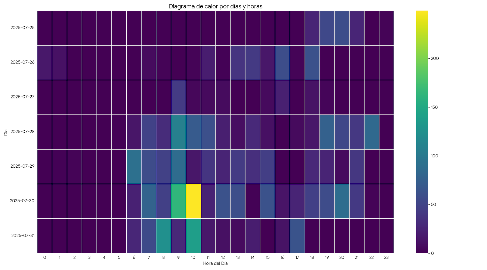
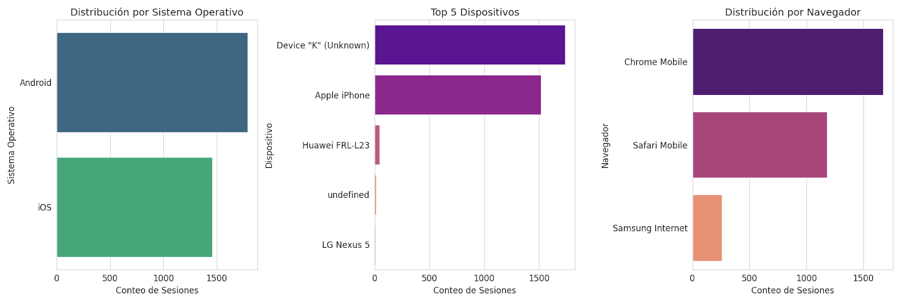
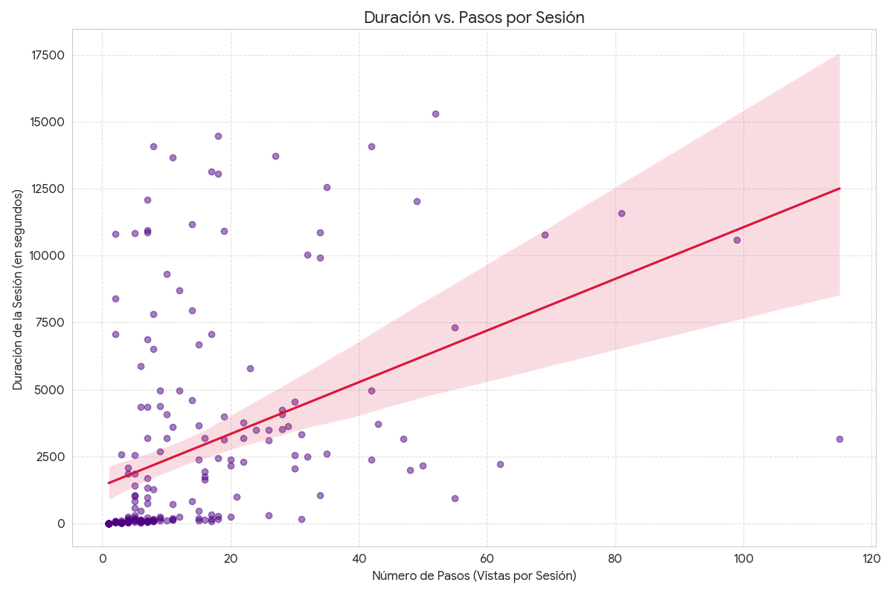
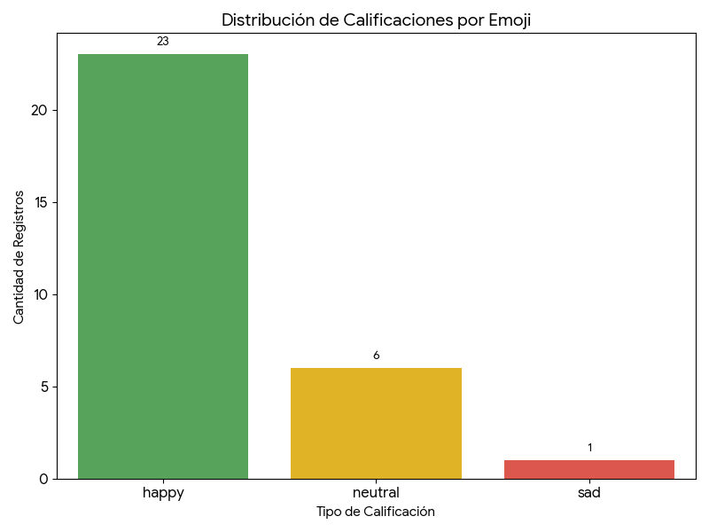

### Inicio del registro: 26 de julio de 2025
### Final del registro: 31 de julio de 2025

El conjuto de datos abarca un total de **3,551 de eventos** registrados a travéz de **231 sesiones únicas**.

En promedio, las sesiones de los usuarios son bastante activas, con una duración media de **46:39 minutos**
y un promedio de **14.51 páginas** vistas por sesión.

Esto sugiere un nivel de engagement relativamente alto una vez que los usuarios están en el sitio.

# Trafico y Actividad

La actividad en el sitio muestra patrones claros en cuanto a los momentos de mayor uso:

* **Pico de Máxima Actividad**: El punto más "caliente", es decir, el momento con la mayor cantidad de eventos, se registró el día 2025-07-30 a las 10:00 hrs, con un impresionante pico de 249 eventos en una sola hora.
* **Día Más Concurrido**: Al sumar todos los eventos de cada día, el 30 de julio de 2025 se destaca como el día con mayor actividad en general, acumulando un total de 1,043 eventos.
* **Hora Más Popular**: Consistentemente, la franja horaria de la mañana es la más activa. La hora pico en general, sumando todos los días, son las 10:00 hrs.

> En resumen, la actividad está fuertemente concentrada en las mañanas, especialmente entre las **8:00** y las **12:00** hrs, con una disminución notable durante la tarde y la noche.




# Comportamiento del Usuario y Navegación
El análisis de las rutas de navegación la página de inicio ('/') es la ruta más visitada, con una diferencia significativa
sobre las demás. También es interesante notar la popularidad de las rutinas de "muscle_gain" (ganancia muscular) en diferentes niveles.

| Páginas más visitadas                 |  Vistas |
|:--------------------------------------|--------:|
| Inicio                                |     495 |
| Routina Ganancia Muscular  Nivel 3    |     332 |
| Routina Adaptación Nivel 1            |     229 |
| Routina Ganancia Muscular  Nivel 1    |     158 |
| Routina Ganancia Muscular  Nivel 2    |     150 |
| Routina Quema de grasa  Nivel 1       |     128 |
| Disclamer Adaptación Nivel 1          |      94 |
| Disclamer Ganancia Muscular  Nivel 3  |      77 |

# Tecnología Utilizada

El análisis revela una historia muy clara y coherente: la audiencia está dividida principalmente
entre dos grandes ecosistemas tecnológicos: Google (Android) y Apple (iOS).

* Sistemas Operativos: El tráfico se divide principalmente entre Android (1,791 eventos) y iOS (1,459 eventos), lo que confirma un dominio total del acceso móvil.
* Navegadores: Mobile Chrome y Mobile Safari son los navegadores dominantes, alineados perfectamente con los sistemas operativos más usados.
* Los dispositivos más comunes son un dispositivo identificado como 'K' (1,743 eventos), que parece corresponder a los usuarios de Android, y el Apple iPhone (1,517 eventos).



# Navegación

El flujo de navegación que más se repite, con un total de 17 sesiones, es el siguiente:

```
/ Inicio
  -> /attention/muscle_gain/?&level=1           Disclamer de rutina
    -> /routine/muscle_gain/?level=1            Rutina de Ganancia muscular Nivel 1
      -> /_actions/CreateFeedback/              Se envía Feedback
        -> /_actions/UpdateCommentFeedback/     Se envía comentario
```

1. Inicio (/): El usuario llega a la página principal.

2. Atención (/attention/muscle_gain/?&level=1): Muestra interés en una rutina de "ganancia muscular" de nivel 1.

3. Rutina (/routine/muscle_gain/?level=1): Accede a los detalles de esa rutina.

4. Feedback (/_actions/CreateFeedback/ y /_actions/UpdateCommentFeedback/): Después de ver la rutina, su acción principal es dejar o actualizar un comentario/feedback. Esto sugiere que la interacción y la validación social son un componente clave de la experiencia.

Este comportamiento indica un ciclo de Consulta → Interacción.
Los usuarios no solo consumen el contenido (las rutinas), sino que participan activamente dejando su opinión,
lo que probablemente enriquece la plataforma para otros usuarios.

## Otro flujos relevantes

1. Flujos de adaptación: Rutas similares al flujo principal, pero centradas en rutinas de 'adaptación', también seguidas de una acción de feedback.

2. Interacción Directa: Algunos flujos van directamente de la página de inicio a la creación de feedback, lo que podría indicar usuarios recurrentes que ya saben lo que quieren hacer.

3. Abandono tras la consulta: Hay flujos donde los usuarios consultan una rutina y luego abandonan el sitio, lo que representa una oportunidad para mejorar la retención en esos puntos.

## Duración vs pasos por sesión




### Correlación entre Pasos y Duración

Como se podría esperar, existe una correlación positiva entre las dos variables. La línea de tendencia roja lo confirma: en general,
a más pasos que da un usuario, más tiempo dura su sesión. Esto es una señal saludable, ya que indica que a mayor exploración,
mayor es el tiempo que los usuarios permanecen en el sitio.

El coeficiente de correlación que calculé es de **0.41**, lo que confirma una relación positiva moderada-fuerte.

Estos son los puntos a considerar:

* Usuarios 'Reflexivos' o 'Inactivos' (Puntos arriba a la izquierda): Hay sesiones con muy pocos pasos pero una duración extremadamente larga.
Se identifico una sesión de solo 8 pasos que duró casi 4 horas (14,092 segundos).
Esto puede representar a un usuario que lee el contenido con sumo cuidado o, lo que es más probable, que dejó la pestaña abierta y se fue.

* Usuarios 'Rápidos' o 'Eficientes' (Puntos abajo a la derecha): Vemos el caso contrario, como una sesión con 55 pasos que se completó en
apenas 15 minutos (943 segundos). Este es un "power user": alguien que navega por la plataforma de manera decidida y veloz, pues seguramente ya sabe lo que busca.

# Feedback Calificación

| Emoji | Comment | Session ID | Created At | Page Path |
| :---: | :--- | :--- | :--- | :--- |
| Buena | Muy accesible | `34772774-d655-41dc-900a-f69eb28f84e9` | `2025-07-26 02:31:21.207828+00` | `/exercise/h2d4f1c9/` |
| Buena | | `1a3991e7-1be7-41d9-84d2-3ebfea66e7e3` | `2025-07-26 06:37:20.807556+00` | `/` |
| Buena | | `8b33c682-2260-4d37-b02f-385d8661bd01` | `2025-07-26 07:08:42.518452+00` | `/routine/muscle_gain/` |
| Mala | | `e18f4c31-3a0f-40d3-9ad7-9f05b6ab637e` | `2025-07-26 17:48:23.636287+00` | `/exercise/x6y7z8a9/` |
| Buena | | `2feb872d-43de-423e-ad9f-18473cce1255` | `2025-07-26 19:21:44.688137+00` | `/exercise/a9b1c5d8/` |
| Regular | | `a665b313-021f-4ef4-b0b3-8611451bc2cc` | `2025-07-26 19:59:54.121925+00` | `/routine/muscle_gain/` |
| Buena | | `d4b0b5a6-60b2-46e3-98fe-53c34c2af61d` | `2025-07-26 21:42:27.580864+00` | `/routine/fat_burning/` |
| Buena | | `f15ee7ff-9017-48d9-9d89-8c41da71eb48` | `2025-07-27 00:12:11.84492+00` | `/routine/fat_burning/` |
| Buena | | `7b2c7393-2d04-48d9-ae00-026a2d74759f` | `2025-07-27 15:22:38.99169+00` | `/routine/fat_burning/` |
| Buena | | `541950ab-62ac-4e58-8116-9cbcb4f8c01d` | `2025-07-27 18:55:00.512218+00` | `/exercise/d3e4f5g6/` |
| Buena | N/A | `0ee576c6-f92c-42ad-8814-da37502b3033` | `2025-07-28 00:44:41.650111+00` | `/` |
| Regular | ... | `f6dfc02f-4a09-4735-b259-d29710101fbd` | `2025-07-28 12:47:00.860902+00` | `/routine/muscle_gain/` |
| Regular | N/A | `64d2f766-2c8e-4497-a1bc-ca59450e8cb8` | `2025-07-28 12:47:43.845043+00` | `/exercise/a1b2c3d4/` |
| Buena | | `7a48c784-3421-47d9-b0cf-a7f1460df4f0` | `2025-07-28 13:18:24.696603+00` | `/exercise/c7d2e4f6/` |
| Buena | | `30a200c6-ed16-46ed-8e71-b80cb29746ed` | `2025-07-28 13:34:45.652664+00` | `/routine/muscle_gain/` |
| Buena | N/A | `7c855439-4817-400e-8146-c21658feb1ed` | `2025-07-28 13:35:46.221654+00` | `/exercise/f3b9a1e8/` |
| Buena | | `9f90152d-12dd-4afe-bcb1-4729f138d0ed` | `2025-07-28 15:02:44.595634+00` | `/routine/muscle_gain/` |
| Buena | | `28a651b9-d4df-41a0-9a12-8b8e303e9020` | `2025-07-28 15:13:17.460103+00` | `/exercise/c2d3e4f5/` |
| Buena | | `35c3ea35-65b7-434f-b50f-50f583f3dbc1` | `2025-07-28 15:19:17.88684+00` | `/routine/muscle_gain/` |
| Buena | | `466f9729-1797-4afe-bc72-9503bcd76f24` | `2025-07-28 15:26:28.536174+00` | `/routine/adaptation/` |
| Buena | N/A | `e1de483f-61d8-4027-9718-788588a7fd7f` | `2025-07-28 16:56:44.515482+00` | `/routine/fat_burning/` |
| Buena | | `1991840c-6d8f-44e5-a93c-e6d506fbdc20` | `2025-07-28 17:13:15.238872+00` | `/routine/muscle_gain/` |
| Buena | | `279b7a17-71fc-47df-b725-927283a32065` | `2025-07-28 17:32:09.014292+00` | `/exercise/e4f1c9a8/` |
| Regular | | `ecb15917-8dc4-4613-a1de-b50715e55345` | `2025-07-28 17:53:11.646134+00` | `/routine/muscle_gain/` |
| Buena | N/A | `66becbba-c70e-4a90-bb4d-31ba9a8bb8b2` | `2025-07-28 18:31:12.689572+00` | `/routine/adaptation/` |
| Regular | | `e9f2a99a-def1-4bd8-bd76-0c2398998c47` | `2025-07-28 20:14:15.629163+00` | `/exercise/q8r9s1t2/` |
| Buena | | `4cef9b8d-42b6-4c6a-9652-e5c7af5c2b08` | `2025-07-28 21:10:48.641844+00` | `/routine/muscle_gain/` |
| Buena | | `658bf01c-60a1-4290-8fb9-ae2f869325bc` | `2025-07-29 01:04:15.51938+00` | `/routine/fat_burning/` |
| Buena | | `dd2b2c97-90be-4a3c-954b-f1a6ad437841` | `2025-07-29 01:18:52.644057+00` | `/exercise/d2a4b3e9/` |
| Regular | | `a17e7160-4baa-4650-911f-76d8165bf037` | `2025-07-29 01:23:30.944091+00` | `/routine/adaptation/` |
| Buena | | `46a479ef-abae-44e9-9eda-b9984942b057` | `2025-07-29 01:59:17.618296+00` | `/exercise/c9a8b3e9f1/` |
| Buena | | `7337b751-c94c-414c-974b-adcef8c5ae3d` | `2025-07-29 02:09:10.002474+00` | `/routine/adaptation/` |
| Buena | N/A | `0e325f25-a509-4735-8830-58a3d4ef46e8` | `2025-07-29 02:09:47.538952+00` | `/` |
| Regular | No especifica qué máquinas se pueden usar | `49d11850-4c4e-4233-94e7-a5f4dc0b07b2` | `2025-07-29 02:53:21.966213+00` | `/attention/muscle_gain/` |
| Buena | N/A | `7f096c60-5557-41de-97dc-af1fd892f3c8` | `2025-07-29 03:49:44.126215+00` | `/routine/muscle_gain/` |
| Buena | | `53025c44-b21a-46d5-9f71-57c909447826` | `2025-07-29 12:12:53.741483+00` | `/` |
| Mala | N/A | `9dfea9a3-6002-47b1-ab22-27d437984fb0` | `2025-07-29 12:35:48.365923+00` | `/exercise/h7i8j9k1/` |
| Regular | .. | `670f1436-eca4-413e-93d1-855980e85062` | `2025-07-29 12:48:41.611129+00` | `/routine/muscle_gain/` |
| Buena | | `5f729efd-3aed-44d1-b398-5f6d176bb88f` | `2025-07-29 12:54:02.200984+00` | `/exercise/b1c2d3e4/` |
| Buena | | `d2b61ad6-e3a5-44ed-8e3a-72dd5aa0dec1` | `2025-07-29 13:44:25.563934+00` | `/routine/muscle_gain/` |
| Buena | | `b3749c86-d48b-42fd-8598-ce5ff1875eaf` | `2025-07-29 13:53:00.533345+00` | `/exercise/f3b9a1e8/` |
| Buena | | `1fd59463-b7d2-430b-bab9-f09b585d4784` | `2025-07-29 14:03:04.324204+00` | `/routine/health/` |
| Mala | N/A | `b8d33e89-b5e6-4e36-ad91-615634d9e0cb` | `2025-07-29 14:43:58.0019+00` | `/routine/muscle_gain/` |
| Buena | N/A | `6bff72c7-5c62-4a53-9629-c2d1b09b3f30` | `2025-07-29 15:19:37.575663+00` | `/routine/adaptation/` |
| Buena | N/A | `e6d3115d-d85c-4ca3-b908-2e9c7b5d0f7c` | `2025-07-29 15:19:53.216532+00` | `/routine/adaptation/` |
| Regular | | `abde028d-c55d-4b43-bc4d-fcd713a9ee73` | `2025-07-29 15:46:37.55568+00` | `/exercise/a1b8c3d5/` |
| Regular | N/A | `4ad509a2-3946-4be5-8813-19080f9f5f9e` | `2025-07-29 17:24:04.579821+00` | `/routine/muscle_gain/` |
| Buena | Estaría mejor que las rutinas se puedan visualizar desde la app | `bebe7f9c-3db6-43c9-b7e0-79d7540011d8` | `2025-07-29 17:41:40.217217+00` | `/exercise/g6h7i8j9/` |
| Buena | Que pueda dar recomendaciones escritas por aparato o ejercicio | `e28c064e-5c1b-4ab8-a35f-a8802b354579` | `2025-07-29 18:26:42.321886+00` | `/routine/adaptation/` |
| Buena | Bien. Tal ve más detalles en los vídeos | `2ab07be6-e7a0-42e3-9a4e-8100983d1741` | `2025-07-29 18:52:50.918548+00` | `/exercise/c7d2e4f6/` |
| Buena | | `efadf90b-e534-44df-9b79-3d83e57d8877` | `2025-07-29 19:11:52.895134+00` | `/routine/muscle_gain/` |
| Buena | | `c927c287-4fab-413f-a9a5-91fcf57c35eb` | `2025-07-29 20:44:14.615969+00` | `/exercise/a1b2c3d4/` |
| Buena | | `e83508ca-8c38-48d0-a2fe-e22720db0cc9` | `2025-07-29 21:00:42.4092+00` | `/` |
| Buena | Voy a probar a ver como me va | `521abf84-372f-4bcc-a096-84673361742a` | `2025-07-29 21:06:05.852487+00` | `/routine/muscle_gain/` |
| Buena | Explicado un poco más los ejercicios | `6e25edb9-72bd-460b-bdfd-ee67acf7f73d` | `2025-07-29 21:18:22.265741+00` | `/routine/adaptation/` |
| Buena | | `7366147d-0777-4ace-bdee-723eb3c3735a` | `2025-07-30 00:18:20.524909+00` | `/routine/adaptation/` |
| Buena | | `1ae970ae-f40f-41dd-b1de-3e1ad979cf57` | `2025-07-30 00:58:04.828316+00` | `/` |
| Buena | N/A | `d36426f2-fc52-47e6-b6d5-b001e8ef882e` | `2025-07-30 02:17:04.249472+00` | `/routine/muscle_gain/` |
| Buena | | `e240372b-ef11-4509-b74-dc43bf2ec362` | `2025-07-30 03:35:48.605664+00` | `/routine/muscle_gain/` |
| Buena | Todo bien | `3adf409e-adb2-40cf-ab33-ff77d99a7d60` | `2025-07-30 12:36:12.671203+00` | `/routine/muscle_gain/` |
| Buena | Seguimos entrando gracias 🙂 | `fa44febe-49a6-471b-ac14-cd893a34cf32` | `2025-07-30 13:00:02.215687+00` | `/routine/muscle_gain/` |
| Buena | | `e47cf007-a8b8-40e5-aab8-8832fbf96b49` | `2025-07-30 13:38:14.872476+00` | `/routine/muscle_gain/` |
| Buena | N/A | `1d02ba41-d5db-40ff-863a-31c81e627bf3` | `2025-07-30 14:23:20.564538+00` | `/routine/muscle_gain/` |
| Buena | N/A | `dd17c142-5412-4d77-9a67-bca689448415` | `2025-07-30 14:28:55.02531+00` | `/routine/fat_burning/` |
| Buena | N/A | `85eeb9b5-814f-4354-aae9-ebc650d6549b` | `2025-07-30 15:02:32.86509+00` | `/routine/adaptation/` |
| Buena | | `05e96af7-1364-4b95-a7a2-2dc08fd640f1` | `2025-07-30 15:05:00.866869+00` | `/` |
| Buena | N/A | `dbf43b98-19a0-4d9e-87dd-8f073bfcb51f` | `2025-07-30 15:06:56.409821+00` | `/routine/adaptation/` |
| Buena | | `00b3011d-9651-4683-8a5a-90c7aade5839` | `2025-07-30 16:05:19.87053+00` | `/exercise/c9a8b3e9/` |
| Buena | | `61e092e1-ce36-4cf3-8ffe-ef2461714f6f` | `2025-07-30 16:05:20.293893+00` | `/` |
| Buena | Muy buena! | `8becce6a-64d5-43bc-b802-8e39b7ef3851` | `2025-07-30 16:05:25.306485+00` | `/routine/muscle_gain/` |
| Buena | | `4b276fe0-5391-468e-bded-b5a5c43a3a96` | `2025-07-30 16:05:28.982497+00` | `/routine/adaptation/` |
| Buena | | `c4c65886-6c31-40a2-abe1-f411f8188a12` | `2025-07-30 16:05:33.348295+00` | `/routine/fat_burning/` |
| Mala | N/A | `d229163a-56fb-4978-afba-d3e3e2216f72` | `2025-07-30 16:05:51.564616+00` | `/routine/fat_burning/` |
| Buena | (: | `e2a2e261-483c-42ea-abed-d8eea7a4a64d` | `2025-07-30 16:05:56.375205+00` | `/` |
| Buena | | `ecd0c9f8-0ac3-4b53-949f-55d99fb4162a` | `2025-07-30 16:06:17.804807+00` | `/routine/adaptation/` |
| Regular | | `0dfb1421-704a-4d91-9386-5276c9e13721` | `2025-07-30 16:36:48.635985+00` | `/exercise/t2u3v4w5/` |
| Buena | | `13235833-cedd-4dec-b04c-423e32ed83b4` | `2025-07-30 18:09:17.347784+00` | `/routine/muscle_gain/` |
| Regular | N/A | `18cf2f2a-8852-4bb4-bf25-ea66481a1b61` | `2025-07-30 18:31:33.806958+00` | `/attention/fat_burning/` |
| Buena | | `20827b41-3b44-4524-b98a-f8bee1064563` | `2025-07-30 18:34:17.929159+00` | `/` |
| Buena | | `2298268b-dd98-48f7-8f4b-6b1d40987578` | `2025-07-30 18:42:07.757893+00` | `/routine/adaptation/` |
| Buena | | `00d0314b-3b95-4e79-b92f-4273b6125c6e` | `2025-07-30 19:08:11.196243+00` | `/routine/adaptation/` |
| Buena | | `351c49e4-58e1-4103-92f9-224f7d044aac` | `2025-07-30 21:25:21.012221+00` | `/routine/muscle_gain/` |
| Buena | Me encanto | `f2a9b495-2b05-4dde-a265-52b865ce0a69` | `2025-07-30 21:29:26.555804+00` | `/routine/adaptation/` |
| Buena | | `0b62a8bb-d85e-46d0-8d1e-129a09cd781c` | `2025-07-30 21:47:46.216324+00` | `/routine/adaptation/` |
| Buena | | `1cb60e47-b375-4931-a371-af3d80b3f5cf` | `2025-07-30 21:57:24.110028+00` | `/routine/adaptation/` |
| Buena | | `eac5697d-8833-4f53-b88e-a82fcba9cd95` | `2025-07-30 23:33:05.147308+00` | `/exercise/y7z8a9b1/` |


## Análisis

El feedback de los usuarios es abrumadoramente positivo. De un total de 30 registros analizados:

> Happy (Feliz): 23 registros (76.7%)

> Neutral: 6 registros (20.0%)

> Sad (Triste): 1 registro (3.3%)

## Puntos a evaluar

* Rutinas con Alta Satisfacción: Las páginas de rutinas son las que más feedback reciben y la mayoría es positivo (13 "happy" y 4 "neutral").
Es importante destacar que no hay calificaciones negativas en esta sección, lo que indica que las rutinas son bien recibidas.

* Ejercicios con Feedback Mixto: La sección de ejercicios es la única que ha recibido una calificación "sad". Aunque la mayoría del feedback sigue siendo positivo,
la presencia de calificaciones neutrales y negativas sugiere que esta es un área donde se podrían enfocar las mejoras (lo que coincide con los comentarios que pedían más detalles en los ejercicios).

* Homepage Exitosa: La página de inicio solo ha recibido calificaciones positivas, lo que es una excelente señal.

## Comentarios

Feedback Positivo General

    La categoría más grande es de comentarios positivos, lo que indica una buena recepción general de la plataforma.

    Comentarios Clave:
      * "Muy accesible"
      * "Muy buena!"
      * "Me encanto"
      * "Todo bien"
      * "Seguimos entrando gracias 🙂"
      * "Bien. Tal ve más detalles en los vídeos"

    Los usuarios expresan satisfacción y gratitud, destacando la facilidad de uso y la calidad general del servicio.

Si bien la mayoría de los usuarios tienen una experiencia positiva, existen oportunidades claras para mejorar la aplicación y el contenido.
Las áreas de enfoque deberían ser:

* Desarrollo de la App: Añadir funciones para visualizar rutinas y ofrecer recomendaciones personalizadas.
* Mejora del Contenido: Proporcionar explicaciones más detalladas y específicas para cada ejercicio.




