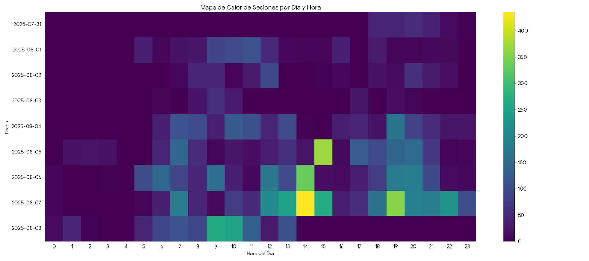
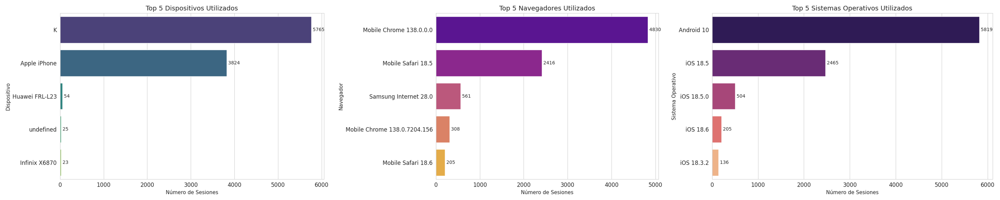
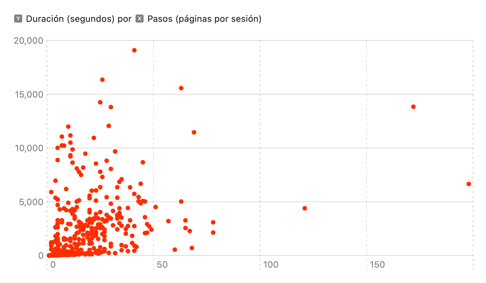
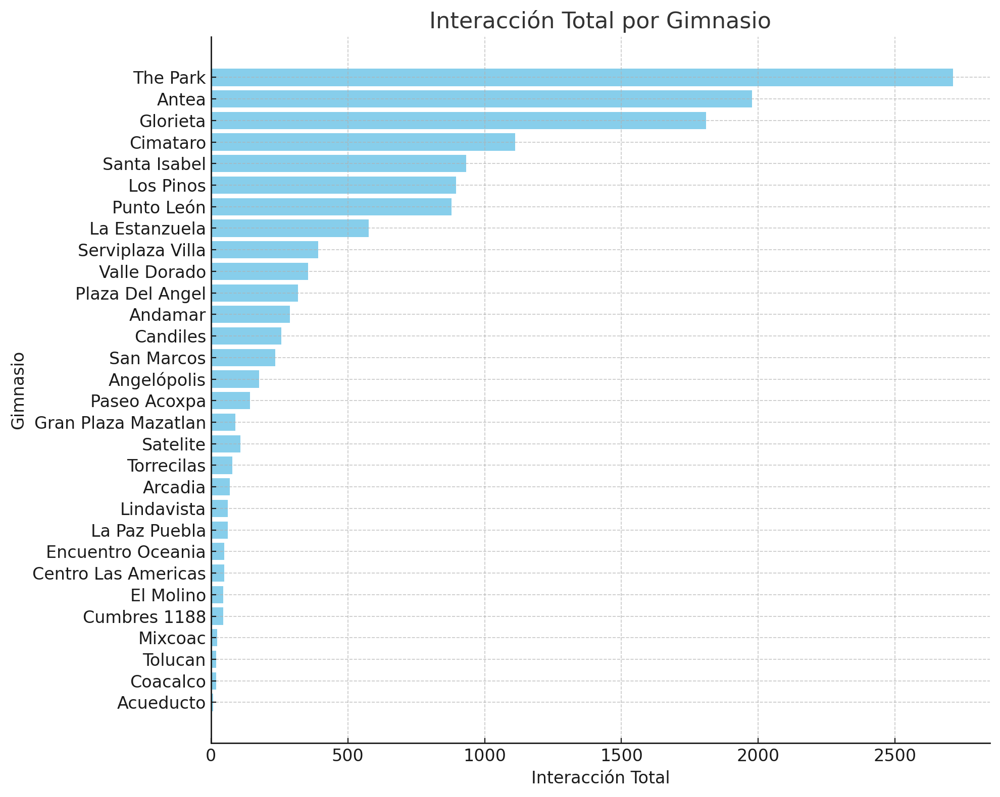

### Inicio del registro: 01 de agosto de 2025
### Final del registro: 07 de agosto de 2025

El conjuto de datos abarca un total de **9,743 de eventos** registrados a travéz de **628 sesiones únicas**.

En promedio, las sesiones de los usuarios son bastante activas, con una duración media de **16.8 minutos**
y un promedio de **10.51 páginas** vistas por sesión.

---------

# Trafico y Actividad

La actividad de los usuarios se concentra en dos franjas horarias principales durante el día:

Analicé los momentos de mayor y menor actividad de los usuarios.

* Pico de máxima actividad: La hora con más eventos registrados fue el 2025-08-08 a las 18:00 (hora de CDMX).

* Día más concurrido: El viernes es el día con mayor número de interacciones.

* Hora más popular: La franja horaria más activa es entre las 18:00 y las 19:00.

> En resumen, la actividad está fuertemente concentrada en las tardes, especialmente entre las **18:00 PM ** y las **19:00** hrs.

---------

# Comportamiento del Usuario y Navegación

El análisis por categorías revela lo siguiente:

Las Rutinas son el Corazón de la App: La categoría "Rutinas" es la más popular, acumulando más de 2,600 visitas. Esto demuestra que el contenido principal y de mayor valor para tus usuarios son los planes de ejercicio estructurados.

Punto de Partida Claro: La "Página Principal" sigue siendo crucial, con más de 1,400 visitas.

Engagement Activo: Las "Acciones de Usuario" y las "Páginas de Atención" (las páginas previas a una rutina) tienen un volumen de visitas similar. Esto refuerza la idea de que los usuarios están explorando el contenido y participando activamente.

| Página                                                                                  | Visita |
| :---                                                                                    | :---   |
| Inicio                                                                                  | 1407   |
| Rutina Ganancia muscular  Nivel 1                                                       | 913    |
| Rutina Adapatación  Nivel 1                                                             | 707    |
| Rutina Ganancia muscular  Nivel 3                                                       | 411    |
| Rutina Ganancia muscular  Nivel 4                                                       | 387    |
| Envío de Feedback                                                                       | 353    |
| Discalmer de la Rutina Ganancia muscular  Nivel 1                                       | 312    |
| Discalmer de la Rutina Adapatación  Nivel 1                                             | 286    |
| Rutina Quema de grasa  Nivel 1                                                          | 276    |
| Rutina Ganancia muscular  Nivel 2                                                       | 250    |
| Rutina Adapatación  Nivel 2                                                             | 190    |
| Discalmer de la Rutina Ganancia muscular  Nivel 4                                       | 146    |
| Discalmer de la Rutina Quema de grasa  Nivel 1                                          | 140    |
| Discalmer de la Rutina Ganancia muscular  Nivel 3                                       | 128    |
| Ejercicio "Press de hombro" Nivel 1, Día 1 de Categoría Adaptación                      | 127    |
| Ejercicio "Press de hombro" Nivel 1, Día 1 de Categoría Ganancia muscular               | 127    |
| Discalmer de la Rutina Ganancia muscular  Nivel 2                                       | 116    |
| Rutina Adapatación  Nivel 3                                                             | 111    |
| Rutina Quema de grasa  Nivel 2                                                          | 77     |
| Discalmer de la Rutina Adapatación  Nivel 2                                             | 76     |
| Ejercicio "Press de Pecho" Nivel 1, Día 1 de Categoría Ganancia muscular                | 74     |
| Rutina Quema de grasa  Nivel 4                                                          | 71     |
| Rutina  Salud  Nivel 1                                                                  | 60     |
| Ejercicio "Talones alternados al glúteo" Nivel 1, Día 1 de Categoría Quema de grasa     | 59     |
| Ejercicio "Press de Triceps" Nivel 1, Día 1 de Categoría Ganancia muscular              | 56     |
| Ejercicio "Curl de Biceps" Nivel 1, Día 1 de Categoría Ganancia muscular                | 56     |
| Rutina Quema de grasa  Nivel 3                                                          | 55     |
| Ejercicio "Sentadilla TRX" Nivel 1, Día 3 Categoría Ganancia muscular                   | 55     |
| Ejercicio "Press de pecho" Nivel 1, Día 1 Categoría Adaptación                          | 53     |
| Ejercicio "Remo Sentado" Nivel 1, Día 1 Categoría Ganancia muscular                     | 50     |
| Ejercicio "Curl de Pierna Sentado" Nivel 1, Día 3 Categoría Ganancia muscular           | 48     |
| Rutina Adapatación  Nivel 4                                                             | 48     |
| Discalmer de la Rutina Quema de grasa Nivel 2                                           | 47     |
| Ejercicio "Abdominal crunch" Nivel 1, Día 1 Categoría Ganancia muscular                 | 47     |
| Discalmer de la Rutina  Salud  Nivel 1                                                  | 46     |
| Ejercicio "Saltos rodillas al pecho" Nivel 1, Día 1 Categoría Adaptación                | 45     |
| Ejercicio "Aductor" Nivel 1, Día 3 Categoría Ganancia muscular                          | 44     |
| Ejercicio "Extensión de cuadriceps" Nivel 1, Día 3 Categoría Ganancia muscular          | 43     |
| Ejercicio "Sentadilla TRX" con salto Nivel 1, Día 1 Categoría Adaptación                | 40     |
| Ejercicio "Press de Hombro" Nivel 4, Día 1 Categoría Ganancia muscular                  | 38     |
| Ejercicio "Abductor" Nivel 1, Día 3 Categoría Ganancia muscular                         | 38     |
| Ejercicio "Extensión de Gemelos" Nivel 1, Día 3 Categoría Ganancia muscular             | 37     |
| Ejercicio "Curl de Biceps" Nivel 1, Día 1 Categoría Adaptación                          | 36     |
| Discalmer de la Rutina Quema de grasa  Nivel 4                                          | 33     |
| Discalmer de la Rutina Adapatación  Nivel 4                                             | 33     |
| Discalmer de la Rutina Adapatación  Nivel 3                                             | 31     |
| Ejercicio "Remo Sentado" Nivel 1, Día 3 Categoría Adaptación                            | 31     |
| Ejercicio "Hammer Strength Shoulder Press" Nivel 4, Día 1 Categoría Ganancia muscular   | 31     |
| Ejercicio "Abdominal crunch" Nivel 1, Día 1 Categoría Adaptación                        | 30     |

---------

# Tecnología Utilizada

El análisis revela una historia muy clara y coherente: la audiencia está dividida principalmente
entre dos grandes ecosistemas tecnológicos: Google (Android) y Apple (iOS).

* Sistemas Operativos: El tráfico se divide principalmente entre Android (1,791 eventos) y iOS (1,459 eventos), lo que confirma un dominio total del acceso móvil.
* Navegadores: Mobile Chrome y Mobile Safari son los navegadores dominantes, alineados perfectamente con los sistemas operativos más uMalaos.
* Los dispositivos más comunes son un dispositivo identificado como 'K' (1,743 eventos), que parece corresponder a los usuarios de Android, y el Apple iPhone (1,517 eventos).

---------

# Navegación

El flujo de navegación más común que identifiqué en los datos es el de los usuarios que van desde la página de "atención" para un plan de ganancia muscular directamente a la rutina específica.

El path más repetido es:

> /attention/muscle_gain/?&level=1 -> /routine/muscle_gain/?level=1

El comportamiento más frecuente de los usuarios es la interacción con el sistema de comentarios, seguido por el inicio de rutinas de "Aumento de masa muscular"
y "Adaptación". Esto indica un alto grado de engagement con el contenido y las funcionalidades de la comunidad.

La página de inicio (/) actúa como el distribuidor principal de tráfico hacia las diferentes secciones de "atención".

Destinos más comunes desde Inicio: Los usuarios que llegan a la página principal se dirigen mayoritariamente a las secciones de atención de "aumento de masa muscular" y "adaptación".

Orígenes más comunes hacia Inicio: Los usuarios tienden a regresar a la página principal después de haber estado en una rutina o en una sección de atención,
probablemente para elegir su siguiente acción.

| De.                                                    | A                                                                  | Contador |
| :---                                                   | :---                                                               | :---     |
| /attention/muscle_gain/?&level=1                       | /routine/muscle_gain/?level=1                                      |    242   |
| /attention/adaptation/?level=1                         | /routine/adaptation/?level=1                                       |    222   |
| /                                                      | /attention/muscle_gain/?&level=1                                   |    216   |
| /                                                      | /attention/adaptation/?level=1                                     |    207   |
| /attention/muscle_gain/?&level=4                       | /routine/muscle_gain/?level=4                                      |    116   |
| /routine/adaptation/?level=1                           | /exercise/f3b9a1e8/?level=1&day=1&category=adaptation              |    115   |
| /routine/muscle_gain/?level=1                          | /exercise/a1b2c3d4/?level=1&day=1&category=muscle_gain             |    113   |
| /exercise/f3b9a1e8/?level=1&day=1&category=adaptation  | /routine/adaptation/?level=1                                       |    111   |
| /attention/muscle_gain/?&level=3                       | /routine/muscle_gain/?level=3                                      |    108   |
| /                                                      | /attention/muscle_gain/?&level=4                                   |    104   |
| /                                                      | /attention/muscle_gain/?&level=3                                   |    103   |
| /attention/fat_burning/?&level=1                       | /routine/fat_burning/?level=1                                      |    103   |
| /exercise/a1b2c3d4/?level=1&day=1&category=muscle_gain | /routine/muscle_gain/?level=1                                      |    102   |
| /                                                      | /attention/fat_burning/?&level=1                                   |    92    |
| /routine/muscle_gain/?level=1                          | /                                                                  |    89    |
| /attention/muscle_gain/?&level=2                       | /routine/muscle_gain/?level=2                                      |    86    |
| /routine/adaptation/?level=1                           | /                                                                  |    85    |
| /                                                      | /attention/muscle_gain/?&level=2                                   |    81    |
| /routine/muscle_gain/?level=1                          | /exercise/e5f6g7h8/?level=1&day=1&category=muscle_gain             |    72    |
| /exercise/e5f6g7h8/?level=1&day=1&category=muscle_gain | /routine/muscle_gain/?level=1                                      |    70    |
| /attention/adaptation/?level=2                         | /routine/adaptation/?level=2                                       |    64    |
| /                                                      | /attention/adaptation/?level=2                                     |    61    |
| /routine/muscle_gain/?level=1                          | /attention/muscle_gain/?&level=1                                   |    56    |
| /routine/muscle_gain/?level=1                          | /exercise/m4n5o6p7/?level=1&day=1&category=muscle_gain             |    55    |
| /attention/adaptation/?level=1                         | /                                                                  |    55    |
| /routine/muscle_gain/?level=1                          | /exercise/i9j1k2l3/?level=1&day=1&category=muscle_gain             |    55    |
| /exercise/e4f1c9a8/?level=1&day=1&category=fat_burning | /routine/fat_burning/?level=1                                      |    54    |
| /routine/fat_burning/?level=1                          | /exercise/e4f1c9a8/?level=1&day=1&category=fat_burning             |    53    |
| /routine/adaptation/?level=1                           | /_actions/CreateFeedback/                                          |    53    |
| /routine/adaptation/?level=1                           | /attention/adaptation/?level=1                                     |    53    |
| /exercise/m4n5o6p7/?level=1&day=1&category=muscle_gain | /routine/muscle_gain/?level=1                                      |    52    |
| /exercise/i9j1k2l3/?level=1&day=1&category=muscle_gain | /routine/muscle_gain/?level=1                                      |    52    |
| /routine/muscle_gain/?level=1                          | /exercise/y7z8a9b1/?level=1&day=3&category=muscle_gain             |    51    |
| /attention/muscle_gain/?&level=1                       | /                                                                  |    50    |
| /routine/muscle_gain/?level=1                          | /exercise/q8r9s1t2/?level=1&day=1&category=muscle_gain             |    50    |
| /exercise/c7d2e4f6/?level=1&day=1&category=adaptation  | /routine/adaptation/?level=1                                       |    49    |
| /routine/muscle_gain/?level=1                          | /exercise/g6h7i8j9/?level=1&day=3&category=muscle_gain             |    47    |
| /routine/adaptation/?level=1                           | /exercise/c7d2e4f6/?level=1&day=1&category=adaptation              |    46    |
| /routine/muscle_gain/?level=1                          | /exercise/u3v4w5x6/?level=1&day=1&category=muscle_gain             |    46    |
| /routine/muscle_gain/?level=4                          | /                                                                  |    45    |
| /exercise/g6h7i8j9/?level=1&day=3&category=muscle_gain | /routine/muscle_gain/?level=1                                      |    45    |
| /exercise/y7z8a9b1/?level=1&day=3&category=muscle_gain | /routine/muscle_gain/?level=1                                      |    45    |
| /exercise/u3v4w5x6/?level=1&day=1&category=muscle_gain | /routine/muscle_gain/?level=1                                      |    45    |
| /exercise/q8r9s1t2/?level=1&day=1&category=muscle_gain | /routine/muscle_gain/?level=1                                      |    45    |
| /routine/fat_burning/?level=1                          | /                                                                  |    44    |
| /routine/adaptation/?level=1                           | /exercise/d5e6f8a9/?level=1&day=1&category=adaptation              |    43    |
| /exercise/d5e6f8a9/?level=1&day=1&category=adaptation  | /routine/adaptation/?level=1                                       |    43    |
| /routine/muscle_gain/?level=1                          | /exercise/c2d3e4f5/?level=1&day=3&category=muscle_gain             |    42    |

## Duración vs pasos por sesión

-------

# Feeback Calificación

## Sede: Antea

### Estadísticas de Emojis:

| Calificación | Conteo   |
| :---:        | :---     |
| Buena        | 47       |
| Neutral      | 3        |
| Mala         | 0        |
| **Total**    | 50       |

### Total de Comentarios: 5

#### Comentarios:

| Calificación | Comentario                                                                      |
| :---:        | :---                                                                            |
| Buena	       | Me gusta por los ritmos, y mi inicio en el gym. Los ejercicios están adecuados  |
| Buena	       | Me gusta la aplicación, muy buena explicación del coach                         |
| Buena	       | Bueno                                                                           |
| Buena	       | Muy practica                                                                    |
| Buena	       | Todo ok                                                                         |

-------------------------------------------

## Sede: Candiles

### Estadísticas de Emojis:

| Calificación | Conteo  |
| :---:        | :---    |
| Buena        | 4       |
| Neutral      | 4       |
| Mala         | 0       |
| **Total**    | 8       |

### Total de Comentarios: 3

#### Comentarios:

| Calificación | Comentario   |
| :---:        | :---         |
| Neutral      | ...          |
| Neutral      | ...          |
| Neutral      | ...          |

-------------------------------------------

## Sede: Cimatario

### Estadísticas de Emojis:

| Calificación | Conteo  |
| :---:        | :---    |
| Buena        | 10      |
| Neutral      | 1       |
| Mala         | 0       |
| **Total**    | 11      |

### Total de Comentarios: 0

-------------------------------------------

## Sede: El Molino

### Estadísticas de Emojis:

| Calificación | Conteo  |
| :---:        | :---    |
| Buena        | 1       |
| Neutral      | 0       |
| Mala         | 0       |
| **Total**    | 1       |

### Total de Comentarios: 1

#### Comentarios:

| Calificación | Comentario   |
| :---:        | :---         |
| Buena        | Me encanta   |

-------------------------------------------

## Sede: Glorieta

### Estadísticas de Emojis:

| Calificación | Conteo  |
| :---:        | :---    |
| Buena        | 17      |
| Neutral      | 5       |
| Mala         | 1       |
| **Total**    | 23      |

### Total de Comentarios: 5

#### Comentarios:

| Calificación | Comentario                                       |
| :---:        | :---                                             |
| Buena        | Muy buena                                        |
| Neutral      | No hay entrenadores disponibles                  |
| Buena        | Excelentes instalaciones y personal              |
| Buena        | Excelente explicación de los ejercicios y rutina |
| Buena        | Exelente                                         |

-------------------------------------------

## Sede: La Estanzuela

### Estadísticas de Emojis:

| Calificación | Conteo |
| :---:        | :---   |
| Buena        | 5      |
| Neutral      | 0      |
| Mala         | 1      |
| **Total**    | 6      |

### Total de Comentarios: 0

-------------------------------------------

## Sede: Plaza Del Angel

### Estadísticas de Emojis:

| Calificación | Conteo |
| :---:        | :---   |
| Buena        | 7      |
| Neutral      | 2      |
| Mala         | 0      |
| **Total**    | 9      |

### Total de Comentarios: 3

#### Comentarios:

| Calificación | Comentario                                                                                      |
| :---:        | :---                                                                                            |
| Buena        | Pero me gustaría que pusieron los nombres tal cual de la máquina Y falta el tiempo de descanso  |
| Neutral      | Ok                                                                                              |
| Buena        | Muy digerible y facil de usar .....                                                             |

-------------------------------------------

## Sede: Punto León

### Estadísticas de Emojis:

| Calificación | Conteo |
| :---:        | :---   |
| Buena        | 11     |
| Neutral      | 0      |
| Mala         | 0      |
| **Total**    | 11     |

### Total de Comentarios: 2

#### Comentarios:

| Calificación | Comentario                            |
| :---:        | :---                                  |
| Buena        | Bien ojalá e incorporen todo a la app |
| Buena        | Buena                                 |

-------------------------------------------

## Sede: Santa Isabel

### Estadísticas de Emojis:

| Calificación | Conteo |
| :---:        | :---   |
| Buena        | 11     |
| Neutral      | 2      |
| Mala         | 2      |
| **Total**    | 15     |

### Total de Comentarios: 3

#### Comentarios:

| Calificación | Comentario                                                                                                                                                          |
| :---:        | :---                                                                                                                                                                |
| Buena        | Hola, me está gustando. Estoy activandome después de mucho tiempo, me gustaría que nos orientaran en el calentamiento antes de iniciar a trabajar con los equipos.  |
| Mala         | Desconozco la ubicación de los aparatos, no hay instructores en el área.                                                                                            |
| Buena        | Muy buena asesoría por parte de Mike, rutina muy completa para acondicionar ____                                                                                    |

-------------------------------------------

## Sede: The Park

### Estadísticas de Emojis:

| Calificación | Conteo |
| :---:        | :---   |
| Buena        | 59     |
| Neutral      | 7      |
| Mala         | 4      |
| **Total**    | 72     |

### Total de Comentarios: 16

#### Comentarios:

| Calificación | Comentario                                                                                   |
| :---:        | :---                                                                                         |
| Buena        | __                                                                                           |
| Mala         | Ay no, quería poner la carita feliz de: muy buena. Pero me equivoqué.                        |
| Buena        | Está cool                                                                                    |
| Buena        | Me gustarían ejercicios distintos                                                            |
| Buena        | Me salió la encuesta sin haberme metido a ninguna rutina ni haber navegado en la aplicación  |
| Buena        | Me encanta soy de glorieta y me ha funcionado muy bien                                       |
| Buena        | Excelente app                                                                                |
| Buena        | Excelente                                                                                    |
| Mala         | Muy mala                                                                                     |
| Buena        | Exelente rutina                                                                              |
| Buena        | likeeeee                                                                                     |
| Buena        | Chuy el más sexy                                                                             |
| Buena        | Chuy el maestro                                                                              |
| Buena        | Me gusta                                                                                     |
| Buena        | .                                                                                            |
| Buena        | Super                                                                                        |

-------------------------------------------

## Sede: Valle Dorado

### Estadísticas de Emojis:

| Calificación | Conteo |
| :---:        | :---   |
| Buena        | 3      |
| Neutral      | 0      |
| Mala         | 0      |
| **Total**    | 3      |

### Total de Comentarios: 2

#### Comentarios:

| Calificación | Comentario          |
| :---:        | :---                |
| Buena        |	Muy bueno          |
| Buena        |	Exelente servicio  |

# Interacción por Club

> Cabe destacar que, a diferencia de la información presentada anteriormente, los datos actuales no han sido sometidos a un proceso de depuración para su cómputo. Esta decisión obedece a la necesidad de que el recuento de las interacciones se mantenga lo más fidedigno posible.

| Clabe del Gym | Nombre               | Interacción Total |
| :---          | :---                 | :---              |
| 90e4b5c13a    | The Park             | 2711              |
| 8c1029a5e7    | Antea                | 1978              |
| 2e7d9a4c05    | Glorieta             | 1809              |
| 6623005224    | Cimatario            | 1112              |
| 0b0986e177    | Santa Isabel         | 933               |
| c50f0f52f8    | Los Pinos            | 896               |
| 6f1c8b2375    | Punto León           | 879               |
| 660e5a1d8c    | La Estanzuela        | 577               |
| 44a6932e11    | Serviplaza Villa     | 392               |
| 54b5f8a3c2    | Valle Dorado         | 354               |
| f1e2d3c4b5    | Plaza Del Angel      | 317               |
| 9b4a5e7d13    | Andamar              | 288               |
| c022aa7cdc    | Candiles             | 261               |
| 8932ff1b6e    | San Marcos           | 234               |
| 5dc0a1b409    | Angelópolis          | 176               |
| 6a2052d8f9    | Paseo Acoxpa         | 142               |
| 9e4f35b27c    | Satelite             | 107               |
| 4bfa66b080    | Gran Plaza Mazatlan  | 89                |
| c4e220d3af    | Torrecillas          | 78                |
| c6232e9461    | Arcadia              | 69                |
| 358829c03d    | Lindavista           | 62                |
| d7b69c1f80    | La Paz Puebla        | 62                |
| eac1e502d3    | Encuentro Oceania    | 49                |
| 3d207a9c12    | Centro Las Americas  | 48                |
| fa3dde34d7    | El Molino            | 44                |
| 31b8e2a04f    | Cumbres 1188         | 24                |
| a49d5f73c4    | Mixcoac              | 22                |
| b291e7d7f0    | Tollocan             | 19                |
| 7aa8f6d5c3    | Coacalco             | 18                |
| 15bd2f6108    | Acueducto            | 7                 |
| 236a7d40af    | Punto Rio Nilo       | 0                 |
| 17cf8bbf29    | Santa Catarina       | 0                 |
| aa85485a04    | Galerías Cuernavaca  | 0                 |
| bf41e2d6ab    | Tlatelolco           | 0                 |
| b70f4e2d6a    | Jardines Xalapa      | 0                 |
| 257d3e6a8b    | Center Plazas        | 0                 |

### Diagrama

